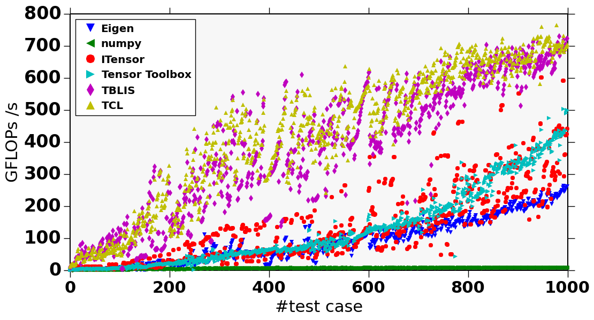

# Tensor Software Benchmarks

## Synthetic Benchmark \cite{Springer2018}

This benchmark consists of 1000 random tensor contractions. The tensor contractions exhibit very different number of indices, index dimensions, and permutation of the indices to stress the performance of any tensor contraction implementation across a wide range of use cases, ranging from very bandwidth-bound contractions all the way to very compute-bound contractions.  Moreover, tensor contractions that natively map to a direct matrix-matrix multiplication are omitted (i.e., only "pure" tensor contractions).  

The benchmark is expressed via the Einstein notation; link to the raw data <a href="randomTCs.dat">here</a> (right click to download).

You can find the python script that was used to generated the data <a href="plot.py">here</a>.

The reported performance measurements were conducted on a two socket Intel Xeon E5 2680 v3 (i.e., Haswell) with 2x 12 cores using double precision. Numbers reported below are gigaflops per second; higher is better.

<table class="simple_table">
<tr colspan=4><td><b>Tensor contraction performance in GFLOPS/s:</b></td></tr>
<tr><td></td><td>min</td><td>avg</td><td>max</td></tr>
<tr>
    <td><a href="https://github.com/springer13/tcl">TCL</a></td>
    <td>11.63</td><td>424.60</td><td>764.69</td>
</tr>
<tr>
    <td><a href="https://github.com/devinamatthews/tblis">TBLIS</a></td>
    <td>5.52</td><td>382.83</td><td>730.28</td>
</tr>
<tr>
    <td><a href="http://www.sandia.gov/~tgkolda/TensorToolbox">Tensor Toolbox</a></td>
    <td>0.84</td><td>127.17</td><td>503.91</td>
</tr>
<tr>
    <td><a href="https://itensor.org/">ITensor</a></td>
    <td>1.92</td><td>131.34</td><td>601.42</td>
</tr>
<tr>
    <td><a href="http://www.numpy.org/">NumPy</a></td>
    <td>0.75</td><td>6.40</td><td>8.82</td>
</tr>
<tr>
    <td><a href="http://eigen.tuxfamily.org">Eigen</a></td>
    <td>0.77</td><td>88.52</td><td>263.26</td>
</tr>
</table>

## Real-world Benchmark (coming soon)

