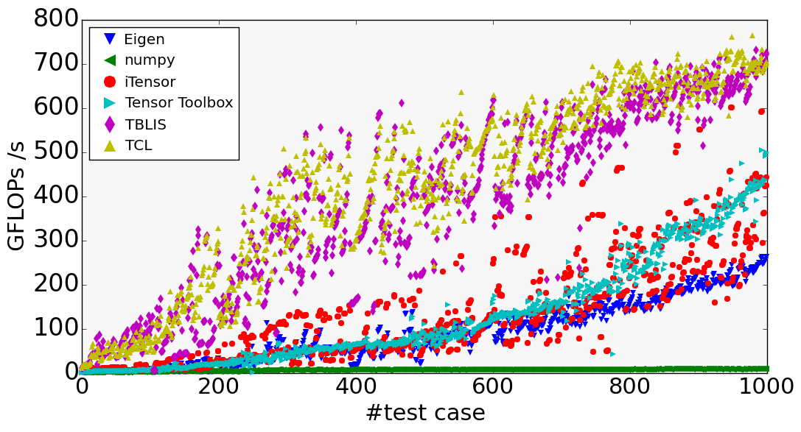

# Tensor Operation Benchmarks

## Synthetic Benchmark

This benchmark consists of 1000 random tensor contractions. The tensor contractions exhibit very different number of modes, extents, and permutation of the modes to stress the performance of any tensor contraction implementation across a wide range of use cases, ranging from very bandwidth-bound TCs all the way to very compute-bound TCs.  Moreover, tensor contractions that natively map to a direct matrix-matrix multiplication are omitted (i.e., only "pure" tensor contractions).  

The benchmark is expressed via the Einstein notation and is found at [[here|randomTCs.dat]].

You can find the python script that was used to generated the data below [[here|plot.py]].

The reported performance measurements were conducted on a two socket Intel Xeon E5 2680 v3 (i.e., Haswell) with 2x 12 cores using double precision.

|               |min       |avg       |max     |
| ------------- | -------- | -------- | ------ |
|[TCL](https://github.com/springer13/tcl)            |11.63     |424.60    |764.69|
|[BLIS](https://github.com/flame/blis)          |5.52      |382.83    |730.28|
|[Tensor Toolbox](http://www.sandia.gov/~tgkolda/TensorToolbox) |0.84      |127.17    |503.91|
|[ITensor](http://itensor.org/)        |1.92      |131.34    |601.42|
|[NumPy](http://www.numpy.org/)          |0.75      |6.40      |8.82|
|[Eigen](http://eigen.tuxfamily.org)          |0.77      |88.52     |263.26|

## Real-world Benchmark (coming soon)

