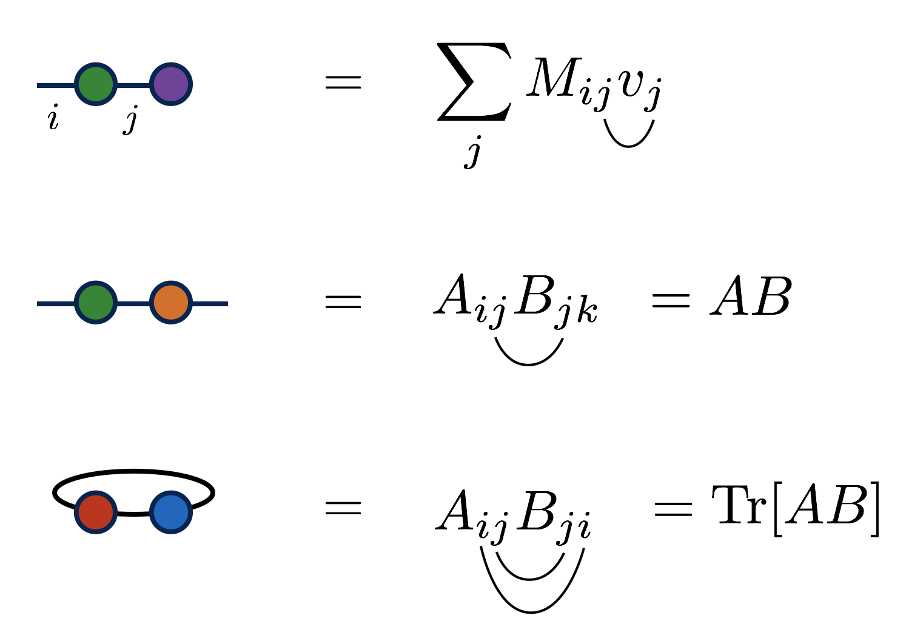

# Tensor Diagram Notation

Tensor diagram notation\cite{Penrose:1971} is a simple, yet powerful
graphical notation for networks of contracted tensors.

A tensor contraction of the form $\sum_j M_{ij} N_{jkl}$ can be notated 

Despite its graphical and intuitive nature, tensor diagram notation
is completely rigorous and well defined: it is just a graphical
notation for sums. It is inspired by
the Einstein summation convention for notating tensor contractions.

## Tensor Diagram Rules

There are two hard-and-fast rules of tensor diagrams:

1. Tensors are notated by solid shapes, and tensor indices
   are notated by lines emanating from these shapes.

2. Connecting two index lines implies a contraction, or summation
   over the connected indices.

Other rules and conventions are sometimes adopted by 
authors or used in specific contexts. These extensions
include using specific shapes or 
shadings to designated properties of tensors;
orienting index lines according to certain conventions;
or putting arrows on lines to distinguish
contravariant and covariant indices.

Though it can be helpful to label indices and tensors
with letters, it is optional to do so when the same information
can be inferred from context. In fact, one of the main
benefits of diagram notation is that it frees one
from having to name every index in a complicated 
tensor network.

## Examples

Let us look at some example diagrams for familiar low-order tensors:

And some examples of tensor contractions:

In the first example above, the names of the indices are
notated on the diagram. But the other examples emphasize that this
is optional. (Technically the second example is ambiguous about
which index is $i$ and which is $k$, but in practice this ambiguity
is rarely a problem, or when it is, the labels can be notated.)

## Other Resources

The diagram notation used in the tensor network literature is relatively 
informal and has quite a range of variation, but more formal
specifications have been [proposed](https://en.wikipedia.org/wiki/Penrose_graphical_notation).

