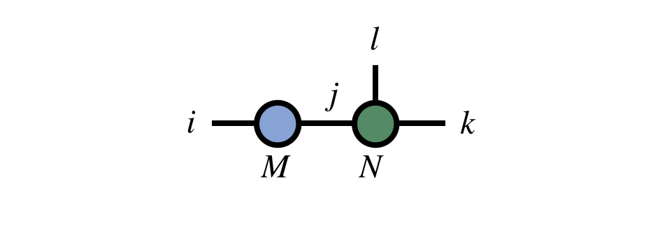

# Tensor Diagram Notation

Tensor diagram notation is a simple, yet very powerful
graphical notation for networks of contracted tensors.

A tensor contraction of the form $M_{ij} N_{jkl}$ can be notated 

