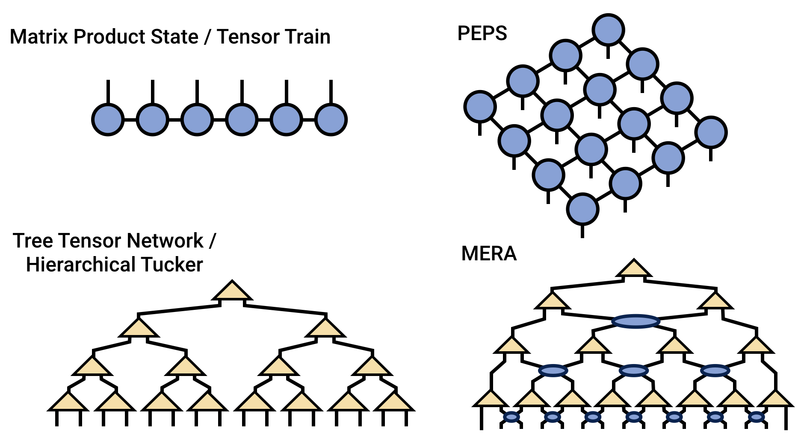

### <b>Welcome to the Tensor Network</b>

This site is a resource for tensor network algorithms, theory, and software.

Tensor networks are factorizations of very large tensors
into networks of smaller tensors, 
with applications in applied mathematics, chemistry, physics, machine
learning, and many other fields.

<b>Fundamentals</b>:

- [[Tensor Diagram Notation|diagrams]]
- [[Review Articles & Learning Resources|reviews_resources]]

<b>Types of Tensor Networks</b>:

- [[Matrix Product State / Tensor Train|mps]]
- [[Matrix Product Operator|mpo]]
- Tree Tensor Network / Hierarchical Tucker (coming soon)
- [[PEPS|peps]]
- MERA (coming soon)

<b>Tensor Network Algorithms</b>:

- [[MPS/TT and MPO Algorithms|mps/algorithms]]
  * [[Elementary MPS/TT Algorithms|mps/algorithms#elementary]]
  * [[Solving Linear Equations (DMRG, etc.)|mps/algorithms#linear]]
  * [[Summing MPS/TT Networks|mps/algorithms#summing]]
  * [[Multiplying an MPS/TT by an MPO|mps/algorithms#mpo]]
  * [[Time Evolution Algorithms|mps/algorithms/timeevo]]
- [[TRG Algorithm|trg]]

<b>Computing with Tensor Networks</b>:

- Tensor Software (coming soon)
- [[Software Benchmarks|benchmarks]]

<!--

Sections:
- [[Fundamentals|fundamentals]]
- [[Physics|physics]]
- [[Mathematics|mathematics]]
- [[Software|software]]
-->
