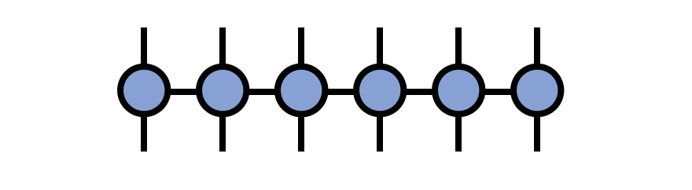

# Matrix Product Operator (MPO)

A matrix product operator (MPO) is a tensor network where each tensor has two external, uncontracted indices as well as two internal indices contracted with neighboring tensors in a chain-like fashion. Intuitively, if one thinks of a matrix product state (MPS) as parameterizing a large "vector" in a high-dimensional space, then an MPO is the generalization to the case of a "matrix" acting in the same space. 

More formally, an MPO is a factorization of a tensor with N covariant and N contravariant indices into a contracted product of smaller tensors, each carrying one of the original contravariant and covariant indices each, as well as "bond indices" connecting to the neighboring factor tensors.

In traditional notation, an MPO is a tensor network of the form

\begin{equation}
M^{s_1 s_2 s_3 s_4 s_5 s_6}_{s'_1 s'_2 s'_3 s'_4 s'_5 s'_6}
= \sum_{\{\mathbf{\alpha}\}} A^{s_1 \alpha_1}_{s'_1} 
A^{s_2 \alpha_2}_{\alpha_1 s'_2}
A^{s_3 \alpha_3}_{\alpha_2 s'_3}
A^{s_4 \alpha_4}_{\alpha_3 s'_4}
A^{s_5 \alpha_5}_{\alpha_4 s'_5}
A^{s_6}_{\alpha_5 s'_6}
\end{equation}

or in diagrammatic form:

One of the key uses of MPOs is to represent large, sparse matrices in a form convenient for MPS algorithms, such as finding MPS approximations of eigenvectors. MPOs also arise in certain algorithms for approximately contracting [[PEPS tensor networks|peps]].

## Compressing Sums of Local Terms

One particularly useful application of MPO tensor networks is representing sums of local terms
in a compressed manner which is especially convenient for algorithms involving 
the [[MPS/TT|mps]] format.

By a sum of local terms, one means a sum such as:
\begin{equation}
A^{s'_1}_{s_1} \otimes I^{s'_2}_{s_2} \otimes I^{s'_3}_{s_3} \otimes I^{s'_4}_{s_4} \otimes \cdots  \\
+ I^{s'_1}_{s_1} \otimes A^{s'_2}_{s_2} \otimes I^{s'_3}_{s_3} \otimes I^{s'_4}_{s_4} \otimes \cdots \\
+ I^{s'_1}_{s_1} \otimes I^{s'_2}_{s_2} \otimes A^{s'_3}_{s_3} \otimes I^{s'_4}_{s_4} \otimes \cdots \\
+ \ldots \\
+ B^{s'_1}_{s_1} \otimes C^{s'_2}_{s_2} \otimes I^{s'_3}_{s_3} \otimes I^{s'_4}_{s_4} \otimes \cdots  \\
+ I^{s'_1}_{s_1} \otimes B^{s'_2}_{s_2} \otimes C^{s'_3}_{s_3} \otimes I^{s'_4}_{s_4} \otimes \cdots  \\
+ I^{s'_1}_{s_1} \otimes I^{s'_2}_{s_2} \otimes B^{s'_3}_{s_3} \otimes C^{s'_4}_{s_4} \otimes \cdots  \\
\end{equation}
where $I^{s'_j}_{s_j}$ is the identity operator on vector space $j$ and $A,B,C$ are
arbitrary matrices. The first group of terms are 1-local terms, the second group are 2-local, etc.

References \onlinecite{Hubig:2017,McCulloch:2008} offer very detailed discussions about compressing sums of local terms into MPO tensor networks.

## Additional Content Needed for this Page

- More examples of exact MPO representations

- Representing long-range Hamiltonians with MPOs

- Zalatel, Mong, Pollmann approach for approximating exponentials of Hamiltonian (Hermitian) matrices as MPOs
