# MPO-MPS Multiplication: Density Matrix Algorithm

One way to multiply a [[matrix product state (MPS)|mps]] 
(or *tensor train*) tensor network
by a [[matrix product operator (MPO)|mpo]] is to 
use the product of these two networks as input to
the [[density matrix MPS compression algorithm|mps/index#compression]].

The page will describe the algorithm in detail, but it may be
helpful to first review the [[simpler case of the algorithm|mps/index#compression]]
that only involves compressing an MPS to a smaller MPS.

## Statement of the Problem

Given an MPS of bond dimension $M$ and an MPO of bond dimension $k$,
we wish to represent their product as another MPS of bond dimension $m$.
That is, we wish to find the MPS on the right-hand side of the following
equation:

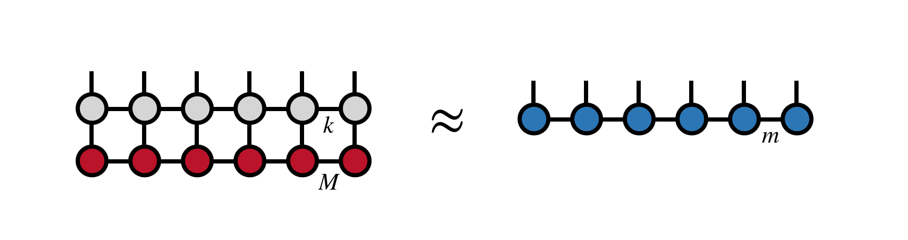

such that the Euclidean distance between the two sides of the equation
are minimized subject to the constraint on the dimensions of the 
constituent tensors.

## Steps of the Algorithm

The algorithm uses the fact that the MPS representation of a large
tensor can be computed by singular value decompositions of the 
tensor over bipartitions of its indices. Just as the singular value
of a matrix $M$ can be computed by diagonalizing $M^\dagger M$ 
and $M M^\dagger$, so an MPS can be computed by squaring a tensor
over different subsets of its indices. These squarings
of the tensor we wish to compress are the density matrices,
and the tensor we are compressing is the product of the MPS 
times the MPO.

To begin the algorithm, one computes the following square or partial trace
 of the MPO-MPS product:

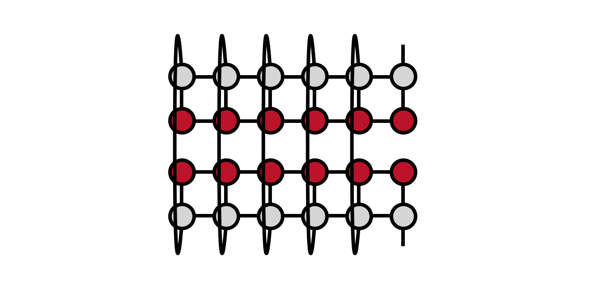

Note that the the MPO-MPS product in the lower part of the diagram
is the Hermitian conjugate of the original MPO-MPS product we want 
to compute.

To make it easier to visualize the contractions in the diagram
above, it is helpful to redraw the network to be computed as follows:

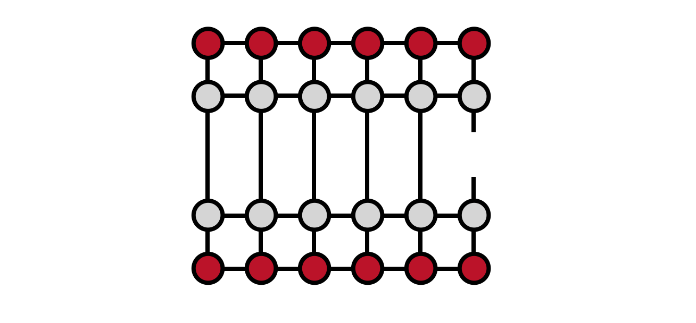

Now, one begins computing the network from the left, saving
the 'overlap' tensors $L_j$ indicated in the figure below to be used
in later steps of the algorithm:

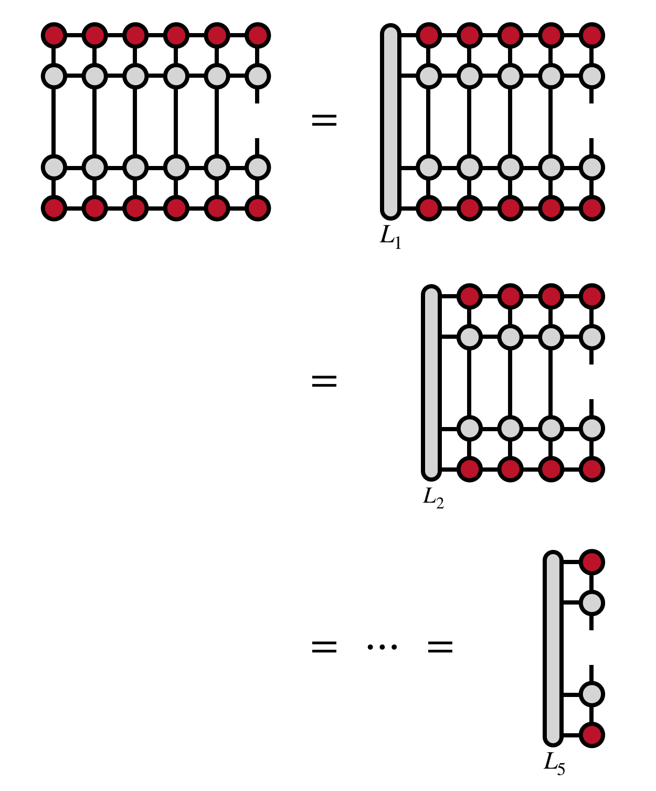

To compute these overlap tensors efficiently, one contracts the previous
$L_j$ with the next MPS, MPO, then conjugate MPO and MPS tensors one 
at a time (not shown).

Having computed the partial overlap tensors $L_j$, one can
now compute the reduced density matrix for the last visible
index:

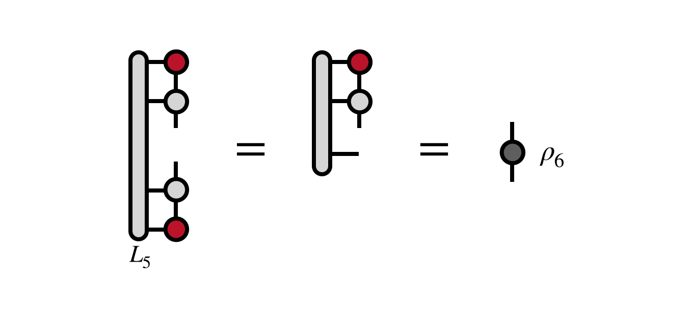

The unitary $U_6$ which diagonalizes this (Hermitian) matrix 
is the first tensor of the new MPS we seek:

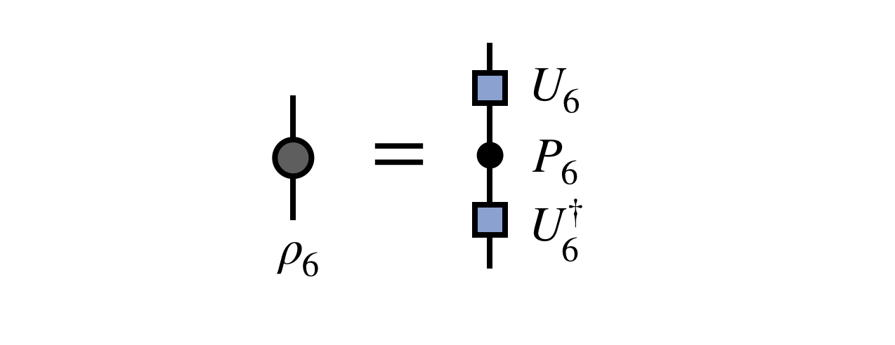

To control the size of the new MPS, one truncates all but
the $m$ largest eigenvalues of $\rho_6$, truncating the 
corresponding columns of $U_6$ as well.

Next, one uses a previous $L_j$ tensor to "uncover" the density
matrix for the last two visible indices, while at the 
same time applying the previous $U$ tensor to transform 
the basis of this density matrix. The transformation
by the $U$ tensors is necessary to keep the cost of
the algorithm under control and to ensure that each
new MPS tensor produced has compatible indices 
with the previous one.

Diagonalizing the density matrix $\rho_{56}$ and truncating
the smallest eigenvalues gives the next MPS tensor $U_5$:

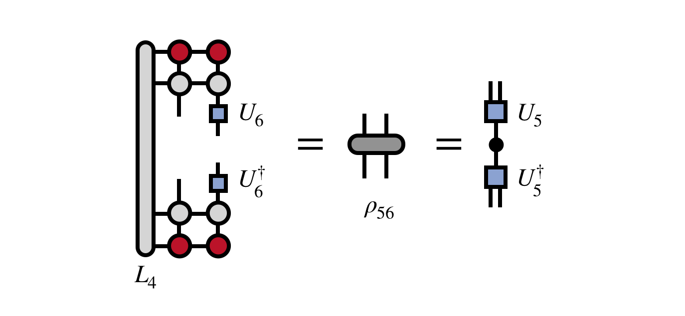

For efficiency, note that the part of the above diagram nearby to
$U_6$ is identical in the upper and lower part of the diagram,
except for a Hermitian conjugation of the tensors. So one can
begin to save this part of the diagram so as not to compute it more
than once:

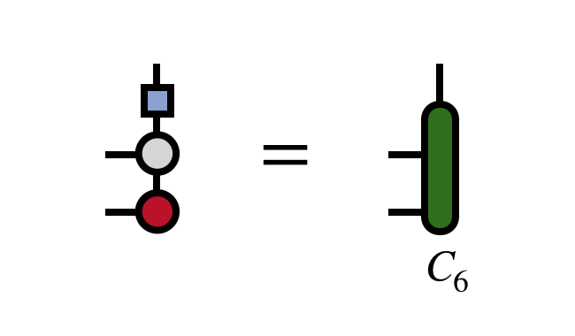

Having obtained $U_5$ above, one applies it to transform the basis
and uncovers another external index of the MPO-MPS product, reusing
the saved $L_3$ tensor to obtain the density matrix $\rho_{456}$. 
Diagonalizing this density matrix (with truncation) gives the next MPS tensor $U_4$:

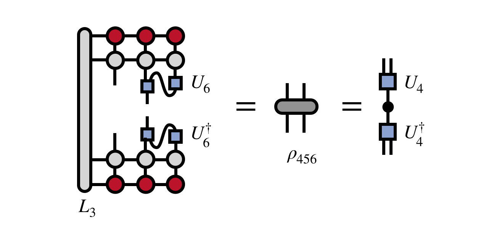

Continuing with steps similar to the ones above, one can continue
to obtain the tensors $U_3$, $U_2$, etc. which diagonalize the
reduced density matrices obtained by exposing each previous 
external index. For example, the steps to obtain $U_3$ are:

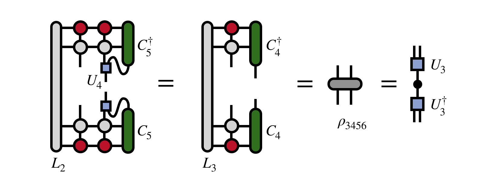

Finally, once all of the tensors down to $U_2$ have been obtained,
the MPS tensor $M_1$ carrying the first external index can be computed as:

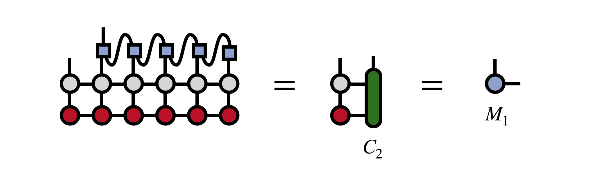

Having obtained this tensor, the final MPS which represents the MPO-MPS product
we seek is:

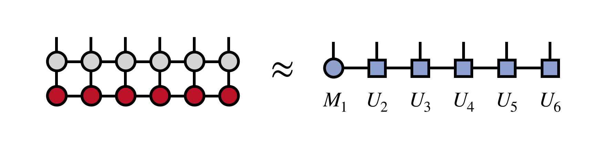

As a bonus, the resulting MPS has the property of being in the [[right orthogonal gauge|mps#gauges]].

## Acknowledgements

The idea for the algorithm came from discussions with Glen Evenbly,
Steven R. White, and Ian McCulloch.

