# Density Matrix Renormalization Group Algorithm (DMRG)

<!--TOC-->

The density matrix renormalization group (DMRG)\cite{White:1992,White:1993den,Schollwoeck:2005,Schollwoeck:2011}
is an adaptive algorithm for optimizing a [[matrix product state (MPS)|mps]] (or tensor train) 
tensor network, such that after optimization, the MPS is approximately the dominant 
eigenvector of a large matrix $H$.
The matrix $H$ is usually assumed to be a Hermitian matrix, but the 
algorithm can also be formulated for more general matrices.

The DMRG algorithm works by optimizing two neighboring MPS tensors at a time, 
combining them into a single tensor to be optimized. 
The optimization is performed using 
an iterative eigensolver approach such as Lanczos\cite{LanczosWikipedia,Lanczos:1950} or Davidson.\cite{Davidson:1975} 
Before the next step, the single tensor is
factorized using an [[SVD|svd]] or density matrix decomposition in order to restore the MPS form.
During this factorization, the bond dimension (or tensor train rank) of the MPS can be
adapted. This adaptation is optimal in the sense of preserving the distance between the 
network just after the optimization step and the network with restored MPS form.

In physics and chemistry applications, DMRG is mainly used to find ground states of 
Hamiltonians of many-body quantum systems. It has also been extended to 
compute excited states, and to simulate
dynamical, finite-temperature, and non-equilibrium systems. 

Algorithms similar to or inspired by DMRG have been developed for more general MPS computations, such
as summing two MPS; multiplying MPS by MPO networks; or finding MPS solutions to linear systems.

## Statement of the Problem

Consider a Hermitian matrix $H$ acting in vector space that 
is the tensor product of $N$ smaller spaces, each of dimension $d$:

The DMRG algorithm seeks the dominant eigenvector of $H$ in the form of an MPS tensor network 

Here $E_0$  $(\leq E_1 \leq E_2 \ldots)$ is the minimum eigenvalue of $H$.
(See below for a discussion of what the DMRG algorithm does when $H$ has more
than one minimum eigenvalue.)

For the algorithm to be efficient, $H$ must have certain simplifying properties.
For example $H$ could be a sum of local terms

or, more generally, $H$ could be given as an [[MPO|mpo]] tensor network

The MPO form is the most natural one for the DMRG algorithm, and can efficiently
represent many cases one wants to consider, such as when $H$ is a sum of local
terms.

However, other simplifying forms of $H$ can also permit efficient formulations of the DMRG
algorithm, such as if $H$ is a sum of MPO tensor networks or outer products of MPS
tensor networks.

## Steps of the DMRG Algorithm

### Step 0: Setup

Before beginning the DMRG algorithm, it is imperative to bring the initial MPS into an orthogonal form via a [[gauge transformation|mps#toc_7]]. Here we will choose to begin the DMRG algorithm assuming (without loss of generality) that the MPS tensors 2,3,...,N are all right-orthogonal:

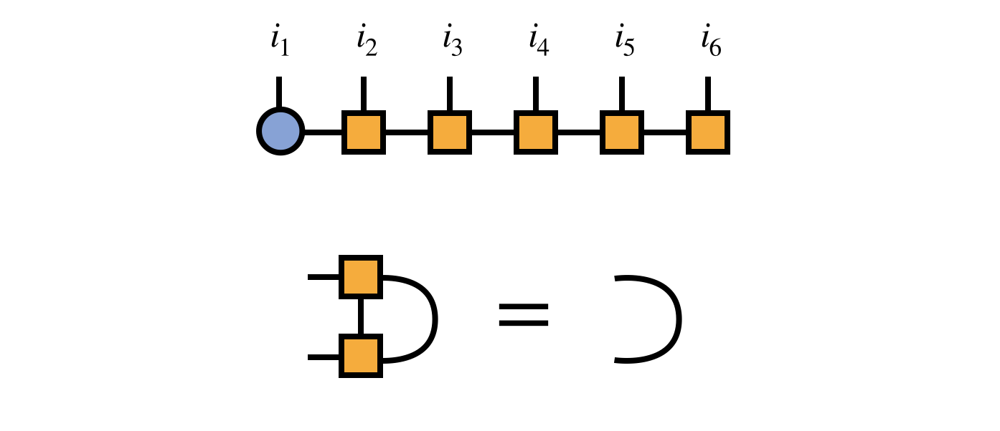

Because of the right-orthogonality property, we can interpret the MPS tensors numbers
$3,4,5,\ldots$ collectively as a change of basis from the basis of visible indices
$i_3,i_4,i_5,\ldots$ to the bond index $\alpha_2$ as follows:

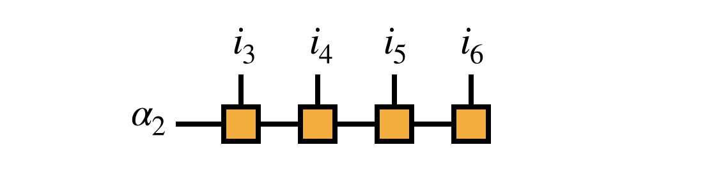

This interpretation motivates transforming the matrix $H$ into the $i_1,i_2,\alpha_2$
basis as given by the following diagram:

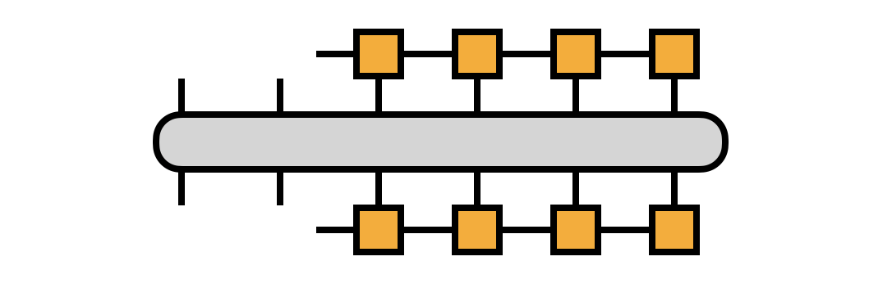

If we take $H$ to be in [[MPO|mpo]] form, we can compute the transformation efficiently,
defining the $R_j$ tensors along the way:

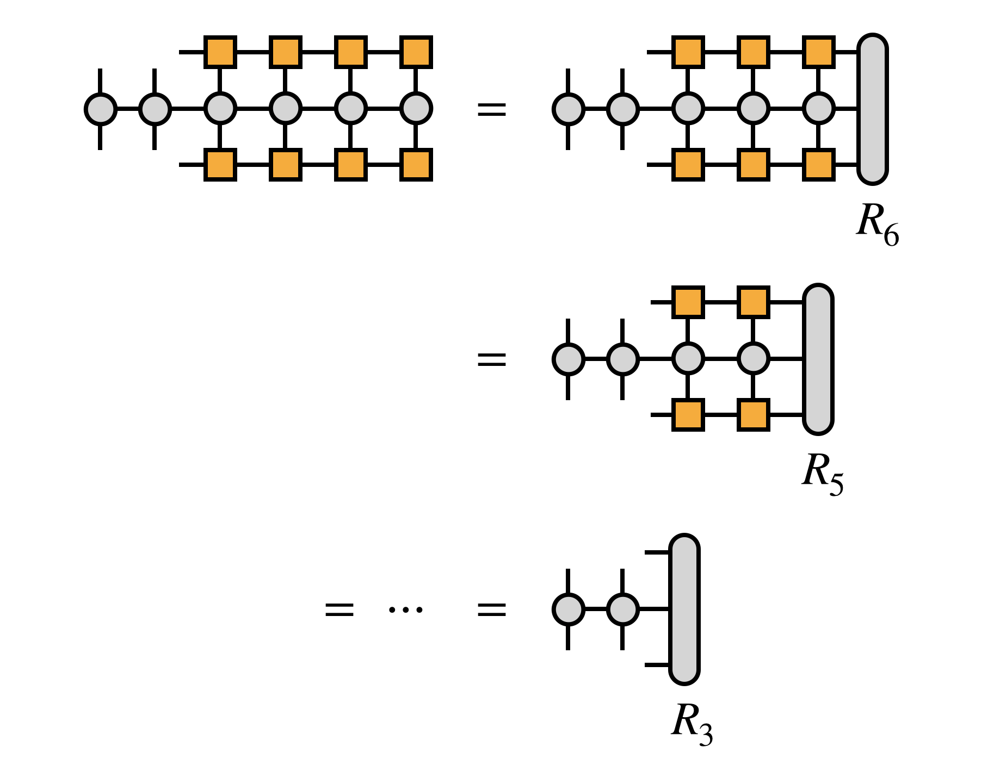

For efficiency, it is crucial that the edge tensors be created by contracting 
each MPS or MPO tensor one at a time in a certain order, as follows:

Next, combine the first two MPS tensors by contracting over their shared bond index:

At the point, it is helpful to observe that the "bond tensor" $B^{i_1 i_2 \alpha}_{12}$ does not contain just partial information about the tensor represented by the MPS. Rather, it is the *entire* tensor (eigenvector of $H$) just written in the $i_1, i_2, \alpha_2$ basis. If the $\alpha_2$ basis spans a subspace of the $i_3, i_4, \ldots, i_N$ space sufficient to represent the eigenvector of $H$ we seek, then optimizing $B_{12}$ to be the dominant eigenvector of the transformed $H$ is sufficient to solve the original problem.

In practice, however the $\alpha_2$ basis can be improved, and to do so the algorithm optimizes the MPS at every bond sequentially.

### Step 1a: Optimization of First Bond

To optimize the first bond tensor $B_{12}$, a range of procedures can be used---for example, gradient descent or conjugate gradient---but among the most effective are iterative algorithms, such as the Davidson\cite{Davidson:1975} or Lanczos\cite{LanczosWikipedia,Lanczos:1950} algorithms.

The key step of each of these algorithms is the multiplication of $B_{12}$ by the (transformed) matrix $H$. Using the projected form of $H$ in terms of the $R_j$ tensors defined above, this multiplication can be computed as:

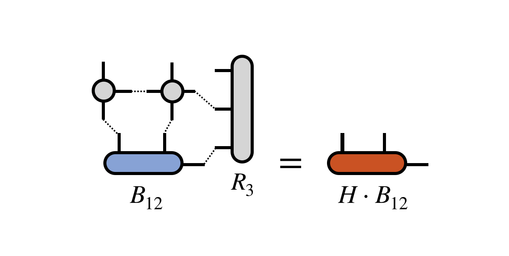

where one must take care to contract the MPO and $R_3$ tensors one at a time and 
in a reasonable order to ensure efficiency.

The iterative algorithm takes the resulting $H$ times $B_{12}$ tensor and
processes it further, depending on the particular algorithm used. 
Multiplication steps of same form as the diagram above
are repeated until some convergence criterion is met. These multiplication steps 
typically dominate the cost of a DMRG calculation. The result is an improved
bond tensor $B^\prime_{12}$ which more closely approximates the dominant eigenvector
of $H$ one is seeking.

It is important to note that for an efficient DMRG algorithm, one should not fully
converge the iterative eigensolver algorithm at this step, or subsequent similar 
bond-optimization steps.
Until the entire algorithm converges globally, the subspace spanned by the 
rest of the MPS tensors cannot be assumed to be the ideal one for representing
the true eigenvector. It would be counterproductive to fully converge $B_{12}$
in such an imperfect subspace.

### Step 1b: Adaptive Restoration of MPS Form

Having obtained an improved bond tensor $B^\prime_{12}$, it is necessary to
restore the MPS form of the candidate eigenvector before proceeding to
optimize the next bond. Otherwise, the algorithm would become inefficient.

The simplest way to optimally restore MPS form is to compute
a singular value decomposition (SVD) of the $B^\prime_{12}$ tensor:

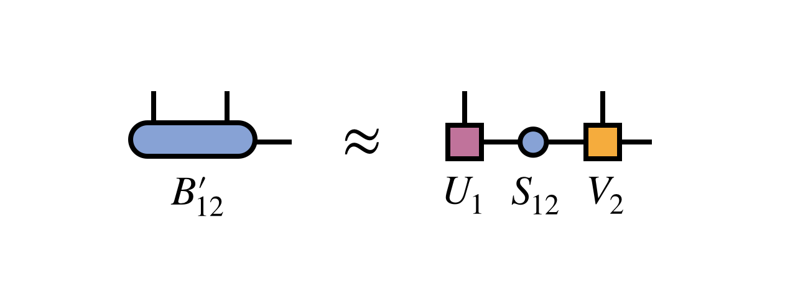

Crucially, one keeps only the first $m$ columns of $U_1$ and rows of $V_2$ 
corresponding to the $m$ largest singular values of $B^\prime_{12}$. 
The other columns and rows of $U_1$ and $V_2$ are truncated, or discarded.

To complete the restoration of MPS form, one multiplies the singular values
into the matrix $V_2$ to obtain a new second MPS tensor $M_2 = S_{12} V_2$:

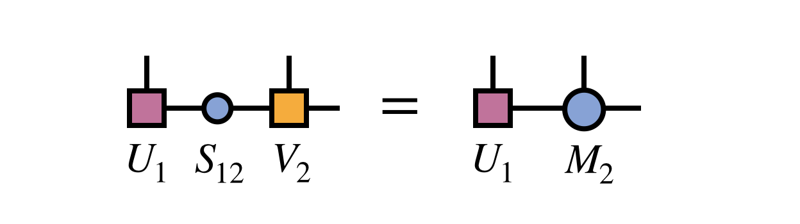

Note that the new MPS tensor carrying the index $i_1$ will automatically
obey the left orthogonality property since it was formed from a unitary
matrix as guaranteed by the properties of the SVD:

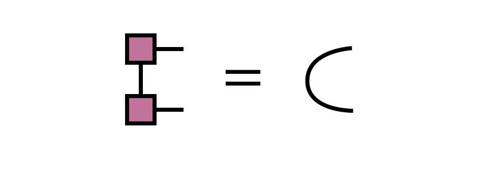

The SVD approach produces an optimal MPS in the sense of minimizing the 
Euclidean distance between the MPS and the network with $B^\prime_{12}$ 
as the first tensor.

In other words, the distance:

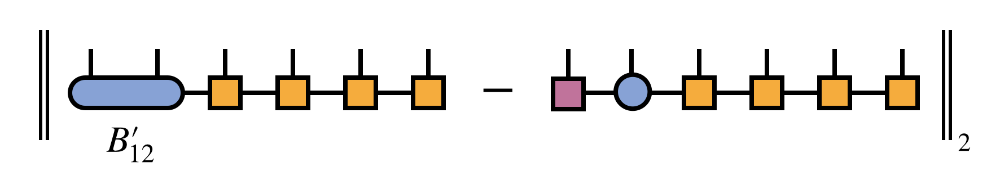

is minimized, subject to the constraint that the resulting MPS bond dimension is $m$.
Because the tensors carrying the external indices $i_3, i_4, \ldots, i_N$ are
all right-orthogonal (and thus parameterize an orthonormal sub-basis), it
is sufficient for minimizing the above distance to just minimize the distance
between $B^\prime_{12}$ and the product of SVD factors $U_1 S_{12} V_2$.

An alternative, and formally equivalent, way to restore MPS form is
to form and then diagonalize the following *density matrix*

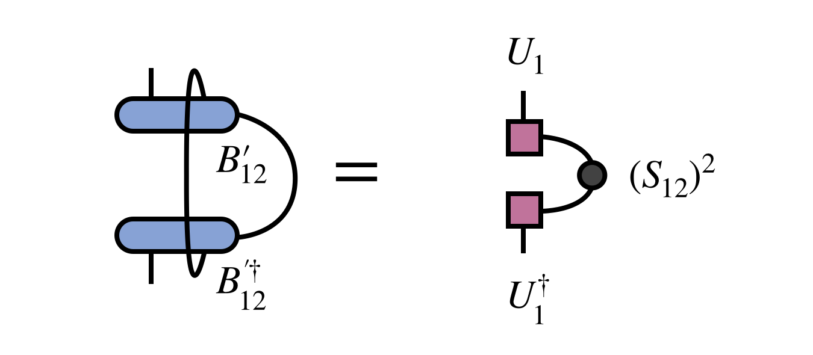

The tensor $U_1$ obtained by diagonalizing the density matrix and truncating
according to its eigenvalues (which are the squares of the singular values $S_12$)
is identical to $U_1$ obtained from the SVD. The tensor $M_2$ can be obtained by
contracting $U_1$ with $B^\prime_{12}$.

It is important to mention the density matrix approach for two reasons. First,
it is the original approach used by White and the basis for the name 
*density matrix renormalization group*, since the truncated diagonalization
was originally interpreted motivated as a kind of physical 
[renormalization group](https://en.wikipedia.org/wiki/Renormalization_group) procedure.
Secondly, the density matrix approach has the advantage that the density matrix
can be modified for various purposes before diagonalizing it to obtain the new MPS
tensors. One modification involves summing density matrices from multiple MPS 
to obtain a basis suitable for representing them all in the so-called 
*multiple targeting* procedure.\cite{Schollwoeck:2005} Another important modification is
the *noise term* perturbation often used to improve the 
convergence properties of DMRG.\cite{White:2005} (However, also see
the more recent *subspace expansion* approach which uses the SVD 
formalism.\cite{Hubig:2015})

### Step 2: Optimization and Adaptation of Second Bond

After merging and improving the first two MPS tensors, then restoring MPS form
the algorithm continues by carrying out a similar procedure for the MPS tensors
sharing the second bond index.

First one merges these two tensors to define the bond tensor $B_{23}$:

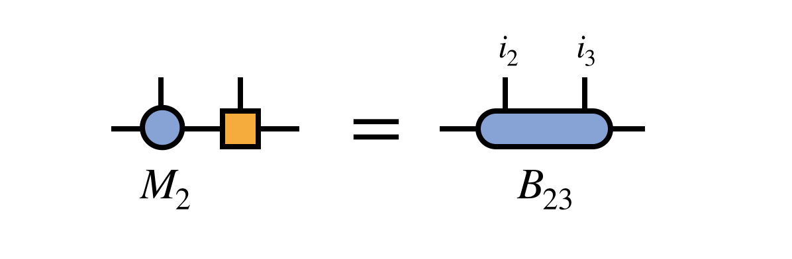

The previously obtained tensor $U_1$ is used to update the projection
of $H$ into the basis in which $B_{23}$ is defined:

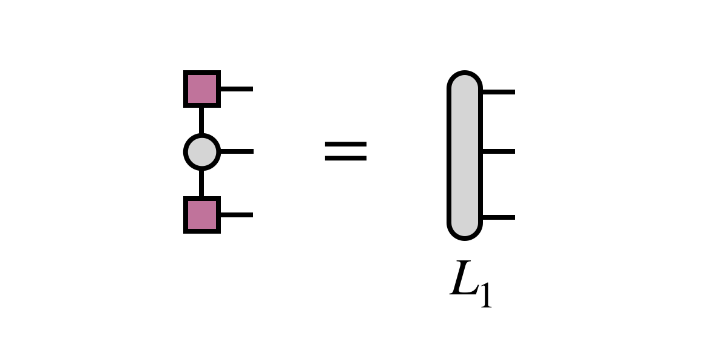

Then $B_{23}$ is optimized via an iterative method, with the key step
being the multiplication of $H$ (in projected form) times $B_{23}$:

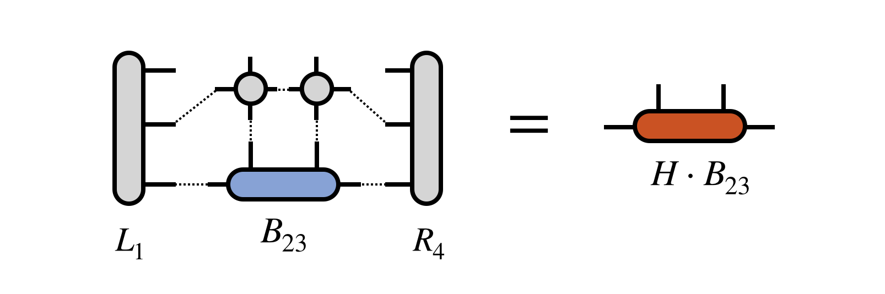

Note that the tensor $R_4$ does not need to be recomputed for this 
step, but was assumed to be saved in memory from the initial pass
of computing the $R_j$ tensors in Step 0 above.

After obtaining the improved bond tensor $B^\prime_{23}$, one
again factorizes it (using the truncated SVD, say) to restore
MPS form and adapt the bond dimension:

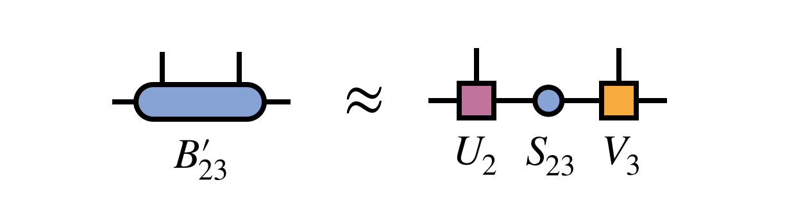

To prepare for the next step, one merges the singular value matrix $S_{23}$ with $V_3$ 
to define $M_3$:

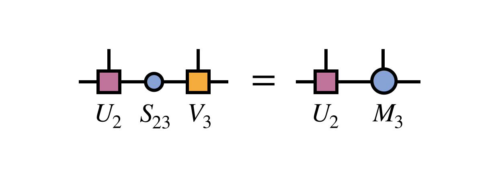

and one uses the newly obtained $U_2$ tensor to update the projected form of $H$
by computing $L_2$ as follows:

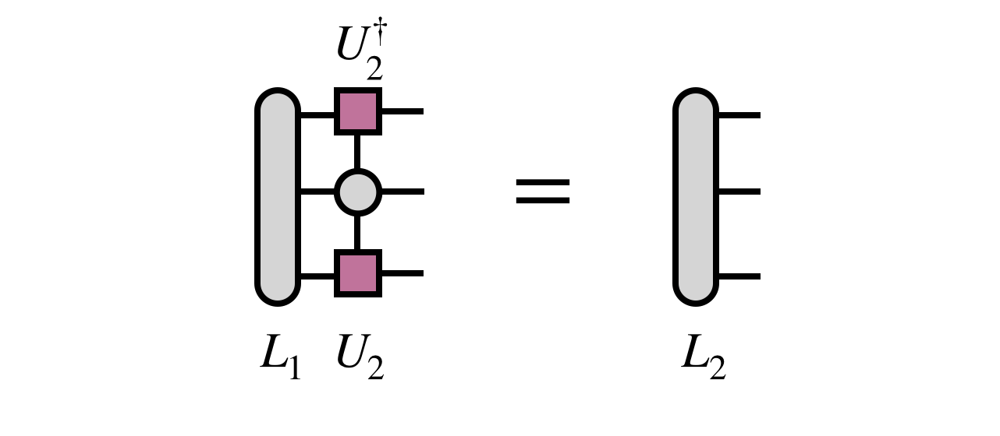

### Remaining Steps And DMRG Sweeping Algorithm

Following the optimization of the second two MPS tensors (corresponding to
the external indices $i_2$ and $i_3$), very similar steps can be carried
out to optimize the remaining MPS tensors two at a time and to adapt
all of the bond indices of the MPS. Once all tensors have been
optimized in a forward pass, one has done a single "half sweep" of DMRG.

Next one performs the procedure in reverse, merging and optimizing MPS
tensors $(N-1)$ and $N$ back to the first bond. After reaching the 
first bond again, one has done a full sweep of DMRG.

## Diagrammatic Summary of Main Steps

To convey the bigger picture of what the DMRG algorithm does, it is
helpful to summarize the main steps diagrammatically.

At each bond one optimizes, the two MPS tensors sharing the bond 
index are contracted together, then multiplied by $H$. To make 
this multiplication efficient, $H$ is transformed into the basis
in which the bond tensor is defined by contracting $H$ with all of
the other MPS tensors:

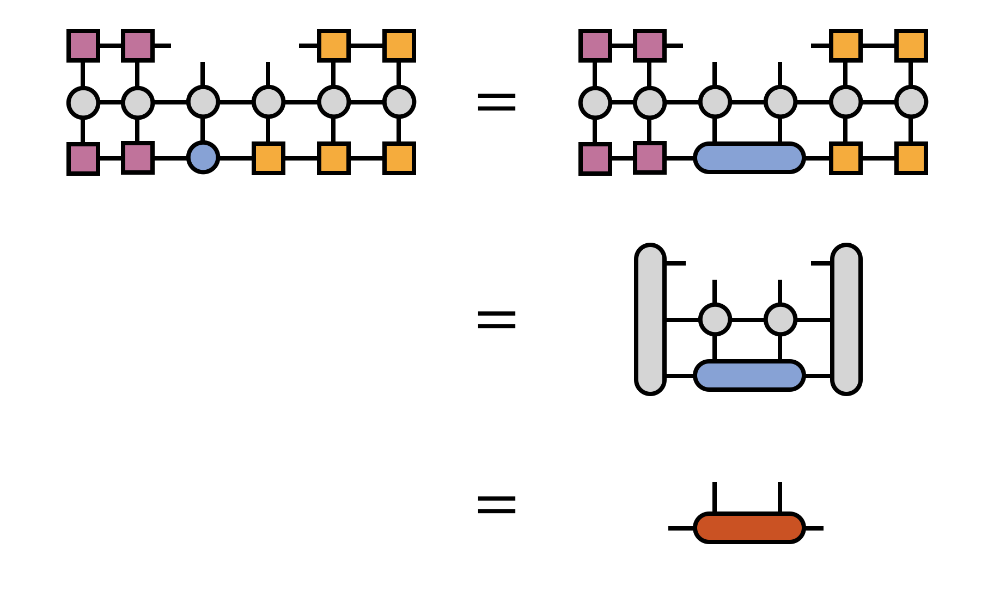

The full optimization of the bond tensor involves other steps as 
well, depending on the particular eigensolver algorithm being used
(such as Davidson or Lanczos), but multiplication by $H$ is the most
costly and technical step.

After the bond tensor is optimized, it is factorized using a truncated
SVD to restore MPS form:

Here, in the last equation, one has multiplied the singular values into the right-hand SVD
factor tensor, intending to optimize the bond to the right next.

Now the process can be repeated for the next bond (to the right)
and all bonds of the MPS in turn.

<!--
## Convergence Properties

- Exponential convergence in sweeps when H is 1D, local, gapped / finite correlation length
- Not guaranteed to converge to dominant eigenvector: "sticking problem"
- Discuss case of degenerate minimum eigenvalues (MES hypothesis)
-->

<!--
## DMRG for Tree Tensor Networks

The DMRG algorithm can be extended straightforwardly to arbitrary [[tree tensor networks|ttn]], of 
which MPS are a special case. Instead of sweeping forward and backward along an MPS chain, the
algorithm visits each bond of a tree, otherwise performing very similar optimization and factorization
steps. 

An important optimization compared to the MPS case, however, is that instead of merging adjacent
tree tensors by simply contracting their shared bond index, one first factorizes each factor tensor
into a tensor carrying the external index and a remainder, then merges the tensors carrying 
the external indices as shown below

After optimizing the merged tensor, it is factorized using an SVD and the tree tensor network
form restored:

-->

<!--
## Connections to Other Algorithms

- An algorithm with similar steps as DMRG has been developed for (Discuss Rolfe EM algorithm)
-->

