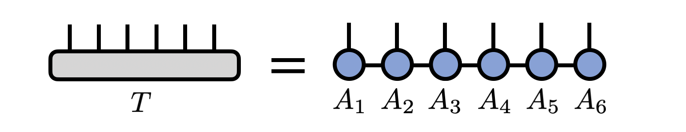
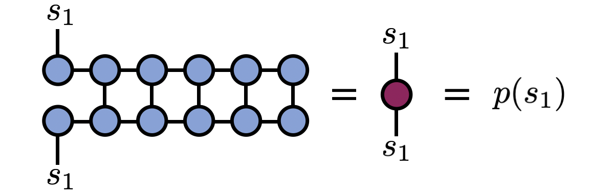
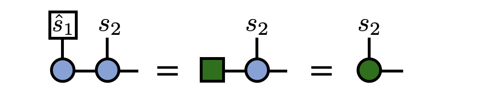
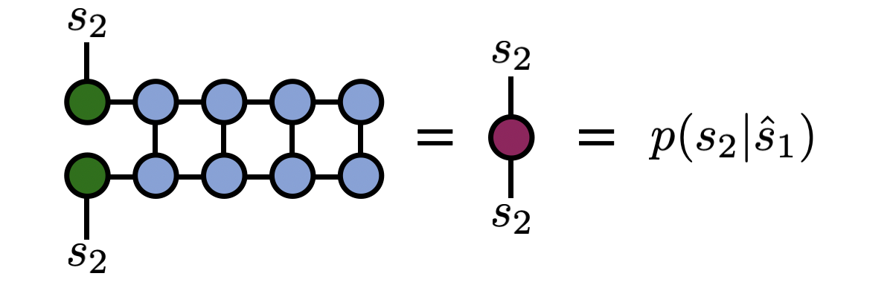

# Sampling from an MPS / TT

There is an efficient, direct sampling algorithm (or "perfect sampling" algorithm) that can be used to sample
from any probability distribution that can be represented as an MPS/TT network.\cite{METTS_Algorithms,Perfect_Sampling}
This sampling algorithm can be used within the standard (or "one-norm") probability formalism
or in the two-norm (or "Born rule") probability formalism.

The algorithm described below can be extended to
any tensor network with a tree structure. It can also be extended to a MERA tensor network.\cite{Perfect_Sampling} 

More generally, the algorithm below follows principles
that can be applied to any function approximator for which marginal probabilities 
can be computed efficiently. (Examples include "autoregressive" neural networks and hidden Markov models.)

## Review: MPS/TT Form of a Tensor

Consider an MPS/TT representing a tensor $T^{s_1 s_2 s_3 \cdots s_N}$
with $N$ indices. In other words,
\begin{equation}
T^{s_1 s_2 s_3 \cdots s_{N-1} s_{N}} = \sum_{\{\mathbf{\alpha}\}} A^{s_1}_{\alpha_1} 
A^{s_2}_{\alpha_1 \alpha_2}
A^{s_3}_{\alpha_2 \alpha_3} 
\cdots
A^{s_{N-1}}_{\alpha_{N-2} \alpha_{N-1}} 
A^{s_N}_{\alpha_{N-1}}
\end{equation}
or diagramatically

## Two-Norm Sampling Algorithm

Assume that the probability of observing the indices to have
the values $(s_1, s_2, s_3, \ldots, s_N)$ is given by
\begin{equation}
p(s_1, s_2, s_3, \ldots, s_N) = |T^{s_1 s_2 s_3 \cdots s_N}|^2
\end{equation}

For simplicity, assume that the MPS is normalized so that $\sum_{\{s\}} |T^{s_1 s_2 s_3 \cdots s_N}|^2 = 1$, or diagrammatically

If it is not, the normalization can be computed efficiently by summing the diagram above and dividing the MPS by the square root of the value obtained.

The principle underlying the MPS sampling algorithm below is the "chain rule" of probability
\begin{equation}
p(s_1, s_2, s_3, \ldots, s_N) = p(s_1) p(s_2|s_1) p(s_3|s_1 s_2) \cdots p(s_N|s_1 s_2 s_3 \cdots s_{N-1}) \ .
\end{equation}
which can be verified by using the definition of marginal and conditional probabilities. Each factor in the expression on the right can be computed efficiently using MPS summation techniques, allowing one to draw a single sample from the full (or "joint") distribution on the left.

(1) The first step is to obtain $p(s_1)$, which is equal to
\begin{equation}
p(s_1) = \sum_{s_2, s_3, \ldots, s_N} p(s_1, s_2, \ldots, s_N) = \sum_{s_2, s_3, \ldots, s_N} T^{s_1 s_2 \cdots s_N} \bar{T}^{s_1 s_2 \ldots s_N}
\end{equation}
and can be computed by summing the following diagram:

From the diagram above, one can see that actually there is a matrix we could have computed by taking the open $s_1$ indices on top and bottom to have different values. This matrix is known as a "reduced density matrix" in the physics literature, but here we will only need its diagonal elements.

(2) Having obtained the values $p(s_1=1), p(s_1=2), \ldots, p(s_1=d)$, assuming that the $s_1$ index runs over $d$ values or is $d$-dimensional, one next **randomly chooses** a specific value from $\{1,2,...,d\}$, weighted by these probabilities.

For example, if $d=2$, then we obtain two probabilities $p(1)$ and $p(2)$ such that $p(1)+p(2)=1$. One can sample the value of $s_1$ by drawing a uniform random number $r \in [0,1]$ then selecting $s_1=1$ if $r < p(1)$, otherwise selecting $s_2=2$.

Call the specific value that is selected $\hat{s}_1$.

(3) Now one "projects" the first index of the MPS to have the value $\hat{s}_1$. To do this, contract the $s_1$ index of the first MPS tensor with the standard basis vector $e_{\hat{s}_1}$, that is a vector of all zeros except for a "1" in the $\hat{s}_1$ entry. This step can be depicted diagrammatically as

Before going on to the next step, the above tensor is divided by the factor $1/\sqrt{p(\hat{s}_1)}$ to ensure the next probabilities to be computed are correctly normalized.

(4) One step of the algorithm is now complete. The algorithm proceeds recursively. Next, compute $p(s_2|\hat{s}_1)$ (probability of observing $s_2$ conditional on $s_1=\hat{s}_1$) by summing the following diagram:

Note how the diagram above is the same as the diagram for $p(s_1)$, just for an MPS that is one site shorter and where the first tensor has been modified to "remember" the history of index values we have sampled so far. Therefore, in a code implementation the code can loop or recurse at this point.

After obtaining $p(s_2|\hat{s}_1)$, one randomly samples a value $\hat{s}_2$ from it, then proceeds to compute $p(s_3|\hat{s}_2 \hat{s}_1)$ and so on, using an identical sequence of diagrams as shown above.

Once a full pass of the algorithm completes, a specific sample $(\hat{s}_1, \hat{s}_2, \hat{s}_3, \ldots, \hat{s}_N)$ of the indices has been obtained. To obtain another sample, one simply starts the algorithm over from the beginning with the original MPS.

## Properties of the Algorithm

Notable properties of the above algorithm are:

* The algorithm is a direct, memoryless, or "perfect" sampling algorithm. It does not rely on a Markov chain so each sample is a true or direct draw from the probability distribution. Therefore it does not suffer from ergodicity issues or autocorrelation effects. To see this property, it is enough to observe that for each new sample the algorithm starts over from the beginning and does not use any information about previous samples.
* For external dimension $d$ and internal (bond) dimension or rank $\chi$ the algorithm scales as $N d \chi^3$.
* If the MPS is in the right-orthogonal gauge, samples can be computed with a cost scaling as $\chi^2$. (However, bringing an arbitrary MPS into right-orthogonal gauge has a cost scaling as $\chi^3$.) When computing many samples, it can therefore be a good strategy to bring the MPS into right-orthogonal gauge before sampling.

## Applications and Extensions

The MPS perfect sampling algorithm forms the update step of the minimally entangled typical thermal state (METTS) algorithm for sampling pure states whose average gives thermal expected values of a quantum system at a temperature $T$.\cite{METTS_Algorithms} The proposed next state after this step is always accepted (i.e. METTS does not do any "rejection" sampling). Although the MPS sampling algorithm is "perfect", the overall METTS algorithm is based on a Markov chain so does not perform perfect sampling.

A deterministic version of the (two-norm) MPS sampling algorithm, which greedily selects index values with the highest probabilities at each step, has been proposed.\cite{OptimaTT,Sreedhar_QAOA} 
While computing a single sample this way is not always guaranteed to give the highest probability sample,\cite{Sreedhar_QAOA} keeping the top K samples can give the highest probability sample in practice and can be used for applications like function optimization\cite{OptimaTT} or graph problems through the QAOA algorithm.\cite{Sreedhar_QAOA}

