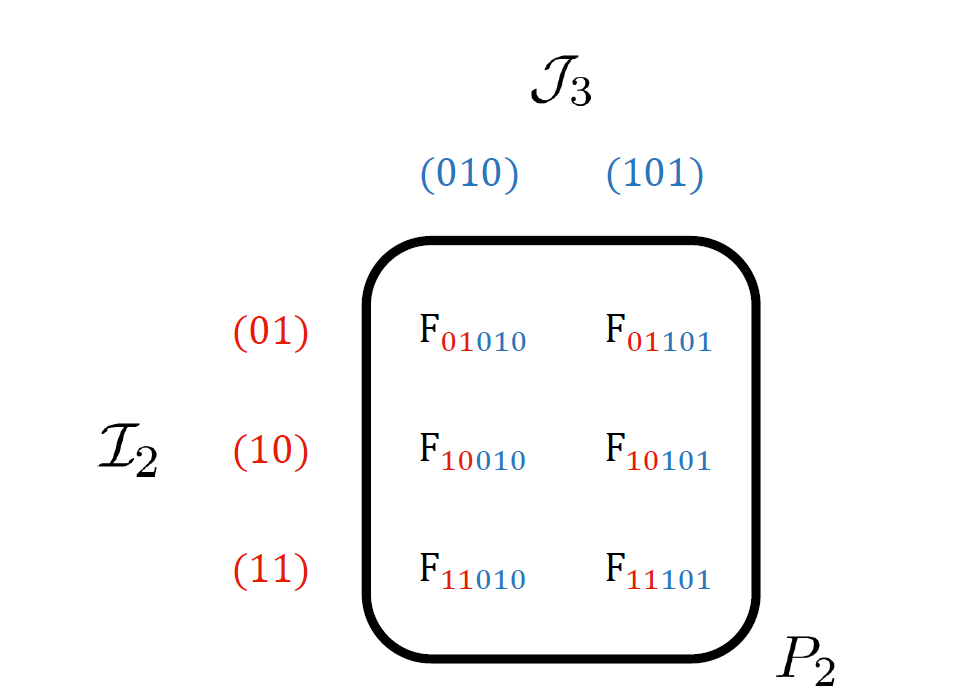

# Tensor Cross Interpolation (TT-cross)

Without storing an entire, exponentially large tensor, the TT-cross or tensor cross interpolation (TCI) algorithm \cite{oseledets2010tt, savostyanov2011, savostyanov2014, dolgov2020parallel} constructs a compressed [[MPS or tensor train (TT)|mps]] representation of an input tensor. Note that by input tensor one means a multi-linear function of discrete inputs, which could be a piece of code that generates components of the input tensor "on the fly" or could be another tensor network. The algorithm learns important slices of the input tensor, called pivots, which are used to minimise the error of the approximation. By accessing only specific elements of the input tensor, it constructs a decomposition of this tensor based on matrix cross interpolation, with the result being an MPS tensor network. The algorithm continues to refine the MPS by sweeping over its tensor cores, usually two at a time, improving the choice of pivots and reducing the error of the approximation. 

When a compressed representation is available, the TCI algorithm will often find it. However, when the tensor is not compressible, the algorithm will not converge with small internal index dimensions or ranks. TCI can also fail if the function has non-zero values only in isolated regions unless a good initial guess of the MPS or its pivots is provided.

TCI therefore works well for learning tensors or functions with structure, such as those representing smooth functions on a lattice, but works poorly when there is little or no structure such as a tensor with a small number of non-zero entries following no obvious pattern. The algorithm has found applications in physics, such as for approximating high dimensional integrals of Feynman diagrams,\cite{nunez2022learning} and further applications are being explored such as the algorithm's relation to machine learning.\cite{nunez2025learning}

## Matrix Cross Interpolation\cite{Goreinov1997}

Cross interpolation factorises a matrix $A$ using only a subset of the elements of $A$. (Cross interpolation is also known as the skeleton approximation and is closely related to the Nyström approximation.) By choosing a subset of the rows of the matrix and the same number of columns we can construct the interpolation from three factor matrices. The list of all the rows of the matrix can be notated as $\mathbb{I}$ and all columns $\mathbb{J}$. The subset that have been chosen for the interpolation are called $\mathcal{I}$ and $\mathcal{J}$. 

The first matrix of the factorization consists of the selected columns, namely $A(\mathbb{I}, \mathcal{J})$. The third consists of selected rows $A(\mathcal{I}, \mathbb{J})$. The middle factor is the inverse of the matrix comprised of the intersections of these rows and columns $A(\mathcal{I}, \mathcal{J})^{-1}$. The cross interpolation approximation is then

\begin{equation}
    A  = A(\mathbb{I}, \mathbb{J}) \approx A(\mathbb{I},\mathcal{J})A(\mathcal{I},\mathcal{J})^{-1} A(\mathcal{I},\mathbb{J})
\end{equation}

$A(\mathcal{I},\mathcal{J})$ is called the pivot matrix and its elements pivots. With $\chi$ pivots, the factorization is exact on the rows and columns coinciding with the pivots (to check this, slice the right hand side above only on selected rows and columns). It is for this reason that it is called an interpolation. If $A$ is exactly low rank with rank $\chi$, then the factorization is exact for the entire matrix \cite{dolgov2020parallel}.

If the rank is greater than $\chi$, the error depends on the pivots chosen. Choosing the pivots that guarantee the minimum interpolation error is difficult as there is an exponentially large number of choices of pivot matrices. Various heuristic methods exist to find good pivots with varying trade-offs between time complexity, stability and accuracy. These are discussed further below.

## High level Overview \cite{nunez2022learning}

In this section we outline how matrix cross interpolation can be extended to a large tensor by a recursive process. The resulting algorithm has exponential cost, however, and is only suitable for tensors small enough to be stored in memory. We later discuss more efficient methods for initializing and iteratively improving MPS approximations in cross interpolation form.

Tensor cross interpolation can be thought of an extension of matrix cross interpolation where one repeatedly or recursively interpolates an input tensor to decompose it into more and more factors. Consider the input tensor $F$ with $N$ indices $\sigma_1,\sigma_2,\dots ,\sigma_N$. We can view the tensor as a matrix by grouping all the indices after the first into what we will call a multi-index $(\sigma_2,\dots,\sigma_N)$ so the matrix is $F_{(\sigma_1),(\sigma_2,\dots ,\sigma_N)}$. Now we can use matrix cross interpolation to decompose it into three matrices, keeping only a small number $\chi$ of pivots.

We can then take the rightmost of these matrices (the row matrix) and regroup or reshape its indices. The new row index of this reshaping consists of $\chi$ pivots which are a subset of all possible values of $\sigma_1$ and we group these with $\sigma_2$ to form the matrix $F_{(\sigma_1,\sigma_2),(\sigma_3,\dots ,\sigma_N)}$. Again we apply cross interpolation to decompose this tensor. We can continue in such a way until we have factored $F$ into $N$ tensors with $(N-1)$ pivot matrices between them. These pivot matrices are finally absorbed into adjacent tensors to form a matrix product state.

In practice, tensor cross interpolation efficiently constructs this initial interpolation of the tensor and then improves the approximation by learning pivots to minimise its error.

## Pivot lists

To generalise matrix cross interpolation to higher order tensors, we must keep track of which elements of the input tensor are used as pivots. We also need to keep track of where these pivots are in the factors of the input tensor. We do this by grouping together indices of the input tensor. The groupings are called multi-indices and we group them into row multi-indices which label the rows of the pivot matrices, and column multi-indices which label their columns.

The different multi-indices are stored in pivot lists. The row multi-indices are stored in $\mathcal{I}_l$ which holds the indices of a pivot up to and including site $l$. The column multi-indices are stored in $\mathcal{J}_l$ which stores the indices from site $l$ up to the final site. For example, for just one pivot (01010), $\mathcal{I}_2=\{(01)\}$ and $\mathcal{J}_3=\{(010)\}$. We can concatenate ($\oplus$) elements of $\mathcal{I}_2$ and $\mathcal{J}_3$, which we call $i$ and $j$ respectively, to get a full multi-index denoting a location in $F$. Here $i=(01)$ and $j=(010)$ so that $i\oplus j =(01010)$ which identifies the element of $F$, $F_{01010}$.

With multiple pivots the lists contain more elements, but no duplicates. See the table below for the pivot lists with the pivots (01010) and (01101):

Using these pivot lists, we build slices of the input tensor $F$. The simplest is the pivot matrix $P_l$ which has no free indices and includes only the pivots specified by the pivot lists. The rows of the pivot matrix are labelled by $\mathcal{I}_l$ and the columns labelled by $\mathcal{J}_{l+1}$.

\begin{equation}
    P_l = F(\mathcal{I}_l, \mathcal{J}_{l+1})
\end{equation}

Consider a single element of the pivot matrix $P_2$ with its row labelled by the element of $\mathcal{I}_2$, $i=(01)$, and its column labelled by the element of $\mathcal{J}_{3}$, $j=(010)$. Then the location in the matrix (01,010), holds the element $F_{01010}$. Below is an example of the pivot matrix $P_2$ made up of 6 pivots where the top row contains those included in the table above. 

  
  

In general, $[P_l]_{ij} = F_{i\oplus j}$. Meaning the element of $P_l$ at $(i,j)$ is the element of $F$ specified by the pivot $i \oplus j$. Since the two pivot lists have the same number of elements, $P_l$ is a square matrix. Most importantly, it must be invertible meaning pivots must be chosen so that $\text{det}(P_l) \neq 0$.

A one-dimensional slice of F is the order 3 tensor with one free external index $\sigma_l$.
\begin{equation}
    T_l=F(\mathcal{I}_{l-1},\sigma_l,\mathcal{J}_{l+1})
\end{equation}

  
  

The index $\sigma_l$ has the freedom to be any of the $d_l$ possible values available to that site. For example, 0 or 1 in this example of $F$ where all the external indices are of dimension 2.

Finally, the two-dimensional slice of $F$ is an order 4 tensor with two free external indices.
\begin{equation}
    \Pi_l = F(\mathcal{I}_{l-1},\sigma_l,\sigma_{l+1},\mathcal{J}_{l+2})
\end{equation}

## Building the Initial MPS Efficiently

Starting with a set of any number of random pivots, we can construct the pivot lists by splitting these pivots $(N+1)$ times to construct each $\mathcal{I}_l$ and $\mathcal{J}_l$ where $l=0,...,N$. Then we construct the initial TCI approximation $\tilde{F}$ of $F$ as 
\begin{equation}
    F \approx \tilde{F} = T_1P_1^{-1} \dots T_lP_l^{-1}T_{l+1} \dots P_{N-1}^{-1}T_N
\end{equation}

## Improving the Approximation

The initial random pivots will most likely lead to a poor approximation of the tensor $F$ and so we start with very few, perhaps just one, initial pivot and look to add important pivots successively. Sweeping back and forth across the sites, at each site $l$ we construct the tensor $\Pi_l$ and compare it with the interpolation of $\Pi_l \approx T_lP_l^{-1}T_{l+1}$. Since the interpolation is exact at the pivots chosen, we search for the element with the maximum absolute error and add this as a pivot since this will have the largest reduction in error\cite{nunez2022learning}. 

Searching the entire matrix for the best pivot - full pivoting - is time intensive as it scales $O(nm)$ for an $(n\times m)$ matrix. However, rook pivoting is a cheaper alternative which starts by searching along a random column for the row with the largest error, then along that row for the column with the largest error and so on alternating between rows and columns until an element is found that maximises the error along both its row and column. This reduces the computational cost to $O[\text{max}(n,m)]$ and has almost as good convergence as full pivoting\cite{nunez2025learning}.

Once a new pivot has been chosen, it is added to the pivot lists $\mathcal{I}_l$ and $\mathcal{J}_{l+1}$. Then the tensors $T_l$, $P_l^{-1}$ and $T_{l+1}$ are constructed using the new pivot lists and we move to the next site.

These sweeps continue until a predefined convergence condition is satisfied, such as the internal index dimensions being unchanged after a forward and backward sweep or growing above a maximum value.

Once the algorithm is converged and the TCI form has been found, adjacent $T_l$ and $P_l^{-1}$ tensors can be contracted to form an MPS.

## Implementation Notes

Although matrix cross interpolation gives a good understanding of TCI, explicitly calculating the inverse of pivot matrices is both computationally costly and can lead to instabilities or poor convergence if pivots lead to pivot matrices with small eigenvalues. In general we want to avoid this and can do so by using alternative decompositions of the $\Pi_l$ matrix. 

For example, the LDU factorisation decomposes the matrix into three parts and the inverse of two permutation matrices $\Pi = P^{-1}LDUQ^{-1}$. $L$ is lower triangular with 1s along the diagonal, $U$ upper triangular with 1s along the diagonal, and $D$ holds the singular values of the matrix and $P$ and $Q$ keep track of the row and column permutations to order the values along D in descending order of magnitude.

By truncating the matrix $D$, such as by using a partially rank revealing LU decomposition, we ensure that only large eigenvalues are kept. A partially rank revealing decomposition uses Gaussian elimination to construct the decomposition matrices by starting with the largest values in the $D$ matrix, once values fall below a threshold or a certain number have been found, the remaining diagonal values are set to 0. Decomposing the matrix in this way finds an approximate rank without needing to find the full rank of the matrix. Keeping just these largest pivot values, we can reshape the LDU factorisation into the combinations $P^{-1}$ matrices and $T$ tensors that we need, resulting in a more stable algorithm which avoids explictly evaluting inverses \cite{nunez2025learning}.

---

Thanks to [Nicholas Woodford](https://github.com/nrwoodford) for contributing this page.

<!--
## Topics that could be discussed

 Nesting conditions
 Quantics
 Alternative factorisations - prrLU
 Suggesting pivots
 Error estimates
 More on applications (In intro)
 More on which functions/tensors TCI works well on

-->
