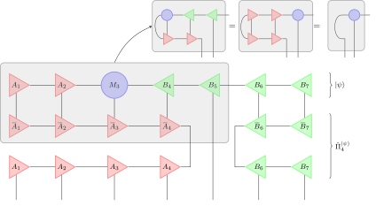
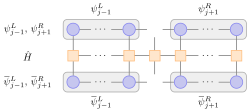
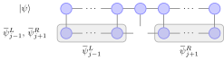
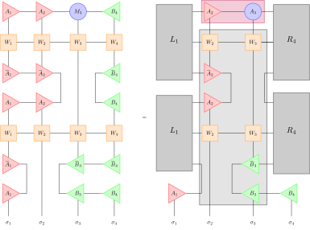

# Time-Step Targeting Method (Local Krylov)

$ \newcommand{\braket}[1]{ \langle #1 \rangle } $

<!--TOC-->

Deriving a Lie-Trotter integration scheme while working in the local
reduced spaces is in fact equivalent to translating the time-step
targeting
DMRG\cite{feiguin05:_time,ronca17:_time_step_target_time_depen,manmana05:_time_quant_many_body_system,rodriguez06,garcia-ripoll06:_time_matrix_produc_states}
into the MPS framework. Crucially, the MPS framework makes it possible
to precisely analyze the errors made, something which would be very
difficult -- and to our knowledge has not been done -- in the standard
environment-system DMRG picture. To integrate the local time-dependent
Schr\"odinger equations resulting from the Lie-Trotter decomposition,
we will use a Krylov-based
approach\cite{manmana05:_time_quant_many_body_system,rodriguez06,garcia-ripoll06:_time_matrix_produc_states}. This
approach has the advantage of a very precise solution of the local
equations and a large degree of similarity with both ground-state
search DMRG and the
[[time-dependent variational principle|mps/algorithms/timeevo/tdvp]].
Alternatively, Runge-Kutta integrators have also been used extensively
with only minor changes to the overall
method\cite{feiguin05:_time,ronca17:_time_step_target_time_depen}.  In
particular, the error analysis presented here is also valid for the
Runge-Kutta integrator, though one of course also has to include the
additional time-step error of this integrator.

We begin by looking at the Lie-Trotter decomposition of the
time-dependent Schrödinger equation \begin{align} -\mathrm
i\frac{d}{dt}\ket{\psi} &= \hat{H}\ket{\psi} \equiv
\sum_{\nu}\hat{H}_{\nu}\ket{\psi}\; .  \end{align} The goal is to find
a decomposition scheme $\hat H = \sum_{\nu} \hat H_{\nu}$ such that we
can integrate each summand separately by taking advantage of the MPS
representation of the state vector $\ket{\psi}$. Therefore we define
orthogonal projectors $\hat{P}^{L,\ket{\psi}}_{j}$ and
$\hat{P}^{R,\ket{\psi}}_{j}$ acting on the physical degrees of freedom
in a partition of the Hilbert space. For that purpose we introduce
bipartitions
$\mathcal{H}=\mathcal{H}^{L}_{j}\otimes\mathcal{H}^{R}_{j+1}$ where
$\mathcal{H}^{L}_{j} =
\mathcal{H}_{1}\otimes\cdots\otimes\mathcal{H}_{j}$ and
$\mathcal{H}^{R}_{j+1} =
\mathcal{H}_{j+1}\otimes\cdots\otimes\mathcal{H}_{L}$ and declare

\begin{align}
        \hat{P}^{L,\ket{\psi}}_{j} 
			&: 
				\mathcal{H}^{L}_{j} \otimes \mathcal{H}^{R}_{j+1} 
				\longrightarrow 
				\mathcal{H}^{L}_{j} \otimes \mathcal{H}^{R}_{j+1} \notag
\\
        \hat{P}^{L,\ket{\psi}}_{j} 
			&= 
				\sum_{
					\substack{
						\sigma_{1}, \ldots, \sigma_{j}, \\ 
						\bar{\sigma}_{1}, \ldots, \bar{\sigma}_{j}, \\
						m_{j}
					}
				} 
					\underbrace{
						A_{1} \cdots A_{j}
					}_{
						\equiv \psi^{L}_{j;m_j}
					}
					\underbrace{
						\bar{A}_{j} \cdots \bar{A}_{1}
					}_{
						\equiv \bar{\psi}^{L}_{j;m_{j}}
					}
					\ket{\sigma_{1} \cdots \sigma_{j}}
					\bra{\bar\sigma_{1} \cdots \bar\sigma_{j}} 
					\otimes 
					\mathbf{\hat{1}}^{R}_{j+1}
\\
        \hat{P}^{R,\ket{\psi}}_{j} 
			&: 
				\mathcal{H}^{L}_{j-1} \otimes \mathcal{H}^{R}_{j} 
				\longrightarrow 
				\mathcal{H}^{L}_{j-1} \otimes \mathcal{H}^{R}_{j} \notag
\\
        \hat{P}^{R,\ket{\psi}}_{j} 
			&= 
				\mathbf{\hat{1}}^{L}_{j-1} 
				\otimes 
				\sum_{
					\substack{
						\sigma_{j}, \ldots, \sigma_{L}, \\
						\bar{\sigma}_{j}, \ldots, \bar{\sigma}_{L}, \\
						m_{j-1}
					}
				}
					\underbrace{
						\bar{B}_{L} \cdots \bar{B}_{j}
					}_{
						\equiv \bar{\psi}^{R}_{j;m_{j-1}}
					}
					\underbrace{
						B_{j} \cdots B_{L}
					}_{
						\equiv \psi^{R}_{j;m_{j-1}}
					}
					\ket{\sigma_{j} \cdots \sigma_{L}}
					\bra{\bar\sigma_{j} \cdots \bar\sigma_{L}}
\end{align}
with mappings
$\psi^{L}_{j;m_{j}}$ from a part of the
physical Hilbert space into the bond space $m_j$.

By construction, these operators fulfill
$\left(\hat{P}^{L/R,\ket{\psi}}_{j}\right)^2 =
\hat{P}^{L/R,\ket{\psi}}_{j}$ and
$\left(\hat{P}^{L/R,\ket{\psi}}_{j}\right)^{\dagger} =
\hat{P}^{L/R,\ket{\psi}}_{j}$, i.e., they are projectors. They are
explicitly constructed from left-/right orthogonalized MPS site
tensors and each term can be visualised as follows:

The action of such projectors onto an MPS representation of $\ket{\psi}$ in canonical form with
orthogonality center at site $j+1$ $(j-1)$ is then given
via
\begin{align}
        \hat{P}^{L,\ket{\psi}}_{j}\ket{\psi}
	        &= 
				\sum_{
					\substack{
						\sigma_{1}, \ldots, \sigma_{j},\\
						\sigma^{\prime}_{1}, \ldots, \sigma^{\prime}_{j},\\
						\bar{\sigma}^{\prime}_{1}, \ldots, \bar{\sigma}^{\prime}_{j},\\
						m_{1}, \ldots, m_{j}, \bar{m}^{\prime}_{j}
					}
				}
					\psi^{L; \sigma^{\prime}_{1}, \ldots, \sigma^{\prime}_{j}}_{j;m^{\prime}_{j}} 
					\underbrace{
						\bar{\psi}^{L;\bar{\sigma}^{\prime}_{1}, \ldots, \bar{\sigma}^{\prime}_{j}}_{j;\bar{m}^{\prime}_j}
						A^{\sigma_{1}}_{1;m_{1}}
						\cdots
						A^{\sigma_{j}}_{j;m_{j-1}, m_{j}}
					}_{
						= 
						\delta_{\bar{m}^{\prime}_{j}, m_j}
						\delta_{\bar{\sigma}^{\prime}_{1}, \sigma_1}
						\cdots\,
						\delta_{\bar{\sigma}^{\prime}_{j}, \sigma_j}
					}
				\sum_{
					\sigma_{j+1}, \ldots, \sigma_L} 
					M_{j+1} B_{j+2} \cdots B_{L} 
					\ket{\sigma_{1} \cdots \sigma_{L}} \notag
\\
	        &= 
				\sum_{\sigma_{1}, \ldots, \sigma_{L}}
					A_{1} \cdots A_{j} M_{j+1} B_{j+2} \cdots B_L
					\ket{\sigma_{1} \cdots \sigma_{L}} = \ket{\psi} 
\\
		\hat{P}^{R,\ket{\psi}}_{j}\ket{\psi}
	        &= 
				\sum_{\sigma_1, \ldots, \sigma_{j-1}} 
					A_{1} \cdots A_{j-2} M_{j-1} 
				\sum_{
					\substack{
						\sigma_{j}, \ldots, \sigma_{L},\\ 
						\sigma^{\prime}_{j}, \ldots, \sigma^{\prime}_{L},\\
						\bar{\sigma}^{\prime}_{j}, \ldots, \bar{\sigma}^{\prime}_{L},\\
						m_{j}, \ldots, m_{L}, \bar{m}^{\prime}_{j}
					}
				}
					\underbrace{
						B^{\sigma_{j}}_{j;m_{j-1}, m_{j}}
						\cdots
						B^{\sigma_{L}}_{L;m_{L-1}}
						\bar{\psi}^{R;\bar{\sigma}^{\prime}_{j}, \ldots, \bar{\sigma}^{\prime}_{L}}_{j;\bar{m}^{\prime}_{j-1}}
					}_{
						\delta_{m_{j},\bar{m}^{\prime}_{j}}
						\delta_{\bar{\sigma}^{\prime}_{j}, \sigma_j}
						\cdots\,
						\delta_{\bar{\sigma}^{\prime}_{L}, \sigma_L}
					} 
					\psi^{R;\sigma^{\prime}_{j}, \ldots, \sigma^{\prime}_{L}}_{j;m^{\prime}_{j-1}}
					\ket{\sigma_{1} \cdots \sigma_{L}} \notag 
\\
	        &= 
				\sum_{\sigma_{1}\ldots\sigma_{L}} 
					A_{1} \cdots A_{j-2} M_{j-1} B_{j} \cdots B_{L} 
					\ket{\sigma_{1} \cdots \sigma_{L}} = \ket{\psi} \;.
\end{align}
That is, if the state $\ket{\psi}$ has orthogonality center to the right (left) of the target index $j$, the projectors constructed from it act as an identity on their Hilbert space partition.

---

(Above) Shifting the center of orthogonality from $3\rightarrow 5$
under the action of $\hat \Pi^{\ket{\psi}}_{5} \ket{\psi} =
\hat{P}^{L,\ket{\psi}}_{4}\otimes \mathbf{\hat{1}}_{5} \otimes
\hat{P}^{R,\ket{\psi}}_{6} \ket{ \psi }$. The orthogonality center is
implicitly shifted to site 5 (without changing the state content,
c.f. gray boxes) which gives identities on sites 1 through 4 and sites
6 and 7 and a new orthogonality center tensor $M_5$. The completely
contracted upper two rows then define the new tensor $M_5$.

---

Next we define the projector on the reduced site-space at site $j$ via
\begin{align}
        \hat{\Pi}^{\ket{\psi}}_{j} \equiv \hat{P}^{L,\ket{\psi}}_{j-1}\otimes \mathbf{\hat 1}_{j} \otimes \hat{P}^{R,\ket{\psi}}_{j+1} \;. \label{eq:local-krylov:projector}
\end{align}

The action of such a projector $\hat{\Pi}^{\ket{\psi}}_{j}$ on a state
$\ket{\psi}$ is to shift the orthogonality center of $\ket{\psi}$ to
the site $j$ which can be shown by applying the manipulation depicted
in the figure above on to $\ket{\psi}$
repeatedly.  Therein gauge invariance is employed so that the action
of the projector is trivial on the site tensors $A_{k}/B_{k}, k \neq
j$ redering $j$ the center of orthogonality.  Thus, the quantum state
$\ket{\psi}$ remains unchanged under the action of
$\hat{\Pi}^{\ket{\psi}}_{j}$ and therefore

\begin{align}
  \braket{\phi|\hat{\Pi}^{\ket{\psi}}_{j}|\psi}  = \braket{\phi | \psi} \label{eq:local-krylov:projector-action}\\
  \Rightarrow \hat{\Pi}^{\ket{\psi}}_{j} \ket{\phi} = \left(\frac{\ket{\psi^{\perp}}\bra{\psi^{\perp}}}{\braket{\psi^{\perp}|\psi^{\perp}}} + \frac{\ket{\psi}\bra{\psi}}{\braket{\psi|\psi}} \right)\hat{\Pi}^{\ket{\psi}}_{j}\ket{\phi} = \frac{\braket{\psi^{\perp}|\hat{\Pi}^{\ket{\psi}}_{j}|\phi} }{\braket{\psi^{\perp}|\psi^{\perp}}}\ket{\psi^{\perp}} + \frac{\braket{\psi|\hat{\Pi}^{\ket{\psi}}_{j}|\phi} }{\braket{\psi|\psi}}\ket{\psi} = \frac{\braket{\psi|\phi}}{\braket{\psi|\psi}}\ket{\psi}
\end{align}

It is instructive to think of $\hat{\Pi}^{\ket{\psi}}_{j}$ as an operator acting on both the physical and gauge degrees of freedom of the MPS representation. In the physical system it acts as a projector on the physical indices
$\sigma_{j}$ of the source state $\ket{\psi}$. In the gauge degrees of freedom of the MPS representation,
$\hat{\Pi}^{\ket{\psi}}_{j}\ket{\phi}$ fixes the orthogonality center
to site $j$. As the physical content of the state is independent of the location of its orthogonality center, we must have
\begin{align}
  \braket{\psi|\psi} &= \left(\bra{\psi} \hat \Pi_j^{\ket{\psi}}\right) \left( \hat \Pi_i^{\ket{\psi}} \ket{\psi} \right)
\end{align}
as also immediately follows. Now, we can reformulate the action of the Hamiltonian by decomposing it into representations $\hat{H}^{\hat \Pi^{\ket{\psi}}_{j}}$ acting only onto reduced site-spaces:
\begin{align}
  \hat{H}
  &\approx
  \frac{1}{L\Vert \ket{\psi}\Vert}\sum_j \hat \Pi^{\ket{\psi}}_j \hat H \hat \Pi^{\ket{\psi}}_j \equiv \frac{1}{L\Vert \ket{\psi}\Vert}\sum_{j} \hat{H}^{\hat \Pi^{\ket{\psi}}_{j}} \label{eq:local-krylov:approx-lie-decomp}\\
  \hat{H}\ket{\psi} &\approx \frac{1}{L\Vert \ket{\psi}\Vert}\sum_{j}\hat{\Pi}^{\ket{\psi}}_{j}\hat{H} \hat \Pi^{\ket{\psi}}_j\ket{\psi} \\
  & =
  \frac{1}{L\Vert \ket{\psi}\Vert}\sum_{j}\hat{H}^{\hat \Pi^{\ket{\psi}}_{j}}\ket{\psi}
\end{align}
which indeed yields a Lie-Trotter decomposition of the time-dependent Schrödinger equation
\begin{align}
        -\mathrm i\frac{d}{dt}\ket{\psi(t)} &= \frac{1}{L\Vert \ket{\psi}\Vert}\sum_{j}\hat{H}^{\hat \Pi^{\ket{\psi}}_{j}}\ket{\psi(t)}\;.\label{eq:local-krylov:decomposition}
\end{align}
Typically, this decomposition is not exact, it depends for instance on the size of
the chosen basis, but given a sufficiently large MPS bond dimension,
the error made will be small.

Having obtained the Lie-Trotter decomposition, we proceed by
formulating a recursive integration scheme which is suitable for the
particular structure of the MPS representation. For this purpose note
that a first-order approximation to the evolved state can be obtained
by solving each problem $-\mathrm i\frac{d}{dt}\ket{\psi(t)} =
\hat{H}^{\hat \Pi^{\ket{\psi}}_{j}}\ket{\psi(t)}$ independently. The
prefactors $\frac{1}{L\Vert \ket{\psi} \Vert}$ are absorbed into the
normalization of the site tensor that is currently evolved. Let
$\ket{\psi^{\hat \Pi^{\ket{\psi}}_{j}}(t)}$ be the solution of the
$j$-th problem. An approximation to the overall time-evolved state
from $t\rightarrow t+\delta$ can then be obtained by sequentially
solving the initial value problems (setting $\ket{\psi^{\hat
\Pi^{\ket{\psi}}_{0}}(t)} \equiv \ket{\psi(t)}$) \begin{align}
-\mathrm i \frac{d}{dt} \ket{\psi^{\hat \Pi^{\ket{\psi}}_{j}}(t)} &=
\hat{H}^{\hat \Pi^{\ket{\psi}}_{j}}\ket{\psi^{\hat
\Pi^{\ket{\psi}}_{j}}(t)} \nonumber \\ \textrm{and} \quad
\ket{\psi^{\hat \Pi^{\ket{\psi}}_{j}}(t)} & = \ket{\psi^{\hat
\Pi^{\ket{\psi}}_{j-1}}(t+\delta)}
\label{eq:lie_trotter_approximation} \end{align} and identifying
$\ket{\psi(t+\delta)} \equiv \ket{\psi^{\hat
\Pi^{\ket{\psi}}_{L}}(t+\delta)}$ with the approximated time evolved
state. Comparing the formal Taylor expansions of the exactly
integrated state $\ket{\psi(t+\delta)}_{\mathrm{exact}}$ with the
approximation one readily finds

\begin{align}
        \ket{\psi(t+\delta)}_{\mathrm{exact}}
	        &= 
				\ket{\psi(t)} 
				- 
				\mathrm i \delta\hat{H}\ket{\psi(t)} 
				-
				\frac{\delta^2}{2}\hat{H}^{2}\ket{\psi(t)} 
				+ 
				\cdots 
\\
        \ket{\psi^{\hat \Pi^{\ket{\psi}}_{j}}(t+\delta)}
	        &= 
				\ket{\psi^{\hat \Pi^{\ket{\psi}}_{j}}(t)} 
				+
				\delta\frac{d}{dt}\ket{\psi^{\hat \Pi^{\ket{\psi}}_{j}}(t)} 
				+ 
				\frac{\delta^2}{2}\frac{d^2}{dt^2}\ket{\psi^{\hat \Pi^{\ket{\psi}}_{j}}(t)} 
				+
				\cdots \notag
\\
	        &= 
				\ket{\psi^{\hat \Pi^{\ket{\psi}}_{j-1}}(t+\delta)} 
				- 
				\mathrm i \delta \hat{H}^{\hat \Pi^{\ket{\psi}}_{j}} \ket{\psi^{\hat \Pi^{\ket{\psi}}_{j}}(t)} 
				-
				\frac{\delta^2}{2}\hat{H}^{\hat \Pi^{\ket{\psi}}_{j}} \hat{H}^{\hat \Pi^{\ket{\psi}}_{j}}\ket{\psi^{\hat \Pi^{\ket{\psi}}_{j}}(t)} 
				+
				\cdots 
\\
        \Rightarrow \ket{\psi(t+\delta)}
	        &= 
				\ket{\psi(t)} 
				-
				\mathrm i \delta\hat{H}\ket{\psi(t)} 
				-
				\frac{\delta^2}{2}\sum_{i\leq j}\hat{H}^{\hat \Pi^{\ket{\psi}}_{j}}\hat{H}^{\hat \Pi^{\ket{\psi}}_{i}}\ket{\psi(t)} 
				\cdots 
\label{eq:local-krylov:taylor-comparison}
\end{align}

where we have already applied $\eqref{eq:lie_trotter_approximation}$ to
the expansion of the partially time-evolved intermediate state
$\ket{\psi^{\hat \Pi^{\ket{\psi}}_j}(t+\delta)}$ around $\delta =
0$. Replacing $\ket{\psi^{\hat \Pi^{\ket{\psi}}_{j-1}}(t+\delta)}$ by
its Taylor expansion around $\delta=0$ generates a recursion for the
partially time-evolved states. Applying this recursion $L$ times and
using the initial condition $\ket{\psi^{\hat \Pi^{\ket{\psi}}_0}(t)} =
\ket{\psi(t)}$ yields the last equation. As expected, $\ket{\psi^{\hat
\Pi^{\ket{\psi}}_L} (t+\delta)}$ coincides with
$\eqref{eq:local-krylov:decomposition}$ up to the first order of the
expansion. The first error occurs at second-order terms in the
expansion and is given by

\begin{align}
        \ket{\psi(t+\delta)}_{\mathrm{exact}} - \ket{\psi(t+\delta)} = \frac{\delta^2}{2}\sum_{i\lt j}\left[\hat{H}^{\hat \Pi^{\ket{\psi}}_{i}}, \hat{H}^{\hat \Pi^{\ket{\psi}}_{j}} \right]\ket{\psi(t)}
\end{align}

and further commutators at arbitrary high orders. Due to the
dependence of the reduced problem currently solved onto the previous
solution in $\eqref{eq:lie_trotter_approximation}$ the projectors
$\hat{P}^{L,\ket{\psi}}_{j-1}$ in our integration scheme are in fact
time-dependent because they need to be constructed from site tensors
$A_{j^\prime\lt j}(t+\delta)$ that have already been evolved. In
contrast, $\hat{P}^{R,\ket{\psi}}_{j+1}$ is constructed from unevolved
site tensors $B_{j^\prime>j}(t)$.  We hence have to actually solve the
$L$ initial value problems

\begin{align}
  -\mathrm i \frac{d}{dt} \ket{\psi^{\hat \Pi^{\ket{\psi}}_{j}}(t)} &= \left[ \hat{\Pi}^{\ket{\psi}}_{j}(t,t+\delta)\hat{H}\hat{\Pi}^{\ket{\psi}}_{j}(t,t+\delta)\right]\ket{\psi^{\hat \Pi^{\ket{\psi}}_{j}}(t)} \nonumber \\
\textrm{and} \quad  \ket{\psi^{\hat \Pi^{\ket{\psi}}_{j}}(t)} & = \ket{\psi^{\hat \Pi^{\ket{\psi}}_{j-1}}(t+\delta)}
\end{align}
with $\hat{\Pi}^{\ket{\psi}}_{j}(t,t+\delta) \equiv \hat{P}^{L,\ket{\psi^{\hat \Pi^{\ket{\psi}}_{j-1}}(t+\delta)}}_{j-1}\otimes\mathbf{\hat 1}_{j}\otimes\hat{P}^{R,\ket{\psi(t)}}_{j+1}$.

Note that while these problems appear to evolve over $L$ time steps
with step size $\delta$, they only do so using different local
Hamiltonians. Those local problems are then connected via their
initial conditions (c.f. \eqref{eq:lie_trotter_approximation}) to
generate a global time evolution by $\delta$ under (an approximation
of) the global Hamiltonian.

Having decoupled the global Schrödinger equation into $L$ local
problems, we can take advantage of the local representation of the
state by multiplying each local differential equation at site $j$ with
the bond maps $\bar{\psi}^{L}_{j-1}\otimes \mathbf{\hat 1}_{j}
\otimes \bar{\psi}^{R}_{j+1}$
\begin{align}
        -\mathrm i \frac{d}{dt} \left[ \bar{\psi}^{L}_{j-1}\otimes \mathbf{\hat 1}_{j} \otimes \bar{\psi}^{R}_{j+1} \right] \ket{\psi^{\hat \Pi^{\ket{\psi}}_{j}}}
        &=
   \left[ \bar{\psi}^{L}_{j-1}\otimes \mathbf{\hat 1}_{j} \otimes \bar{\psi}^{R}_{j+1} \right] \hat{H}^{\hat \Pi^{\ket{\psi}}_{j}} \ket{\psi^{\hat \Pi^{\ket{\psi}}_{j}}} \notag \\
        \Rightarrow
        -\mathrm i \frac{d}{dt} M_{j} &= H^{\mathrm{eff}}_{j} M_{j} \label{eq:local-krylov:local-tdse}
\end{align}
where we defined effective reduced-site state and operator representations $M_{j}$ and
$H^{\mathrm{eff}}_{j}$, respectively.

---

(Above) Visualisation of the local effective operator $H^{\mathrm{eff}}_{j}$ (top) and local
effective state $M_j$.

---

It can be checked easily that the projection of the effective problems
onto their reduced site spaces at site $j$ leaves the solution
invariant. Carrying out the differentiation on the left-hand site
explicitly yields a sum of partial differentiations. However, on the
right hand site $\hat{H}^{\hat \Pi^{\ket{\psi}}_{j}}$ acts only on the
reduced site spaces and hence all differentials must vanish except the
one acting on the tensor in the reduced site space.

Unfortunately, a direct adoption of the recursive solution strategy
proposed above is not possible because the current problem at site $j$
requires the projectors to be constructed from left-/right-canonical
site-tensors $A_{1},\ldots, A_{j-1},B_{j+1},\ldots, B_{L}$. However,
the solution $M_{j-1}$ of the previous reduced problem is not in
general in a canonical representation so that in order to construct
the next projector $\hat \Pi^{\ket{\psi}}_{j}$ we need to perform a
basis transformation first.  There is no prescription in the derived
decomposition scheme which corresponds to such a basis transformation
keeping the evolved site tensors in canonical form.  On the other hand
we can of course rewrite the updated site tensor as
$M_{j-1}\rightarrow A_{j-1} R_{\underline{j-1}}$ in a left-canonical
representation.  But, as already pointed out, we have to discard the
transformation matrix $R_{\underline{j-1}}$ to obey the decomposition
scheme. To proceed with the next reduced problem, we need to resolve
the situation of having $2$ different basis representations between
the sites $(j-1,j)$. Hence, we introduce a transformation between the
unevolved and evolved site tensors $A_{j-1},M_{j}$. The simplest guess
is to consider a direct mapping between the unevolved and evolved site
tensor basis sets. This transformation can be readily obtained from
the iterative solution strategy and is performed by projecting the
evolved onto the unevolved bond space. To see this we write the
partially evolved state explicitely in the mixed canonical form

\begin{align}
	\ket{\psi(t,t+\delta)} 
		&= 
			\sum_{
					\substack
					{
						\sigma_{1}, \ldots, \sigma_{L},\\
						m_{j-1}, m_{j}
					}
				 } 
				\underbrace{
					A^{\sigma_{1}}_{1}(t+\delta)
					\cdots 
					A^{\sigma_{j-1}}_{j-1}(t+\delta)
				}_{
					\equiv \psi^{L; \sigma_1, \ldots, \sigma_{j-1}}_{j-1; m_{j-1}}(t+\delta)
				}
				M^{\sigma_{j}}_{j;m_{j-1}, m_j}(t)
				\underbrace{
					B^{\sigma_{j+1}}_{j+1}(t)
					\cdots 
					B^{\sigma_{L}}_{L}(t)
				}_{
					\equiv \psi^{R; \sigma_{j+1}, \ldots, \sigma_{L}}_{j+1; m_{j}}(t)
				}
				\ket{\sigma_{1} \cdots \sigma_{L}}
\end{align}

and introduce a compact notation for the left/right partition's basis states

\begin{align}
	\ket{\psi^L_{j}(t)}_{m_{j}} &= \sum_{\sigma_1, \ldots, \sigma_{j}} \psi^{L; \sigma_1, \ldots, \sigma_{j}}_{j; m_{j}}(t) \ket{\sigma_1 \cdots \sigma_{j}}	&
	\ket{\psi^R_{j}(t)}_{m_{j-1}} &= \sum_{\sigma_j, \ldots, \sigma_L} \psi^{R; \sigma_{j}, \ldots, \sigma_{L}}_{j; m_{j-1}}(t) \ket{\sigma_{j} \cdots \sigma_{L}}
\;.
\end{align}

Without truncation $\ket{\psi^L_{j}(t)}_{m_{j}}$ and
$\ket{\psi^R_{j}(t)}_{m_{j-1}}$ would constitute complete maps from
the physical degrees of freedom in the left/right partition and we
could perform an exact basis transformation mapping the evolved into
the unevolved left basis

\begin{align}
	\ket{\psi(t)}
		&=
			\sum_{m_{j-1}}
				\ket{\psi^L_{j-1}(t)}_{m_{j-1}}
				{\vphantom{\ket{\psi^L_{j-1}(t)}}}_{m_{j-1}}\hspace{-0.4em}\braket{\psi^L_{j-1}(t) \vert \psi(t,t+\delta)} 
\\
		&=	\sum_{
				\substack
				{
					m_{j-1}, m^{\prime}_{j-1}, \\
					\sigma_{j}, m_{j}
				}
			}
				\ket{\psi^L_{j-1}(t)}_{m_{j-1}}
				\underbrace{
					{\vphantom{\ket{\psi^L_{j-1}(t)}}}_{m_{j-1}}\hspace{-0.4em} \braket{\psi^L_{j-1}(t) \lvert \psi^{L}_{j-1}(t+\delta)}_{m^{\prime}_{j-1}}
				}_{
					Q_{\underline{j-1};m_{j-1},m^{\prime}_{j-1}}(t,t+\delta)
				}
				M^{\sigma_{j}}_{j;m^{\prime}_{j-1}, m_j}(t)\ket{\sigma_{j}}\ket{\psi^{R}_{j}(t)}_{m_{j}} 
\\
		&= 
			\sum_{
				\substack
				{
					\sigma_{1}, \ldots, \sigma_{L},\\
					m_{j-1}, m_{j}\\
					m^{\prime}_{j-1}
				}
			}
				\psi^{L; \sigma_1, \ldots, \sigma_{j-1}}_{j-1; m_{j-1}}(t)
				Q_{\underline{j-1};m_{j-1},m^{\prime}_{j-1}}(t,t+\delta)
				M^{\sigma_{j}}_{j;m^{\prime}_{j-1}, m_j}(t)
				\psi^{R}_{j+1; m_{j}}(t)
				\ket{\sigma_{1} \cdots \sigma_{L}}
\; .
\end{align}

and the matrix elements
$Q_{\underline{j-1};m_{j-1},m^{\prime}_{j-1}}(t,t+\delta)$
of the basis transformation $Q_{\underline{j-1}}(t,t+\delta)$ are
constructed from

\begin{align}
	Q_{\underline{j-1};m_{j-1},m^{\prime}_{j-1}}(t,t+\delta) 
		&=
			\sum_{
				\sigma_{1}, \ldots, \sigma_{j-1}
			}
				\bar{\psi}^{L;\sigma_{1},\ldots,\sigma_{j-1}}_{j-1;m_{j-1}}(t)
				\psi^{L;\sigma_{1},\ldots,\sigma_{j-1}}_{j-1;m^{\prime}_{j-1}}(t+\delta) \;.
\end{align}

The transformation $Q_{\underline{j}}(t,t+\delta)$ maps bond basis
states $\ket{\psi^{L}_{j}(t+\delta)}_{m_j}$ which are optimized to
represent the evolved state $\ket{\psi(t+\delta)}$ into bond basis
states $\ket{\psi^{L}_{j}(t)}_{m_j}$ which are optimized to represent
the unevolved state $\ket{\psi(t)}$. Now, if we would let act
$Q_{\underline{j-1}}(t,t+\delta)$ to the already optimized canonical
site tensor $A^{\sigma_{j-1}}_{j-1}(t+\delta)$ then the effect would
be to undo the previous site optimization. Hence, the inverse
transformation $\bar Q_{\underline{j-1}}(t,t+\delta)$ is employed
to transform the unevolved bond basis labeled by $m_{j-1}$ of the
current site tensor $M_{j}(t)$.

Observing that $\bar Q_{\underline{j-1}}$ is constructed from the above introduced bond maps $\bar{\psi}^{L}_{j-1}(t)$ and  $\psi^{L}_{j-1}(t+\delta)$ which themselves should be build recursively, the transformation can be updated and applied before solving the $j$-th problem via

\begin{align}
	Q_{\underline{j-1}}(t, t+\delta) &= \bar A_{j-1}(t) Q_{\underline{j-2}}(t, t+\delta) A_{j-1}(t+\delta), \quad M_{j}(t) \longrightarrow \bar Q_{\underline{j-1}}(t, t+\delta) M_{j}(t) \; .
\end{align}

If we allow for truncation the error incurred by this mapping depends
on the overlap $\braket{\psi(t+\delta)|\psi(t)}$ as well as the
discarded weight. This basis transformation is mostly motivated by its
straightforward availability during the sweeping procedure.  However,
to the best of our knowledge there is no mathematical justification
and we can only give the physical motivation that for small time steps
$\delta$ the time-evolved state is expected to be relatively close to
the unevolved state (deviation $\propto L\delta^2$ as follows from the
consideration in \cref{sec:local-krylov:errors}).

Instead of mapping onto the space of a single site, in practice we map
onto the space of two sites. The two-site local TDSE is solved using
the time-dependent Lanczos approach to obtain $A_j(t+\delta)$.  The
original orthogonality center MPS tensor $M_{j+1}(t)$ is then
projected onto the new left basis as described above. This allows for
a flexible adaptation of not only the tensor $A_j$ itself but also of
the bond basis and -- if necessary -- MPS bond dimension between sites
$j$ and $j+1$.

Historically, only this two-site variant was used; but in analogy to
the 2TDVP method presented later, it may well make sense to initially
use the two-site local Krylov method until the desired maximal bond
dimension has been obtained and then switch to the single-site
integrator to save computational effort.

## Errors

Four errors are present in the local Krylov method when used in its
(standard) two-site variant. The smallest of those stems from the
inexact solution of the local TDSE
$\eqref{eq:local-krylov:local-tdse}$. This error can be made very
small using a precise solver; in practice, a Krylov exponential as
described on the
[[global Krylov algorithm|mps/algorithms/timeevo/global-krylov]] with
very few (4-5) vectors is sufficient. The second error is the standard
truncation error incurred during the SVD to split the merged two-site
tensors again while truncating to the desired bond dimension. This
error can be measured and observed throughout the calculation and is
much the same as in the other methods.

The third error is due to the approximation in
$\eqref{eq:local-krylov:approx-lie-decomp}$. This projection error is
difficult to measure and strongly depends on the initial state. If the
initial state has a reasonably large bond dimension and the
Hamiltonian has reasonably short-range interactions, this error will
be very small. The longer the interactions in the Hamiltonian, the
larger the state has to be. In the two-site method, nearest-neighbor
interactions can be handled at all bond dimensions, in the single-site
variant, only on-site interactions are error-free at small bond
dimensions. The projection error is in particular problematic when
globally quenching from a product state with a very non-local
Hamiltonian (e.g. resulting from a 2D $\to$ 1D map). When calculating
equilibrium Green's functions for short-range Hamiltonians, this error
is quite negligible.

Finally, there is an error due to the sequential solution of the local
TDSE as resulting from the Lie-Trotter decomposition. This error _can_
be quantified, but doing so requires some additional work which will
follow now: We continue from the Taylor expansion
\cref{eq:local-krylov:taylor-comparison}. We emphasize that the action
of the commutators
$\left[\hat{H}^{\hat \Pi^{\ket{\psi}}_{i}}, \hat{H}^{\hat \Pi^{\ket{\psi}}_{j}} \right]\ket{\psi(t_{0})}$
need to be evaluated with respect to the iteration the commutators are
generated from.

---

Evaluation of $\hat{H}^{\hat \Pi^{\ket{\psi}}_{2}} \hat{H}^{\hat \Pi^{\ket{\psi}}_{3}}\ket{\psi^{\hat \Pi^{\ket{\psi}}_{3}}(t)}$ at the example of a four-site system. The tensors $L_{i}/R_{i}$ correspond to partially contracted MPS-MPO-MPS-networks. The burgundy-shaded rectangular area at the top encloses the reduced site tensor $\psi^{C;\sigma_{i},\ldots,\sigma_{j}}_{i,\ldots,j;m_{i-1},m_{j}}$. The commutator $\left[\hat{H}^{\hat \Pi^{\ket{\psi}}_{2}} \hat{H}^{\hat \Pi^{\ket{\psi}}_{3}}\right]\ket{\psi^{\Pi}_{3}(t)}$ requires also the calculation of $\hat{H}^{\hat \Pi^{\ket{\psi}}_{3}} \hat{H}^{\hat \Pi^{\ket{\psi}}_{2}}\ket{\psi^{\hat \Pi^{\ket{\psi}}_{3}}(t)}$ which is obtained from vertically flipping the tensors covered by the central rectangular grey area between the sites $(i,j)$, i.e., $(2,3)$ in the presented example.

---

Consider, for instance, the action of $\hat{H}^{\hat
\Pi^{\ket{\psi}}_{2}}\hat{H}^{\hat
\Pi^{\ket{\psi}}_{3}}\ket{\psi(t)}$, which is generated from the
first-order contribution $\hat{H}^{\hat \Pi^{\ket{\psi}}_{3}}
\ket{\psi^{\hat \Pi^{\ket{\psi}}_{3}}}$ and subsequent application of
$\hat{H}^{\hat \Pi^{\ket{\psi}}_{2}}$. Thus the commutator also needs
to be evaluated considering the partial solution $\ket{\psi^{\hat
\Pi^{\ket{\psi}}_{j}}}$, so that in general we have for $i \lt j$

\begin{align}
        \left[\hat{H}^{\hat \Pi^{\ket{\psi}}_{i}}, \hat{H}^{\hat \Pi^{\ket{\psi}}_{j}} \right]\ket{\psi(t)} &= \left[\hat{H}^{\hat \Pi^{\ket{\psi}}_{i}}, \hat{H}^{\hat \Pi^{\ket{\psi}}_{j}} \right]\ket{\psi^{\hat \Pi^{\ket{\psi}}_{j}}(t)}\; .
\end{align}

In the figure above, the action of $\hat{H}^{\hat
\Pi^{\ket{\psi}}_{i}} \hat{H}^{\hat
\Pi^{\ket{\psi}}_{j}}\ket{\psi^{\hat \Pi^{\ket{\psi}}_{j}}(t)}$ is
demonstrated in case of a four-site system with $i=2$, $j=3$ by
performing most of the contractions graphically.

In order to obtain the matrix element with an arbitrary state
$\ket{\phi}$ we will introduce a compact notation for contractions of
MPS and MPO site-tensors with the boundary tensors (partially
contracted MPS-MPO-MPS-networks $L_j/R_j$)

\begin{align}
	L_{j-1 }E_{j}
	&\equiv
	L_{j-1} \bar{M}_{j} W_{j} M_{j} 
	= 
	\sum_{m_{j-1}, \sigma^{\prime}_{j}} 
	\left(
		\sum_{w_{j-1}, \sigma_{j}}
		\left(
			\sum_{\bar{m}_{j-1}} 	
				L^{\bar{m}_{j-1},w_{j-1}}_{j-1; m_{j-1}} 
				\bar{M}^{\sigma_{j}}_{j; \bar{m}_{j-1},\bar{m}_{j}} 
		\right)
		W^{\sigma_{j},\sigma^{\prime}_{j}}_{j,w_{j-1},w_{j}} 
	\right)	
	M^{\sigma^{\prime}_{j}}_{j,m_{j-1},m_{j}} 
\\
	E_{j} R_{j+1}
	&\equiv
	\bar{M}_{j} W_{j} M_{j} R_{j+1} 
	=
	\sum_{\bar{m}_j, \sigma_j}
		\bar{M}^{\sigma_{j}}_{j; \bar{m}_{j-1},\bar{m}_{j}}
		\left(
			\sum_{w_j, \sigma^\prime_j}
				W^{\sigma_{j},\sigma^{\prime}_{j}}_{j; w_{j-1},w_{j}}
				\left(
					\sum_{m_j}
						M^{\sigma^{\prime}_{j}}_{j; m_{j-1},m_{j}} 
						R^{\bar{m}_{j},w_{j}}_{j+1; m_{j}}
				\right)
		\right)
\end{align}

with the transfer tensors $E_{j} = \bar{M}_{j} W_{j}
M_{j}$. We also need transfer tensors with the target state which we define by
$E^{\phi}_{j} = \bar{M}^{\phi}_{j} W_{j} M_{j} $. Finally, there will be
\textit{open} bonds at sites $i$ and $j$ that correspond to the contractions originating from the
‘brace’-contractions in the projectors $\hat{P}^{L, \ket{\psi}}_{i}$ and
$\hat{P}^{R,\ket{\psi}}_{i}$ as well as $\hat{P}^{L,\ket{\psi}}_{j+1}$ and
$\hat{P}^{R,\ket{\psi}}_{j+1}$, and we will label these bonds explicitly. Considering for instance
the first summand of the commutator at $i=2,j=3$, that is $\braket{\phi| \hat{H}^{\hat
\Pi^{\ket{\psi}}_{2}}\hat{H}^{\hat \Pi^{\ket{\psi}}_{3}} |\psi^{\hat \Pi^{\ket{\psi}}_{3}}(t)}$
(c.f. \cref{fig:local-krylov:projected_commutator}) the left part of the contractions can be written
as

\begin{align}
	\sum_{m_{2},\bar{m}_{2}} \left(L_{1} E_{2} \right)_{\bar{m}_2} \otimes \left(L_{1} E^{\phi}_{2} \right)_{m_{2}} \delta_{\bar{m}_{2},m_{2}} 
	&\equiv
	\sum_{m_{2},\bar{m}_{2}}\left(L_1 \otimes L_{1} \right) \left( E_{2} \otimes E^{\phi}_{2} \right)_{\bar{m}_{2},m_{2}} \delta_{\bar{m}_{2},m_{2}}\; .
\end{align}

To obtain a compact notation for the right part we introduce the ‘dangling’ transfer tensors
$D_{j} = W_{j}M_{j}$ if only the ket site-tensor of the state is
included and $\bar{D}_{j} = \bar{M}_{j} W_{j}$ if only the
bra site-tensor is considered. In the same manner as for the left part we can now write for the
right contractions compactly

\begin{align}
	\sum_{m_{3},\bar{m}_{3}} \left(D_{3}R_{4} \right)_{\bar{m}_{3}} \otimes \left( \bar{D}^{\phi}_{3} R_{4} \right)_{m_{3}}\delta_{\bar{m}_{3},m_{3}}
	&\equiv
	\sum_{m_{3},\bar{m}_{3}} \left( D_{3} \otimes \bar{D}^{\phi}_{3} \right) \left( R_{4} \otimes R_{4} \right)_{\bar{m}_{3},m_{3}}\delta_{\bar{m}_{3},m_{3}} \;.
\end{align}

In general we obtain for the matrix element of the commutator with the target state $\ket{\phi}$
(suppressing the Kronecker-$\delta$ for brevity)

\begin{align}
	&\braket{\phi|\left[\hat{H}^{\hat \Pi^{\ket{\psi}}_{i}}, \hat{H}^{\hat \Pi^{\ket{\psi}}_{j}} \right]|\psi^{\hat \Pi^{\ket{\psi}}_{j}}(t)} \notag \\
	&=
	\sum_{\substack{m_{j-1},\bar{m}_{j-1} \\ m_{j},\bar{m}_{j} }}
	\left(L_{i-1} \otimes L_{i-1} \right) \left(E_{i}\cdots E_{j-1} \otimes E^{\phi}_{i}\cdots E^{\phi}_{j-1} \right)_{\bar{m}_{j-1},m_{j-1}}\left(D_{j}\otimes \bar{D}^{\phi}_{j} \right) \left( R_{j+1} \otimes R_{j+1} \right)_{\bar{m}_{j},m_{j}} + \cdots \notag \\
	&- \sum_{\substack{m_{i-1},\bar{m}_{i-1} \\ m_{i},\bar{m}_{i} }}
	\left(L_{i-1} \otimes L_{i-1} \right)_{\bar{m}_{i-1},m_{i-1}} \left(D_{i}\otimes \bar{D}^{\phi}_{i} \right)\left(E_{i+1}\cdots E_{j}\otimes E^{\phi}_{i+1} \cdots E^{\phi}_{j} \right)_{\bar{m}_{i},m_{i}} \left(R_{j+1}\otimes R_{j+1} \right)\; .
\end{align}

It becomes immediately clear that only those terms in the Hamiltonian contribute to the commutator
which cross the bond $(j-1,j)$ or $(i,i+1)$. For the current purpose it suffices to find a general
estimate for the incurred error $\propto \delta^2$ in the Taylor expansion.  Thus, we will only
consider the contributions from nearest-neighbor interactions and hence set $i=j-1$ so that

\begin{align}
	&\braket{\phi|\left[\hat{H}^{\hat \Pi^{\ket{\psi}}_{j-1}}, \hat{H}^{\hat \Pi^{\ket{\psi}}_{j}} \right]|\psi^{\hat \Pi^{\ket{\psi}}_{j}}(t)} \notag \\
	&=
	\sum_{\substack{m_{j-1},\bar{m}_{j-1} \\ m_{j},\bar{m}_{j} }}
	\left(L_{j-2}\otimes L_{j-2} \right)\left(E_{j-1}\otimes E^{\phi}_{j-1} \right)_{\bar{m}_{j-1},m_{j-1}} \left(D_{j} \otimes \bar{D}^{\phi}_{j} \right)\left(R_{j+1} \otimes R_{j-1} \right)_{\bar{m}_{j},m_{j}} + \cdots \notag \\
	&-
	\sum_{\substack{m_{j-2},\bar{m}_{j-2} \\ m_{j-1},\bar{m}_{j-1} }}
	\left(L_{j-2} \otimes L_{j-2} \right)_{\bar{m}_{j-2},m_{j-2}} \left(D_{j-1} \otimes \bar{D}^{\phi}_{j-1} \right) \left(E_{j} \otimes E^{\phi}_{j} \right)_{\bar{m}_{j-1},m_{j-1}} \left(R_{j+1} \otimes R_{j+1} \right) \;.
\end{align}

The crucial observation here is that for each open bond index pair we can treat the combined MPS-MPS
and MPO-MPO tensor-contractions over the bond $(j-1,j)$ as scalar product between the left and right
part of the system. We can thus write for the first summand for each open index pair

\begin{align}
	&\underbrace{\left(L_{j-2}\otimes L_{j-2} \right)\left(E_{j-1}\otimes E^{\phi}_{j-1} \right)_{\bar{m}_{j-1},m_{j-1}}}_{\equiv \bra{e^{L}_{j-1}\otimes e^{L,\phi}_{j-1}}} \underbrace{\vphantom{\left(L_{j-2}\otimes L_{j-2} \right)\left(E_{j-1}\otimes E^{\phi}_{j-1} \right)_{\bar{m}_{j-1},m_{j-1}}}\left(D_{j} \otimes \bar{D}^{\phi}_{j} \right)\left(R_{j+1} \otimes R_{j-1} \right)_{\bar{m}_{j},m_{j}}}_{\equiv \ket{d^{R}_{j}\otimes \bar{d}^{R,\phi}_{j}}} \notag \\
	&=
	\frac{1}{2}\left( \left\lvert \ket{e^{L}_{j-1}\otimes e^{L,\phi}_{j-1}} + \ket{d^{R}_{j}\otimes \bar{d}^{R,\phi}_{j}} \right\rvert^{2}  - \braket{e^{L}_{j-1}\otimes e^{L,\phi}_{j-1}|e^{L}_{j-1} \otimes e^{L,\phi}_{j-1}} - \braket{d^{R}_{j}\otimes \bar{d}^{R,\phi}_{j}|d^{R}_{j}\otimes \bar{d}^{R,\phi}_{j}} \right)
\end{align}

and for the second summand

\begin{align}
	&\underbrace{\vphantom{\left(E_{j} \otimes E^{\phi}_{j} \right)_{\bar{m}_{j-1},m_{j-1}} \left(R_{j+1} \otimes R_{j+1} \right)}\left(L_{j-2} \otimes L_{j-2} \right)_{\bar{m}_{j-2},m_{j-2}} \left(D_{j-1} \otimes \bar{D}^{\phi}_{j-1} \right)}_{\equiv \bra{d^{L}_{j-1}\otimes \bar{d}^{L,\phi}_{j-1}}} \underbrace{\left(E_{j} \otimes E^{\phi}_{j} \right)_{\bar{m}_{j-1},m_{j-1}} \left(R_{j+1} \otimes R_{j+1} \right)}_{\equiv \ket{e^{R}_{j}\otimes e^{R,\phi}_{j}}} \notag \\
	&= 
	-\frac{1}{2}\left( \left\lvert \ket{d^{L}_{j-1}\otimes \bar{d}^{L,\phi}_{j-1}} -  \ket{e^{R}_{j}\otimes e^{R,\phi}_{j}}\right\rvert^{2} - \braket{d^{L}_{j-1}\otimes \bar{d}^{L,\phi}_{j-1}|d^{L}_{j-1}\otimes \bar{d}^{L,\phi}_{j-1}} - \braket{e^{R}_{j}\otimes e^{R,\phi}_{j}|e^{R}_{j}\otimes e^{R,\phi}_{j}} \right) \;.
\end{align}

We can bound the sums over the open bonds for the scalar products in terms of absolute values of expectation values of effective Hamiltonians $\hat{h}^{L/R,\mathrm{eff}}_{j}$ at site $j$

\begin{align}
	\sum_{\substack{ m_{j-1} \\ \bar{m}_{j-1}}}\braket{e^{L}_{j-1}\otimes e^{L,\phi}_{j-1}|e^{L}_{j-1} \otimes e^{L,\phi}_{j-1}}
	&\leq \sum_{\substack{ m_{j-1} \\ \bar{m}_{j-1}}} \left\lvert \ket{e^{L}_{j-1}\otimes e^{L,\phi}_{j-1}} \right\rvert^{2} 
	= \left\lvert \bar{\psi}^{\mathrm{eff}}_{j-1}\hat{h}^{L,\mathrm{eff}}_{j-1}\psi^{\mathrm{eff}}_{j-1} \cdot \bar{\phi}^{\mathrm{eff}}_{j-1}\hat{h}^{L,\mathrm{eff}}_{j-1}\psi^{\mathrm{eff}}_{j-1} \right\rvert \\
	\sum_{\substack{ m_{j} \\ \bar{m}_{j} }} \braket{d^{R}_{j}\otimes \bar{d}^{R,\phi}_{j}|d^{R}_{j}\otimes \bar{d}^{R,\phi}_{j}}
	&\leq \sum_{\substack{ m_{j} \\ \bar{m}_{j} }} \left\lvert \ket{d^{R}_{j}\otimes \bar{d}^{R,\phi}_{j}} \right\rvert^{2}
	= \left\lvert \bar{\phi}^{\mathrm{eff}}_{j}\left[\hat{h}^{R,\mathrm{eff}}_{j}\right]^2 \psi^{\mathrm{eff}}_{j} \right\rvert \\
	\sum_{\substack{ m_{j-2} \\ \bar{m}_{j-2} }} \braket{d^{L}_{j-1}\otimes \bar{d}^{L,\phi}_{j-1}|d^{L}_{j-1}\otimes \bar{d}^{L,\phi}_{j-1}} 
	&\leq \sum_{\substack{ m_{j-2} \\ \bar{m}_{j-2} }} \left\lvert \ket{d^{L}_{j-1}\otimes \bar{d}^{L,\phi}_{j-1}}\right\rvert^{2} 
	= \left\lvert \bar{\phi}^{\mathrm{eff}}_{j-1} \left[\hat{h}^{L,\mathrm{eff}}_{j-1}\right]^{2}\psi^{\mathrm{eff}}_{j-1} \right\rvert \\
	\sum_{\substack{ m_{j-1} \\ \bar{m}_{j-1} }} \braket{e^{R}_{j}\otimes e^{R,\phi}_{j}|e^{R}_{j}\otimes e^{R,\phi}_{j}}
	&\leq \sum_{\substack{ m_{j-1} \\ \bar{m}_{j-1} }} \left\lvert \ket{e^{R}_{j}\otimes e^{R,\phi}_{j}} \right\rvert^{2}
	= \left\lvert \bar{\psi}^{\mathrm{eff}}_{j}\hat{h}^{R,\mathrm{eff}}_{j}\psi^{\mathrm{eff}}_{j} \cdot \bar{\phi}^{\mathrm{eff}}_{j}\hat{h}^{R,\mathrm{eff}}_{j}\psi^{\mathrm{eff}}_{j} \right\rvert
	\end{align}
	
where we defined

\begin{equation}
	\hat{h}^{L,\mathrm{eff}}_{j} = L_{j-1} W _{j}\quad \text{and} \quad \left[\hat{h}^{L,\mathrm{eff}}_{j}\right]^{2} = \left(L_{j-1}\otimes L_{j-1}\right) \left(W_{j} \otimes W_{j}\right)
\end{equation}

and in a similiar way $\hat{h}^{R,\mathrm{eff}}_{j}$ replacing $L_{j-1}\rightarrow R_{j+1}$. The
formal absolute values $\lvert \cdot \rvert$ on the right side can be estimated by replacing the
$L_{j}/R_{j}$ tensors with fractions of the overall energy expectation value. This is a valid
approximation as long as there are no interactions connecting the left/right contracted MPS-MPO-MPS
tensor networks with sites to the right/left of them which was exactly the condition for
non-vanishing contributions to the commutator. We hence compare only squares of single-site
expectation values with either one or two MPO site tensors sandwiched between the effective site
tensors at sites $j-1,j$.  For a large system with smoothly varying site tensors the differences at
neighboring sites are negligible so that the commutator can be estimated to

\begin{align}
	\braket{\phi|\left[\hat{H}^{\hat \Pi^{\ket{\psi}}_{j-1}}, \hat{H}^{\hat \Pi^{\ket{\psi}}_{j}} \right]|\psi^{\hat \Pi^{\ket{\psi}}_{j}}(t)}
	&\leq \frac{1}{2}\left( \left\lvert \ket{e^{L}_{j-1}\otimes e^{L,\phi}_{j-1}} + \ket{d^{R}_{j}\otimes \bar{d}^{R,\phi}_{j}} \right\rvert^{2} + \left\lvert \ket{d^{L}_{j-1}\otimes \bar{d}^{L,\phi}_{j-1}} - \ket{e^{R}_{j}\otimes e^{R,\phi}_{j}}\right\rvert^{2} \right) \notag \\
	&\leq \frac{1}{2}\left(\left\lvert \ket{e^{L}_{j-1}\otimes e^{L,\phi}_{j-1}}\right\rvert^{2} + \left\lvert \ket{d^{R}_{j}\otimes \bar{d}^{R,\phi}_{j}} \right\rvert^{2} \right) \;.
\end{align}

The last expression can be estimated easily by the coupling strength of the nearest-neighbor
interaction term which we denote by $\Gamma$. The contributions from the boundary tensors
$L_{j}/R_{j}$ are bounded by the square of the system size and cancel with the prefactors
$\frac{1}{L}$ of each projected Hamiltonian. We hence conclude this analysis by the somewhat
straightforward statement that in general the error at second order in $\delta$ scales with $L\cdot
\Gamma^2$. However, there is one special situation which simplifies the preceeding arguments
drastically namely if we set $\ket{\phi}=\ket{\psi^{\hat \Pi^{\ket{\psi}}_{j}}(t)}$. Then the
commutator compares only local overlaps between site tensors sandwiched between either one or two
MPO tensors on neighboring sites which scales as $\frac{1}{L}$. Therefore equal-time observables
are evolved with very high precision $\sim \frac{1}{L^2}$ and the contribution due to
nearest-neighbor interactions is strongly suppressed.

## Algorithm

### Common Helper Functions

First, let us define some common helper functions. These are identical to those used in standard
DMRG ground-state search algorithms. In addition, we need a local exponential Lanczos solver. For a
more detailed description of solver used to evaluate the local exponentials, see
[[the page on the global Krylov method|mps/algorithms/timeevo/global-krylov]].
[NB: The `CONTRACT-LEFT` and `CONTRACT-RIGHT` functions defined here are identical to those on the
[[TDVP|mps/algorithms/timeevo/tdvp]] page. Once page includes are available, merge them]

\begin{align}
  & \texttt{CONTRACT-LEFT}(L_{j-1}, W_j, A_j) \; \{ \\
  & \quad L_{j; m_j}^{\bar{m}_j, w_j} = 
					\sum_{
						\sigma_{j}, 
						\sigma^\prime_{j}, 
						w_{j-1}, 
						m_{j-1}, 
						\bar{m}_{j-1}
					} 
						L_{j-1; m_{j-1}}^{\bar{m}_{j-1}, w_{j-1}}
						\bar{A}^{\sigma_{j}}_{j;\bar{m}_{j-1}, \bar{m}_{j}} 
						W_{j; w_{j-1}, w_{j}}^{\sigma_{j}, \sigma^\prime_{j}} 
						A^{\sigma^\prime_{j}}_{j; m_{j-1}, m_{j}} \\
  & \} \\
  & \nonumber \\
  & \texttt{CONTRACT-RIGHT}(R_{j+1}, W_j, B_j) \; \{ \\
  & \quad R_{j; m_{j-1}}^{\bar{m}_{j-1}, w_{j-1}} = 
    \sum_{
    \sigma_{j}, 
    \sigma^\prime_{j}, 
    w_j, 
    m_j, 
    \bar{m}_j
    }
    \bar{B}^{\sigma_{j}}_{\bar{m}_{j-1}, \bar{m}_{j}} 
    W_{j; w_{j-1}, w_{j}}^{\sigma_{j}, \sigma^\prime_{j}}
    B^{\sigma^\prime_{j}}_{j; m_{j-1}, m_{j}} R_{j+1; m_j}^{\bar{m}_j, w_j} \\
  & \} \\
  & \nonumber \\
  & \texttt{INITIALISE}(\textrm{MPO } \{ W_j \}_{j=1}^L, \textrm{MPS } \{ M_j \}_{j=1}^L) \; \{ \\
  & \quad L_{0;m_0}^{\bar{m}_0, w_0} \gets 1 \textrm{ and } R_{L+1;m_L}^{\bar{m}_L,w_L} \gets 1 \\
  & \quad \textrm{Right-normalize } \{ M_j \}_{j=1}^L \to \{ B_j \}_{j=1}^L \textrm{ from right to left } \\
  & \quad \textbf{for } j \in [L, 2] \{ \\
  & \quad \quad R_j \gets \texttt{CONTRACT-RIGHT}(R_{j+1}, W_j, B_j) \\
  & \quad \} \\
  & \quad \textbf{return } L_0, \; \{ R_j \}_{j=2}^{L+1}, \; \{ B_j \}_{j=1}^L \\
  & \} \\
  & \nonumber \\
  & \texttt{TIMESTEP}(\delta, \; L_0, \; \{ R_j \}_{j=2}^{L+1}, \; \{ W_j \}, \; \{ M_1, \; B_j \}_{j=2}^L) \; \{ \\
  & \quad \{ L_j \}_{j=0}^{L-1}, \; \{ A_j, M_L \}_{j=1}^{L-1} \gets \texttt{SWEEP-RIGHT}(\frac{\delta}{2}, \; L_0, \; \{ R_j \}_{j=2}^L, \; \{ W_j \}_{j=1}^L, \; \{ M_1, B_j \}_{j=2}^L) \\
  & \quad \{ R_j \}_{j=2}^{L+1}, \; \{ M_1, B_j \}_{j=2}^L \gets  \texttt{SWEEP-LEFT}(\frac{\delta}{2}, \; R_{L+1}, \; \{ L_j \}_{j=0}^{L-1}, \; \{ W_j \}_{j=1}^L, \; \{ A_j, M_L \}_{j=1}^{L-1}) \\
  & \} \\
\end{align}

### Local 2-site Krylov method/Time-Step Targeting Method

\begin{align}
	& \texttt{SWEEP-RIGHT}(\delta, \; L_0, \; \{ R_j \}_{j=3}^{L+1}, \; \{ W_j \}_{j=1}^L, \; \{M_1, B_j \}_{j=2}^L) \; \{ \\
    & \quad A_1, C_{\underline{1}} \gets M_1 \textrm{ via QR} \\
	& \quad M_2 \gets C_{\underline{1}} \cdot B_2 \\
	& \quad P^{\sigma_1}_{\bar{m}_{0}, m_1} \gets A^{\sigma_1}_{1; m_0, m_1}  \quad \quad \textrm{// entry-for-entry copy, only label of $m_0$ adapted} \\
	& \quad \textbf{for } j \in [1, L-1] \; \{ \\
    & \quad \quad T_{j,j+1} \gets \sum_{m_j} A_{j;m_{j-1}, m_j}^{\sigma_j} M_{j+1;m_j, m_{j+1}}^{\sigma_{j+1}} \\
	& \quad \quad T_{j,j+1} \gets \mathrm{exp}(-\mathrm{i}\delta \hat H^{\mathrm{eff}}_{(j,j+1)}) T_{j,j+1} \textrm{ using } \hat H^{\mathrm{eff}}_{(j,j+1)} \equiv L_{j-1} \cdot W_j \cdot W_{j+1} \cdot R_{j+2} \\
	& \quad \quad \textbf{if } j \neq L-1 \; \{ \\
	& \quad \quad \quad A^\prime_j \gets T_{j,j+1} \textrm{ via SVD and truncation, $S$ and $V$ discarded } \\
    & \quad \quad \quad L_j \gets \texttt{CONTRACT-LEFT}(L_{j-1}, W_j, A^\prime_j) \\
	& \quad \quad \quad \textrm{Delete } R_{j+2} \\
    & \quad \quad \quad P^{\prime \bar{m}_j}_{m_j} \gets \sum_{\sigma_j \bar{m}_{j-1}} P^{\sigma_j}_{\bar{m}_{j-1}, m_j} \cdot \bar{A}^{\prime \sigma_j}_{j; \bar{m}_{j-1}, \bar{m}_j} \quad \textrm{// complete projector} \\
	& \quad \quad \quad M^{\sigma_{j+1}}_{j+1; \bar{m}_j, m_{j+1}} \gets \sum_{m_j} P^{\prime \bar{m}_j}_{m_j} \cdot M^{\sigma_{j+1}}_{j+1; m_j, m_{j+1}} \quad \quad \textrm{// project $M_{j+1}$ into new left basis} \\
    & \quad \quad \quad A_{j+1}, C_{\underline{j+1}} \gets M_{j+1} \textrm{ via QR } \\
	& \quad \quad \quad M_{j+2} \gets C_{\underline{j+1}} \cdot B_{j+2} \\
    & \quad \quad \quad P^{\sigma_{j+1}}_{\bar{m}_{j}, m_{j+1}} \gets \sum_{m_j} P^{\prime \bar{m}_{j}}_{m_j} \cdot A^{\sigma_j}_{j+1; m_j,m_{j+1}} \\
    & \quad \quad \} \textbf{ else } \{ \\
    & \quad \quad \quad A^\prime_j, C_{\underline{j}}, B_{j+1} \gets T_{j,j+1} \textrm{ via SVD and truncation}\\
    & \quad \quad \quad M_{j+1} \gets C_{\underline{j}} \cdot B_{j+1} \\
    & \quad \quad \} \\
    & \quad \quad A_j \gets A^\prime_j \\
    & \quad \}  \\
    & \quad \textbf{return } \{ L_j \}_{j=0}^{L-2}, \{ A_j, M_L \}_{j=1}^{L-1} \\
    & \} \\
	& \nonumber \\
	& \texttt{SWEEP-LEFT}(\delta, \; R_{L+1}, \; \{ L_j \}_{j=0}^{L-2}, \; \{ W_j \}_{j=1}^L, \; \{ A_j, M_L \}_{j=1}^{L-1}) \; \{ \\
    & \quad B_L, C_{\underline{L-1}} \gets M_L \textrm{ via QR} \\
	& \quad M_{L-1} \gets A_{L-1} \cdot C_{\underline{L-1}} \\
    & \quad P^{\sigma_L}_{m_{L-1}, \bar{m}_L} \gets B^{\sigma_L}_{L; m_{L-1}, m_L} \quad \quad \textrm{// entry-for-entry copy, only label of m_L adapted} \\
    & \quad \textbf{for }j \in [L, 2] \; \{ \\
    & \quad \quad T_{j-1,j} \gets \sum_{m_{j-1}} A_{j-1;m_{j-2}, m_{j-1}}^{\sigma_{j-1}} M_{j;m_{j-1}, m_{j}}^{\sigma_{j}} \\
    & \quad \quad T_{j-1,j} \gets \mathrm{exp}(-\mathrm{i} \delta \hat H^{\mathrm{eff}}_{(j-1,j)}) T_{j-1,j} \textrm{ using } \hat H^{\mathrm{eff}}_{(j-1,j)} \equiv L_{j-2} \cdot W_{j-1} \cdot W_{j} \cdot R_{j+1} \\
    & \quad \quad \textbf{if } j \neq 2 \; \{ \\
    & \quad \quad \quad B^\prime_{j} \gets T_{j-1,j} \textrm{ via SVD and truncation, $U$ and $S$ discarded} \\
    & \quad \quad \quad R_j \gets \texttt{CONTRACT-RIGHT}(R_{j+1}, W_j, B_j) \\
	& \quad \quad \quad \textrm{Delete } L_{j-2} \\
    & \quad \quad \quad P^{\prime \bar{m}_{j-1}}_{m_{j-1}} \gets \sum_{\sigma_j \bar{m_j}} P^{\sigma_j}_{m_{j-1}, \bar{m}_j} \bar{B}^{\prime \sigma_j}_{j; \bar{m}_{j-1}, \bar{m}_j} \quad \quad \textrm{// complete projector} \\
    & \quad \quad \quad M^{\sigma_{j-1}}_{j-1; m_{j-2}, \bar{m}_{j-1}} \gets \sum_{m_{j-1}} P^{\prime \bar{m}_{j-1}}_{m_{j-1}} M^{\sigma_{j-1}}_{j-1; m_{j-2}, m_{j-1}} \\
    & \quad \quad \quad B_{j-1}, C_{\underline{j-2}} \gets M_{j-1} \textrm{ via QR} \\
	& \quad \quad \quad M_{j-2} \gets M_{j-2} \cdot C_{\underline{j-2}} \\
    & \quad \quad \quad P^{\sigma_{j-1}}_{m_{j-2}, \bar{m}_{j-1}} \gets \sum_{m_{j-1}} P^{\prime \bar{m}_{j-1}}_{m_{j-1}} B^{\sigma_{j-1}}_{j-1; m_{j-2}, m_{j-1}} \\
    & \quad \quad \} \textbf{ else } \{ \\
    & \quad \quad \quad A_{j-1}, C_{\underline{j-1}}, B_j \gets T_{j-1,j} \textrm{ via SVD and truncation} \\
    & \quad \quad \quad M_{j-1} \gets A_{j-1} \cdot C_{\underline{j-1}} \\
    & \quad \quad \} \\
    & \quad \quad B_j \gets B^\prime_j \\
    & \quad \} \\
    & \quad \textbf{return } \{ R_j \}_{j=2}^{L+1}, \{ M_1, B_j \}_{j=2}^{L} \\
    & \}
\end{align}
