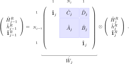
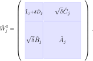

# The MPO $ W^\mathrm{I,II} $ methods

<!--TOC-->

In Ref. \onlinecite{zaletel15:_time} Zaletel et al. proposed a
generalization of the Euler approximation of the operator exponential
$e^{-\mathrm i \delta \hat{H}}$, which can be implemented efficiently
using MPOs. In this scheme, the error per site is independent of the
system size. Furthermore, the construction is capable of dealing with
long-ranged interaction terms making it suitable for two-dimensional
systems, too. Here, we will sketch the derivation of the MPO
representations $W^\mathrm{I,II}$ and discuss how to construct these
operators as well as the numerical errors and the stability of the
overall method.

## Motivation and construction

The general idea is to exploit the intrinsic factorization of MPO
representations of operators. We consider operators which have a local
structure in the sense that they are given by a sum of terms
$\hat{H}_{j}$ acting on a subset of the lattice, starting at site $j$:
$\hat{H} = \sum_{j}\hat{H}_{j}$. The Euler approximation of the
operator exponential is $e^{-\mathrm i \delta \hat{H}} = 1 - \mathrm i
\delta\sum_{j}\hat{H}_{j} + \mathcal{O}(\delta^2)$ and since there are
$\sim L^2$ contributions from all possible combinations of local terms
with finite support the error _per site_ is $\sim L\delta^{2}$;
hence the approximation becomes more and more unstable with increasing
system size. Ref. \onlinecite{zaletel15:_time} introduced the following
local version of the Euler stepper

\begin{align}
	e^{-\mathrm i \delta \hat{H}} &= 1 -\mathrm i \delta \sum_{j}\hat{H}_{j} - \delta^{2}{\sum_{j \lt k}}^{\prime}\hat{H}_{j}\hat{H}_{k} + \mathcal{O}(L\delta^2) + \mathcal{O}(\delta^3)\\
		      	     	      & \approx \prod_{j}(1 - \mathrm i \delta\hat{H}_{j})  \equiv \hat{U}^{\mathrm I}(\delta) \; ,
\end{align}

where the primed sum indicates that the local operator terms
$\hat{H}_{j},\hat{H}_{k}$ do not act on a common subset of the
lattice, i.e., they do not overlap. Even though the error of $\hat
U^{\mathrm{I}}$ is still of order $\delta^2$ in the step size there
are only $\mathcal{O}(L)$ contributions which are missed, namely those
combinations of local terms with overlapping support. Hence, the
overall error is bounded by $\mathcal{O}(L\delta^2)$, and thus the
error per site is constant in the system size.

Recall now the decomposition of an MPO into a left, right and local part
\begin{equation}
	\hat{H} = \hat{H}^{L}_{j-1} \otimes \mathbf{\hat{1}}^{R}_{j} + \mathbf{\hat{1}}^{L}_{j}\otimes \hat{H}^{R}_{j+1} + \sum_{a_j=1}^{N_j}\hat{h}^{L}_{j;a_j} \otimes \hat{h}^{R}_{j;a_j} \; . \label{eq:mpowii:splitting}
\end{equation}
with $N_j$ interaction terms crossing bond $j$, or equivalently:

The operator-valued matrices
$\hat{A}_{j},\hat{B}_{j},\hat{C}_{j},\hat{D}_{j}$ specify the local
structure of the interactions described by $\hat{H}$ and the set of
all matrices $\hat{W}_{1}\ldots\hat{W}_{L}$ define the MPO
representation of $\hat{H}$. The MPO representation $W^{\mathrm I}$ of
$\hat U^{\mathrm{I}}$ is given by

In this case the representation of $\hat{H}$ as finite state machine
is particularly useful since it permits to directly deduce the MPO
representation for $W^{\mathrm I}$. The MPO bond dimension of
$W^{\mathrm I}$ is $w -1$ with $w$ the bond dimension of
$\hat{H}$. Hence, this MPO can be applied numerically very
efficiently.

However, the restriction of $W^{\mathrm I}$ to treat only
non-overlapping local operator terms $\hat{H}_{j}$ is very strong and
fails to even reproduce the correct time evolution of a purely on-site
Hamiltonian. For example, $W^{\mathrm I}$ for
$\hat{H}=\sum_{j}\hat{s}^{z}_{j}$ generates only operator strings
$\hat{s}^{z}_{k}\cdots\hat{s}^{z}_{k+n}$ but not $\hat s^z_k \hat
s^z_k$. An improvement is to permit operator strings that overlap on
one site:
\begin{equation}
	\hat{U}^{\mathrm{II}}(\delta) = 1 - \mathrm i \delta\sum_{j}\hat{H}_{j} - \frac{\delta^2}{2}{\sum_{j,k}}^{\prime\prime}\hat{H}_{j}\hat{H}_{k} +\cdots  \; ,
\end{equation}
where the double-primed sum only excludes terms
$\hat{H}_{j},\hat{H}_{k}$ overlapping at more than one site, sharing a
bond. For instance, consider the expansion of the time-evolution
operator for the $S=1/2$-Heisenberg chain: expressions of the form
$\left(\hat{s}^{+}_{j}\hat{s}^{-}_{j+1}\right)\left(\hat{s}^{z}_{j+1}\right)$
are kept, while those of the form
$\left(\hat{s}^{+}_{j}\hat{s}^{-}_{j+1}\right)\left(\hat{s}^{z}_{j}\hat{s}^{z}_{j+1}\right)$
are discarded.  Hence, the error is again of order $\delta^2$ but
contributions with arbitrary powers of single-site terms are treated
exactly.  There is no closed general MPO representation for
$\hat{U}^{\mathrm{II}}$ but we can give an approximation which has an
error $\mathcal{O}(\delta^3)$ and hence does not affect the
second-order approximation of $\hat{U}^{\mathrm{II}}$.  In the
following we will first explicitly demonstrate how to numerically
construct the MPO representation $W^{\mathrm{II}}$ from the
block-triangular structure of the MPO representation of $\hat{H}$ and
subsequently motivate the used formalism. As for $\hat
U^{\mathrm{I}}$, the MPO representation of $\hat U^{\mathrm{II}}$ is
of the form
\begin{equation}
	\hat{W}^{\mathrm{II}}_{j} = 
	\left(
		\begin{array}{cc}
			\hat{W}^{\mathrm{II}}_{D_j} & \hat{W}^{\mathrm{II}}_{C_j} \\
			\hat{W}^{\mathrm{II}}_{B_j} & \hat{W}^{\mathrm{II}}_{A_j}
		\end{array}
	\right) \; .
\end{equation}

In order to construct the matrices
$W^{\mathrm{II}}_{\left\{A_j,B_j,C_j,D_j\right\}}$ we employ
transition amplitudes between hard-core bosonic states (see the
detailed derivation later) following the notation in
Ref. \onlinecite{zaletel15:_time}. Let $\mathcal{H}_{2,a_j}$ denote
the $a_j$-th hard-core bosonic Hilbert space. $N_j$ of these spaces
form $\mathcal{H}_{c}=\bigotimes_{a_j=1}^{N_j}\mathcal{H}_{2,a_j}$ and
we work in the joint Hilbert space
$\mathcal{H}_{c}\otimes\mathcal{H}_{\bar{c}}$ which spans $2 N_j$
individual hard-core bosonic Hilbert spaces. The ladder operators
acting on $\mathcal{H}_{c}$ and $\mathcal{H}_{\bar{c}}$ are
$\hat{c}^{\dagger}_{a_j},\hat{c}_{a_j},
\hat{\bar{c}}^{\dagger}_{\bar{a}_j}$ and
$\hat{\bar{c}}_{\bar{a}_j}$ respectively.

The generator of the matrix elements is a map on the joint bosonic and physical Hilbert spaces $\mathcal{H}_{c}\otimes\mathcal{H}_{\bar{c}}\otimes\mathcal{H}_{\mathrm{phys}}$ and given by the operator-valued exponentials 
\begin{equation}
	\hat{\Phi}_{j;a_j,\bar{a}_j} = e^{\hat{F}_{j;a_j,\bar{a}_j}} = e^{ \hat{c}^{\dagger}_{a_j}\hat{\bar{c}}^{\dagger}_{\bar{a}_j}\hat{A}_{j;a_j,\bar{a}_j} + \sqrt{\delta}(\hat{c}^{\dagger}_{a_j}\hat{B}_{j;a_j} + \hat{\bar{c}}^{\dagger}_{\bar{a}_j}\hat{C}_{j;\bar{a}_j}) + \delta\hat{D}_j}\; .
\end{equation}
Denoting the combined bosonic vacuum state by $\ket{0}\otimes\ket{\bar{0}} \equiv \ket{0,\bar{0}}$ the following transition amplitudes determine the operator-valued entries of the MPO representation $\hat{W}^{\mathrm{II}}_j$:
\begin{align}
	\hat{W}^{\mathrm{II}}_{A_j;a_j,\bar{a}_j} 
		&= 
			\bra{0,\bar{0}}
			\hat{c}_{a_j}
			\hat{\bar{c}}_{\bar{a}_j} 
			\hat{\Phi}_{j;a_j,\bar{a}_j} 
			\ket{0,\bar{0}} 
			= 
				\bra{0}
				\hat{c}_{a_j}
				\hat{\bar c}_{\bar{a}_j}
				e^{ 
					\hat{c}^{\dagger}_{a_j}
					\hat{\bar{c}}^{\dagger}_{\bar{a}_j}
					\hat{A}_{j;a_j,\bar{a}_j} 
					+ 
					\sqrt{\delta}
					(
						\hat{c}^{\dagger}_{a_j}
						\hat{B}_{j;a_j}
						+
						\hat{\bar{c}}^{\dagger}_{\bar{a}_j}
						\hat{C}_{j;\bar{a}_j}
					)
					+
					\delta\hat{D}_j
				}
				\ket{0} 
				\label{eq:WII:matrix-element-A}
\\
	\hat{W}^{\mathrm{II}}_{B_j;a_j} 
		&= 
			\bra{0,\bar{0}}
			\hat{c}_{a_j} 
			\hat{\Phi}_{j;a_j,\bar{a}_j} 
			\ket{0,\bar{0}} 
			= 
				\bra{0}
				\hat{c}_{a_j} 
				e^{
					\sqrt{\delta}
					\hat{c}^{\dagger}_{a_j}
					\hat{B}_{j;a_j}
					+ 
					\delta\hat{D}_j
				}
				\ket{0}
				\label{eq:WII:matrix-element-B}
\\
	\hat{W}^{\mathrm{II}}_{C_j;\bar{a}_j} 
		&= 
			\bra{0,\bar{0}}
			\hat{\bar{c}}_{\bar{a}_j} 
			\hat{\Phi}_{j;a_j,\bar{a}_j} 
			\ket{0,\bar{0}} 
			= 
				\bra{\bar{0}}
				\hat{\bar{c}}_{\bar{a}_j} 
				e^{ 
					\sqrt{\delta}
					\hat{\bar{c}}^{\dagger}_{\bar{a}_j}
					\hat{C}_{j;\bar{a}_j}
					+ 
					\delta\hat{D}_j
				} 
				\ket{\bar{0}} 
				\label{eq:WII:matrix-element-C}
\\
	\hat{W}^{\mathrm{II}}_{D_j} 
		&= 
			\bra{0,\bar{0}}
			\hat{\Phi}_{j;a_j,\bar{a}_j}
			\ket{0,\bar{0}} 
			= 
				e^{ 
					\delta\hat{D}_j
				} 
\; . \label{eq:WII:matrix-element-D}
\end{align}
For clarity, in the following we will explicitly demonstrate the calculation of the elements of $W^{\mathrm{II}}_{A_j;a_j,\bar{a}_j}$.
Explicitly, we use
\begin{align}
  \ket{0}_{a_j} &=\left(\begin{array}{c} 1 \\ 0 \end{array}\right) \in \mathcal{H}_{2,a_j}, & 
  \hat{c}_{a_j} &= \left(\begin{array}{cc} 0 & 1 \\ 0 & 0 \end{array} \right), & 
  \hat{c}^{\dagger}_{a_j} &= \left(\begin{array}{cc} 0 & 0 \\ 1 & 0 \end{array} \right), & 
  \mathbf{\hat{1}}_{a_j} &= \left(\begin{array}{cc} 1 & 0 \\ 0 & 1 \end{array} \right)
\end{align}
to represent the hard-core bosonic states and operators.
Since $\hat{F}_{j;a_j,\bar{a}_j}$ only contains creation operators for the modes $a_j,\bar{a}_j$ the vacuum expectation value over all $2N_{j}$ bosonic modes can be simplified to the relevant modes, i.e., we can replace $\ket{0,\bar{0}} \rightarrow \ket{0_{a_j},\bar{0}_{\bar{a}_j}}$.
Therefore, the generator is obtained by exponentiating the matrix
\begin{align}
	\hat{F}_{j;a_j,\bar{a}_j} &= 
	\hat{c}^{\dagger}_{a_j}\otimes\hat{\bar{c}}^{\dagger}_{\bar{a}_j} \hat{A}_{j;a_j,\bar{a}_j} + \sqrt{\delta}\left(\hat{c}^{\dagger}_{a_j}\otimes\mathbf{\hat{1}}_{\bar{a}_j}\hat{B}_{j;a_j} + \mathbf{\hat{1}}_{a_j}\otimes \hat{\bar{c}}^{\dagger}_{\bar{a}_j} \hat{C}_{j;\bar{a}_j} \right) + \mathbf{\hat{1}}_{a_j}\otimes\mathbf{\hat{1}}_{\bar{a}_j} \delta\hat{D}_j \\
	&=
	\left(
		\begin{array}{cccc}
			\delta\hat{D}_j & 0 & 0 & 0 \\
			\sqrt{\delta}\hat{C}_{j;\bar{a}_j} & \delta\hat{D}_j & 0 & 0 \\
			\sqrt{\delta}\hat{B}_{j;a_j} & 0 & \delta\hat{D}_j & 0 \\
			\hat{A}_{j;a_j,\bar{a}_j} & \sqrt{\delta}\hat{B}_{j;a_j} & \sqrt{\delta}\hat{C}_{j;\bar{a}_j} & \delta\hat{D}_j
		\end{array}
	\right) \; ,
\end{align}
which has been truncated to the relevant bosonic Hilbert spaces $\mathcal{H}_{2,a_j},\mathcal{H}_{2,\bar{a}_j}$.
The entries of $\hat{W}^{\mathrm{II}}_{A_j;a_j,\bar{a}_j}$ are then obtained by evaluating the power series of the matrix exponential and calculating the vacuum expectation value
\begin{align}
	\hat{W}^{\mathrm{II}}_{A_j;a_j,\bar{a}_j} &= \bra{0,\bar{0}}\hat{c}_{a_j}\hat{\bar{c}}_{\bar{a}_j} \hat{\Phi}_{j;a_j,\bar{a}_j} \ket{0,\bar{0}} = \bra{1_{a_j},\bar{1}_{\bar{a}_j}} \hat{\Phi}_{j;a_j,\bar{a}_j} \ket{0,\bar{0}} \notag \\
	&= \left(\begin{array}{cccc} 0 & 0 & 0 & 1 \end{array}\right) 
	\exp\left\{
	\left(
		\begin{array}{cccc}
			\delta\hat{D}_j & 0 & 0 & 0 \\
			\sqrt{\delta}\hat{C}_{j;\bar{a}_j} & \delta\hat{D}_j & 0 & 0 \\
			\sqrt{\delta}\hat{B}_{j;a_j} & 0 & \delta\hat{D}_j & 0 \\
			\hat{A}_{j;a_j,\bar{a}_j} & \sqrt{\delta}\hat{B}_{j;a_j} & \sqrt{\delta}\hat{C}_{j;\bar{a}_j} & \delta\hat{D}_j
		\end{array}
	\right)\right\}
	\left(\begin{array}{c} 1 \\ 0 \\ 0 \\ 0 \end{array}\right)\; .
\end{align}
A compact notation for all matrix elements of $W^\mathrm{II}$ can be
obtained if we let the annihilation operators
$\hat{c}_{a_j},\hat{c}_{\bar{a}_j}$ in Eqs. (7)-(10) act on the bra
$\bra{0,\bar{0}}$ and define the formal symbol
$\mathcal{S}_j\in\left\{A_j,B_j,C_j,D_j \right\}$
\begin{align}
	\hat{W}^{\mathrm{II}}_{\mathcal{S}_j;a_j,\bar{a}_j} 
	&=
	\left( \begin{array}{cccc} \delta_{\mathcal{S}_j,D_j} & \delta_{\mathcal{S}_j,C_j} & \delta_{\mathcal{S}_j,B_j} & \delta_{\mathcal{S}_j,A_j} \end{array}\right)
	\exp\left\{
	\left(
		\begin{array}{cccc}
			\delta\hat{D}_j & 0 & 0 & 0 \\
			\sqrt{\delta}\hat{C}_{j;\bar{a}_j} & \delta\hat{D}_j & 0 & 0 \\
			\sqrt{\delta}\hat{B}_{j;a_j} & 0 & \delta\hat{D}_j & 0 \\
			\hat{A}_{j;a_j,\bar{a}_j} & \sqrt{\delta}\hat{B}_{j;a_j} & \sqrt{\delta}\hat{C}_{j;\bar{a}_j} & \delta\hat{D}_j
		\end{array}
	\right)\right\}
	\left(\begin{array}{c} 1 \\ 0 \\ 0 \\ 0 \end{array}\right)\; .
\end{align}
Hence, the $N^{2}_j$ exponentials $\exp\left\{\hat{F}_{j;a_j,\bar{a}_j}\right\}$ already contain all relevant information to construct the stepper $W^\mathrm{II}$ and in particular there is no need to calculate different exponentials as suggested by Eqs. (7)-(10).

## Detailed derivation of the $ W^{\mathrm{II}} $ representation 

This part presents the construction of $W^\mathrm{II}$ in more detail, following
Ref. \onlinecite{zaletel15:_time}.  Before digging into the
details, let us briefly sketch the derivation: The goal is to find an
MPO representation of the time stepper $\hat{U}^{\mathrm{II}}(\delta)$
capturing interaction terms in the series expansion as described
above.  The corresponding MPO site tensors $W^\mathrm{II}$ are obtained by
making use of the MPO recursion to
factorize the exponential $e^{-\mathrm i \delta \hat{H}}$.  The
factorization itself is performed exploiting complex Gaussian
integrals via the introduction of auxiliary fields
$\phi_{j},\bar{\phi}_{j}$ on each bond which are integrated over.
The resulting MPO is of the form
\begin{align}
	W^{\mathrm{II}} &= \int D[\phi_{1},\bar{\phi}_{1}] U_{\bar{\phi}_{1}}e^{-\bar{\phi}_{1}\phi_{1}}\int D[\phi_{2},\bar{\phi}_{2}]U_{\phi_{1},\bar{\phi}_{2}}e^{-\bar{\phi}_{2}\phi_{2}}U_{\phi_{2},\bar{\phi}_{3}}\cdots \;,
\end{align}

that is, the bond indices $\phi_{j},\bar{\phi}_{j}$ are continuous
degrees of freedom.  In a final step, these bond indices are
discretized using bosonic coherent state path integrals yielding the
desired expression for the MPO site tensors.

We begin by employing the bond representation of $\hat{H}$ (compare Eq. (3)) and write the operator as a formal scalar product over auxiliary degrees of freedom $a_j = 1\ldots N_j$, where $N_j$ again is the number of interaction terms crossing the bond $j$,
\begin{align}
	\hat{H} &= \hat{H}^{L}_{j-1}\otimes \mathbf{\hat{1}}^{R}_{j} + \mathbf{\hat{1}}^{L}_{j}\otimes \hat{H}^{R}_{j+1} + 
	\left(\begin{array}{ccc}\hat{h}^{L}_{j;1} & \ldots & \hat{h}^{L}_{j;N_j} \end{array}\right)
	\left(\begin{array}{c}\hat{h}^{R}_{j;1} \\ \vdots \\ \hat{h}^{R}_{j;N_j} \end{array} \right) \\
	&\equiv 
	\hat{H}^{L}_{j-1}\otimes \mathbf{\hat{1}}^{R}_{j} + \mathbf{\hat{1}}^{L}_{j}\otimes \hat{H}^{R}_{j+1} + \hat{J}^{t}_{j} \hat{\bar J}^{\phantom{t}}_{j}
\end{align}
and the product between the entries of the operator-valued ``vectors'' $\hat{J}_{j}$ and $\hat{\bar J}_{j}$ are tensor products between operators acting on partitioned Hilbert spaces to the left and right of the bond $j$, respectively.
Next, we introduce complex vector fields $\phi_{j;a_j}$ and their complex conjugate $\bar \phi_{j;a_j}$ and define a mapping from the auxiliary indices into the full Hilbert space
\begin{align}
  \hat{J}^{t}_{j}\cdot \bar{\phi}^{\phantom{t}}_{j}: \quad \left(\mathcal{H}^{L}_{j} \rightarrow \mathcal{H}^{L}_{j}\right)^{\otimes N_j} \times \mathbb{C}^{N_j} & \longrightarrow \left( \mathcal{H} \to \mathcal{H}\right) \notag \\
  \left(\hat{J}_{j} , \bar{\phi}_{j}\right) & \longmapsto \hat{J}^{t}_{j}\cdot \bar{\phi}^{\phantom{t}}_{j} := \hat{h}^{L}_{j;1}\bar{\phi}^{\phantom{L}}_{j;1}\mathbf{\hat 1}^{R}_{j} + \cdots + \hat{h}^{L}_{j;N_j} \bar{\phi}^{\vphantom{R}}_{j;N_j}\mathbf{\hat 1}^{R}_{j} \\
  \phi_{j}\cdot \hat{\bar J}_{j}: \quad \mathbb{C}^{N_j} \times \left(\mathcal{H}^{R}_{j} \rightarrow \mathcal{H}^{R}_{j}\right)^{\otimes N_j} &\longrightarrow  \left( \mathcal{H} \to \mathcal{H}\right) \notag\\
  \left(\phi_{j}, \hat{\bar J}_{j}\right) & \longmapsto \phi_{j}\cdot \hat{\bar J}_{j} := \mathbf{\hat 1}^{L}_{j}\phi^{\vphantom{R}}_{j;1}\hat{h}^{R}_{j;1} + \cdots + \mathbf{\hat 1}^{L}_{j}\phi^{\vphantom{R}}_{j;N_j}\hat{h}^{R}_{j;N_j} \;,
\end{align}
where we will suppress the identities acting on the left and right partitions of the Hilbert space in the following.
We then use complex Gaussian integrals to decouple each left and right interaction term
\begin{align}
	e^{\hat{J}_{j;a_j} \hat{\bar J}_{j;a_j}} &= \frac{1}{\pi}\int d\phi_{j;a_j}d\bar{\phi}_{j;a_j} e^{-\bar{\phi}_{j;a_j}\cdot\phi_{j;a_j} + \hat{J}_{j;a_j}\cdot\bar{\phi}_{j;a_j} + \phi_{j;a_j}\cdot\hat{\bar J}_{j;a_j} } \;.
\end{align}
Furthermore, we factorize the operator exponential $e^{-\mathrm i\delta \hat{H}}$ (setting $\tau = -\mathrm i \delta$)
\begin{align}
	e^{\tau\hat{H}} &= e^{\tau \left( \hat{H}^{L}_{j-1}\otimes \mathbf{\hat{1}}^{R}_{j} + \mathbf{\hat{1}}^{L}_{j}\otimes \hat{H}^{R}_{j+1} + \hat{J}^{t}_{j} \hat{\bar J}^{\phantom{t}}_{j} \right)} \notag\\
	&= e^{\tau \hat{H}^{L}_{j-1}\otimes \mathbf{\hat{1}}^{R}_{j}} e^{\tau \mathbf{\hat{1}}^{L}_{j}\otimes \hat{H}^{R}_{j+1}} e^{\tau \hat{J}^{t}_{j} \hat{\bar J}^{\phantom{t}}_{j}} + \mathcal{O}(\tau^2) \label{eq:te:wii:Trotterization}
\end{align}
where the error occurs at second order in $\tau$ if the operators $\hat{J}_{j},\hat{\bar J}_{j},\hat{H}^{L}_{j-1},\hat{H}^{R}_{j+1}$ do not commute.\footnote{The commutators need to be evaluated on the full Hilbert space by completing the partitioned operators $\hat{J}_{j},\hat{\bar J}_{j},\hat{H}^{L}_{j-1},\hat{H}^{R}_{j+1}$ which is achieved by taking the appropriate tensor products with $\mathbf{\hat 1}^{L}_{j}$ and $\mathbf{\hat 1}^{R}_{j}$.}
Exploiting $N_j$ complex Gaussian integrals and defining $D\left[\phi_{j},\bar{\phi}_{j} \right] = \prod_{a_j} \frac{d\phi_{j;a_j}}{\sqrt{\pi}}\frac{d\bar{\phi}_{j;a_j}}{\sqrt{\pi}}$ we obtain
\begin{align}
	e^{\tau\hat{H}} 
	&= 
	\int D\left[\phi^{\vphantom{R}}_{j},\bar{\phi}^{\vphantom{R}}_{j} \right] e^{\tau\hat{H}^{L}_{j-1}\otimes \mathbf{\hat{1}}^{R}_{j}} e^{\tau\mathbf{\hat{1}}^{L}_{j}\otimes \hat{H}^{R}_{j+1}} e^{-\bar{\phi}^{\vphantom{R}}_{j}\cdot\phi^{\vphantom{R}}_{j} + \sqrt{\tau}\hat{J}^{\vphantom{R}}_{j}\cdot\bar{\phi}^{\vphantom{R}}_{j} + \sqrt{\tau}\phi^{\vphantom{R}}_{j}\cdot\hat{\bar J}^{\vphantom{R}}_{j}} + \mathcal{O}(\tau^{2})\notag \\
	&=
	\int D\left[\phi_{j},\bar{\phi}_{j} \right] e^{\tau\hat{H}^{L}_{j-1} \cdot \mathbf{\hat{1}}^{R}_{j} + \sqrt{\tau}\hat{J}_{j}\cdot\bar{\phi}_{j}} e^{-\bar{\phi}_{j}\cdot\phi_{j}} e^{\tau\mathbf{\hat{1}}^{L}_{j} \cdot \hat{H}^{R}_{j+1} + \sqrt{\tau}\phi_{j}\cdot\hat{\bar J}_{j}} + \mathcal{O}(\tau^{2}) \; .
\end{align}
Here we used that the identities $\mathbf{\hat 1}^{L}_{j}$ and $\mathbf{\hat 1}^{R}_{j}$ can also be interpreted as maps from an auxiliary index into the full Hilbert space.

Now the MPO recursion can be applied to, e.g., shift the active bond $j\rightarrow j+1$ in the third exponential
\begin{align}
	e^{\tau \mathbf{\hat{1}}^{L}_{j}\cdot \hat{H}^{R}_{j+1} + \sqrt{\tau}\phi^{\vphantom{R}}_{j}\hat{\bar J}^{\vphantom{R}}_{j}} 
	&= 
	e^{ \tau \mathbf{\hat 1}^{\vphantom{R}}_{j}\cdot \hat{H}^{R}_{j+1} + \sqrt{\tau}\phi^{\vphantom{R}}_{j}\cdot\hat{A}^{\vphantom{R}}_{j}\hat{\bar{J}}^{\vphantom{R}}_{j+1} + \sqrt{\tau}\phi^{\vphantom{R}}_{j}\cdot\hat{B}^{\vphantom{R}}_{j}\mathbf{\hat 1}^{R}_{j+1} + \tau \hat{C}^{\vphantom{R}}_{j}\hat{\bar{J}}^{\vphantom{R}}_{j+1} + \tau \hat{D}^{\vphantom{R}}_{j}\cdot \mathbf{\hat 1}^{R}_{j+1}}\; .
\end{align}
From now on we replace the formal dot product $\hat{D}^{\vphantom{R}}_{j}\cdot \mathbf{\hat 1}^{R}_{j+1}$ by its action on the full Hilbert space which reduces for the case of $\hat{D}^{\vphantom{R}}_{j}$ to on-site terms only.
The same holds for the dot product $\phi^{\vphantom{R}}_{j}\cdot\hat{B}^{\vphantom{R}}_{j}\mathbf{\hat 1}^{R}_{j+1} \equiv \phi^{\vphantom{R}}_{j}\cdot\hat{B}^{\vphantom{R}}_{j}$ which only connects sites to the left of $j$.
In the exponent the summands $\sqrt{\tau}\phi^{\vphantom{R}}_{j}\cdot\hat{B}^{\vphantom{R}}_{j}\cdot\mathbf{\hat 1}^{R}_{j+1} ,\tau \hat{D}^{\vphantom{R}}_{j}\cdot \mathbf{\hat 1}^{R}_{j+1}$ and $\tau \mathbf{\hat 1}_{j}\cdot \hat{H}^{R}_{j+1}$ already act separately on site $j$ and the right partition of the Hilbert space $\mathcal{H}^{R}_{j+1}$.
In order to separate the remaining summands, too, we introduce another set of auxiliary fields $\phi^{\vphantom{R}}_{j+1},\bar{\phi}^{\vphantom{R}}_{j+1}$ by insertion of more complex Gaussian integrals
\begin{align}
	e^{\sqrt{\tau}\phi_{j}\cdot\hat{A}_{j}\hat{\bar{J}}_{j+1} + \tau \hat{C}_{j}\cdot\hat{\bar{J}}_{j+1}}
	= 
	\int D\left[\phi_{j+1},\bar{\phi}_{j+1} \right] e^{-\bar{\phi}_{j+1}\phi_{j+1}} e^{\phi_{j}\cdot\hat{A}_{j}\cdot\bar{\phi}_{j+1} + \sqrt{\tau}\hat{C}_{j}\cdot\bar{\phi}_{j+1}+\sqrt{\tau}\phi_{j+1}\cdot \hat{\bar{J}}_{j+1}} \notag \\
	\Rightarrow 
	e^{\tau \mathbf{\hat{1}}^{L}_{j}\cdot \hat{H}^{R}_{j+1} + \sqrt{\tau}\phi^{\vphantom{R}}_{j}\cdot\hat{\bar J}^{\vphantom{R}}_{j}} = \int D\left[\phi_{j+1},\bar{\phi}_{j+1} \right] U_{\phi_{j},\bar{\phi}_{j+1}}e^{-\bar{\phi}^{\vphantom{R}}_{j+1}\phi^{\vphantom{R}}_{j+1}} e^{\tau\mathbf{\hat 1}^{L}_{j+1}\cdot\hat{H}^{R}_{j+2} + \sqrt{\tau}\phi^{\vphantom{R}}_{j+1}\cdot\hat{\bar{J}}^{\vphantom{R}}_{j+1}}
\end{align}
with $U_{\phi_{j},\bar{\phi}_{j+1}} = e^{\phi_{j}\cdot\hat{A}_{j}\cdot\bar{\phi}_{j+1} + \sqrt{\tau}\phi_{j}\cdot\hat{B}_{j} + \sqrt{\tau}\hat{C}_{j}\cdot\bar{\phi}_{j+1} + \tau\hat{D}_{j}}$.
The last equation defines a recursion 
\begin{align}
	e^{\tau \mathbf{\hat{1}}^{L}_{j}\cdot \hat{H}^{R}_{j+1} + \sqrt{\tau}\phi_{j}\cdot\hat{\bar J}_{j}} &= \mathcal{F}_{j,j+1}\left[e^{\tau \mathbf{\hat{1}}^{L}_{j+1}\cdot \hat{H}^{R}_{j+2} + \sqrt{\tau}\phi_{j+1}\cdot\hat{\bar J}_{j+1}}\right]
\end{align}
generated by the integration of $U_{\phi_{j},\bar{\phi}_{j+1}}e^{-\bar{\phi}_{j+1}\phi_{j+1}}$ over the continuous bond degrees of freedom $\phi_{j},\bar{\phi}_{j+1}$.
Iterating through the whole system we finally obtain
\begin{align}
	e^{\tau\hat{H}} &= \int D[\phi_{1},\bar{\phi}_{1}] U_{\bar{\phi}_{1}}e^{-\bar{\phi}_{1}\phi_{1}}\int D[\phi_{2},\bar{\phi}_{2}]U_{\phi_{1},\bar{\phi}_{2}}e^{-\bar{\phi}_{2}\phi_{2}}U_{\phi_{2},\bar{\phi}_{3}}\cdots + \mathcal{O}(\tau^2),
\end{align}
which is a first-order approximation in $\tau$ of $e^{\tau\hat{H}}$ in terms of an MPO with continuous bond labels $\phi_{j} = \left(\phi_{1},\cdots ,\phi_{N_j} \right)$.

In a final step the continuous bond labels $\phi_{a_j}$ are transformed into discrete ones.
We note that for a set of $N_j$ bosonic ladder operators $\hat{c}_{a_j},\hat{c}^{\dagger}_{a_j}$ we can rewrite the tensors at site $j$ as expectation values for coherent states 
\begin{align}
	\ket{\phi_{a_j}} &= \sum_{n}\frac{\phi_{a_j}^{n}}{n!} \left(\hat{c}^{\dagger}_{a_j}\right)^{n} \ket{0} \;,
\end{align}
which have the properties
\begin{align}
	 \hat{c}_{a_j}\ket{\phi_{a_j}} = \phi_{a_j}\ket{\phi_{a_j}}, \quad
	\bra{\phi_{a_j}}\hat{c}^{\dagger}_{a_j} = \bra{\phi_{a_j}} \bar{\phi}_{a_j}, \quad \langle \phi_{a_j}|\phi_{a_j} \rangle = e^{\bar{\phi}_{a_j} \phi_{a_j}}\; .
\end{align}
For instance, we may consider the case when $N_j \equiv 1$.
Then a single bond label $\phi_{j;a_j}\equiv z_{j}$ is sufficient and (abbreviating $\hat{c}_{a_j}\equiv \hat{c}_{j}$, $\hat{c}^{\dagger}_{a_j}\equiv \hat{c}^{\dagger}_{j}$) we have at the bond $(j,j+1)$
\begin{align}
	e^{z_{j} \hat{A}_{j}\bar{z}_{j+1} + \sqrt{\tau}z_{j} \hat{B}_{j} + \sqrt{\tau}\hat{C}_{j}\bar{z}_{j+1} + \tau \hat{D}_{j}}
	&= 
	\langle \bar{z}_{j}, z_{j+1} | e^{\hat{c}^{\dagger}_{j} \hat{A}_{j} \hat{c}^{\dagger}_{j+1} + \sqrt{\tau}\hat{c}^{\dagger}_{j}\hat{B}_{j} + \sqrt{\tau}\hat{C}_{j}\hat{c}^{\dagger}_{j+1} + \tau \hat{D}_{j}} | 0, 0 \rangle \notag \\
	&=
	\sum_{n_{j},n_{j+1}}
	\underbrace{\langle n_{j}, \bar{n}_{j+1} | e^{\hat{c}^{\dagger}_{j} \hat{A}_{j} \hat{c}^{\dagger}_{j+1} + \sqrt{\tau}\hat{c}^{\dagger}_{j}\hat{B}_{j} + \sqrt{\tau}\hat{C}_{j}\hat{c}^{\dagger}_{j+1} + \tau \hat{D}_{j}} | 0, 0\rangle}_{\equiv \hat{U}_{n_{j},\bar{n}_{j+1}}} \frac{ z_{j}^{n_{j}} \bar{z}_{j+1}^{\bar{n}_{j+1}}}{\sqrt{n_{j}!\, \bar{n}_{j+1}!}} \; .
\end{align}
In the last equality we expanded the coherent states $\ket{z_{j}},\ket{z_{j+1}}$ in the bosonic occupations number basis $\ket{n_{j}},\ket{\bar{n}_{j+1}}$.
Now, we turn to the integral over one pair of bond labels $z_{j},\bar{z}_{j}$, considering only those factors $\frac{z^{k_{j}}_{j}}{\sqrt{k_j!}}$ which contribute to the integration,
\begin{align}
	\int\frac{dz_{j}d\bar{z}_{j}}{\pi}\hat{U}_{z_{j-1},\bar{z}_{j}}e^{-\bar{z}_{j}z_{j}}\hat{U}_{z_{j},\bar{z}_{j+1}}
	&=
	\sum_{n_{j},\bar{n}_{j}}\int \frac{dz_{j}d\bar{z}_{j}}{\pi} \hat{U}_{n_{j-1}, \bar{n}_{j}} e^{-\bar{z}_{j}z_{j}} \hat{U}_{n_{j},\bar{n}_{j+1}} \frac{\bar{z}^{\bar{n}_{j}}_{j} z^{n_{j}}_{j}}{\sqrt{\bar{n}_{j}!\,n_{j}!}} \notag \\
	&= \sum_{n_{j},\bar{n}_{j}} \hat{U}_{n_{j-1},\bar{n}_{j}}\hat{U}_{n_{j},\bar{n}_{j+1}} \int_{0}^{\infty} d\rho_{j} \frac{\rho^{\bar{n}_{j} + n_{j}+1}_{j}}{\sqrt{\bar{n}_{j}!\,n_{j}!}} e^{-\rho_{j}^{2}}\int_{0}^{2\pi}\frac{d \varphi_{j}}{\pi}e^{\mathrm i \varphi_{j}(n_{j}-\bar{n}_{j})} \notag \\
	&=
	\sum_{n_{j}} \hat{U}_{n_{j-1},n_{j}}\hat{U}_{n_{j},\bar{n}_{j+1}}  \frac{2}{n_{j}!} \underbrace{\int_{0}^{\infty} d\rho \rho^{2n_{j}+1}e^{-\rho^{2}}}_{=\frac{1}{2}\Gamma(n_{j})} \notag \\
	&=
	\sum_{n_{j}} \hat{U}_{n_{j-1},n_{j}}\hat{U}_{n_{j},\bar{n}_{j+1}} \; .
\end{align}
We parametrized the complex integration in polar coordinates in the second identity and exploited the representation of the $\Gamma$ function in the last line.
For the general case $N_j>1$ we define the boson occupation number $\mathbf{n}_j = (n_{1}\cdots n_{N_j})$ for each bond.
Since we can always reorder the $\phi_{a_j}$, we can perform the same integrals for each continuous bond label so that we finally find
\begin{align}
	\hat{U}(\delta) &= \sum_{\mathbf{n}_{1}\cdots \mathbf{n}_{L}} \hat{U}_{\mathbf{\bar n}_{1}} \hat{U}_{\mathbf{n}_{1},\mathbf{\bar n}_{2}} \cdots + \mathcal{O}(\delta^2),
\end{align}
yielding the desired MPO representation.

A pedestrian way to obtain a compact MPO representation from this very formal derivation is to analyze $\hat{U}_{\mathbf{n}_{j-1},\mathbf{\bar n}_{j}}$ when truncating the bosonic Hilbert spaces to a maximal boson occupation $b$, i.e.,  $n_{j;a_j} \in \left\{0,\ldots, b\right\}$.
We define bosonic field operators $\hat{\varphi}^{\dagger}_j = \left(\hat{c}^{\dagger}_{1} \cdots \hat{c}^{\dagger}_{L} \right)$ and denote the maximal occupation number by an upper index $(b)$.
Then, for each $b$ we have operator-valued bosonic matrix elements
\begin{align}
	\hat{U}^{(b)}_{j; \mathbf{n}_{j},\mathbf{\bar n}_{j+1}} &= \langle \mathbf{n}_{j},\mathbf{\bar n}_{j+1}| \underbrace{e^{\hat{\varphi}^{\dagger}_{j} \cdot \hat{A}_{j} \cdot \hat{\bar \varphi}^{\dagger}_{j+1} + \sqrt{\tau}\hat{\varphi}^{\dagger}_{j}\cdot\hat{B}_{j} + \sqrt{\tau}\hat{C}_{j} \cdot \hat{\bar \varphi}^{\dagger}_{j+1} + \tau \hat{D}_{j}}}_{\equiv \hat{\Phi}_{j}} | \mathbf{0},\mathbf{\bar 0} \rangle
\end{align}
of maps $\hat{\Phi}_{j}$ on the joint Hilbert spaces of $b$ bosons $\mathcal{H}_{b;a_j}$ for every $a_j\in\left\{1,\ldots,N_j\right\}$ at each bond and the physical Hilbert space $\mathcal{H}_{\mathrm{phys}}$ at each site
\begin{align}
	\hat{\Phi}_{j}: \bigotimes_{a_j}\mathcal{H}_{b;a_j} \otimes \bigotimes_{\bar{a}_j}\mathcal{H}_{\bar{b}; \bar{a}_j}\otimes \mathcal{H}_{\mathrm{phys}} &\longrightarrow \bigotimes_{a_j}\mathcal{H}_{b;a_j} \otimes \bigotimes_{\bar{a}_j}\mathcal{H}_{\bar{b}; \bar{a}_j}\otimes \mathcal{H}_{\mathrm{phys}}\; .
\end{align}
Let us consider $b\equiv0$, then the matrix elements collapse to pure on-site terms $\hat{U}^{(0)}_{j;\mathbf{0},\mathbf{\bar 0}} = \langle\mathbf{0},\mathbf{\bar 0}| \hat{\Phi}_{j} | \mathbf{0},\mathbf{\bar 0}\rangle = e^{\tau \hat{D}_{j}}$.
The next order $b \equiv 1$ additionally collects contributions from all interactions crossing either the bond $(j-1,j)$ or $(j,j+1)$
\begin{equation}
	\hat{U}^{(1)}_{j;\mathbf{0},\mathbf{\bar 0}} = \langle\mathbf{0},\mathbf{\bar 0}| \hat{\Phi}_{j} |\mathbf{0},\mathbf{\bar 0}\rangle, \quad
	\hat{U}^{(1)}_{j;\mathbf{0},\mathbf{\bar 1}} = \langle\mathbf{0},\mathbf{\bar 1}| \hat{\Phi}_{j} |\mathbf{0},\mathbf{\bar 0}\rangle, \quad
	\hat{U}^{(1)}_{j;\mathbf{1},\mathbf{\bar 0}} = \langle\mathbf{1},\mathbf{\bar 0}| \hat{\Phi}_{j} |\mathbf{0},\mathbf{\bar 0}\rangle, \quad
	\hat{U}^{(1)}_{j;\mathbf{1},\mathbf{\bar 1}} = \langle\mathbf{1},\mathbf{\bar 1}| \hat{\Phi}_{j} |\mathbf{0},\mathbf{\bar 0}\rangle \; ,
\end{equation}
which can be arranged as an operator-valued matrix
\begin{align}
	\hat{U}^{(1)}_{j}
	&=
	\left(
		\begin{array}{cc}
			\langle\mathbf{0},\mathbf{\bar 0}| \hat{\Phi}_{j} |\mathbf{0},\mathbf{\bar 0}\rangle & \langle\mathbf{0},\mathbf{\bar 1}| \hat{\Phi}_{j} |\mathbf{0},\mathbf{\bar 0}\rangle \\
			\langle\mathbf{1},\mathbf{\bar 0}| \hat{\Phi}_{j} |\mathbf{0},\mathbf{\bar 0}\rangle & \langle\mathbf{1},\mathbf{\bar 1}| \hat{\Phi}_{j} |\mathbf{0},\mathbf{\bar 0}\rangle
		\end{array}
	\right)
	\equiv
	\left(
		\begin{array}{cc}
			\hat{W}^{\mathrm{II}}_{D_j} & \hat{W}^{\mathrm{II}}_{C_j} \\
			\hat{W}^{\mathrm{II}}_{B_j} & \hat{W}^{\mathrm{II}}_{A_j}
		\end{array}
	\right)
	\equiv \hat{W}^{\mathrm{II}}_{j}
\end{align}
and yields the suggested form of $W^\mathrm{II}$.
The lower right matrix element $\hat{W}^{\mathrm{II}}_{A_j}$ contains two bosons.
When formally contracting $\hat{U}^{(1)}_{j}$ with the neighboring matrix $\hat{U}^{(1)}_{j+1}$, these bosons connect, for instance, all local operators from $\hat{A}_{j}$ to local operators from $\hat{B}_{j+1}$.
Following this procedure, we find that in this way truncating the MPO approximation to $b=1$ we keep all local operator strings that overlap at most at one site and hence the error is $\mathcal{O}(\tau^2)$.

## Errors

The MPO $W^\mathrm{II}$ approximation to the time-evolution operator $\hat{U}(\delta)$ primarly exhibits an error $\mathcal{O}(\delta^2)$ due to the truncation of the auxiliary degrees to hard-core bosons with maximal occupation $b\equiv 1$.
The Trotter error created by Eq. (22) was shown in Ref. \onlinecite{zaletel15:_time} to be $\mathcal{O}(\tau^3)$ so that it is subleading compared to the auxiliary boson field truncation error.
However, the $W^\mathrm{II}$ MPO representation is not invariant under the particular choice of the decomposition of the Hamiltonian into local terms $\hat{H} = \sum_{j}\hat{H}_{j}$.
This degree of freedom can be used to reduce the truncation error and is discussed in detail in Ref. \onlinecite{zaletel15:_time}.

We want to point out that the method of complex time steps discussed [[here|mps/algorithms/timeevo/tricks]] can transform a first-order stepper with error $\mathcal{O}(\delta^2)$ into a second-order stepper with error $\mathcal{O}(\delta^3)$.
This is particularly suitable for the $W^\mathrm{II}$ MPO representation since the $W^\mathrm{II}$ bond dimension $w=N_j+1$ is comparably small also for long-ranged Hamiltonians.
An improved stepper is hence available without too much numerical effort and should be used (it is used in this form in the experiments run later).
In turn, this construction in general destroys the unitarity of the stepper.
Furthermore, as discussed [[for TEBD|mps/algorithms/timeevo/tebd]], the choice of the MPO application method can significantly improve (or reduce) the accuracy of the time stepper.

---

The content of this page is based on [Time-evolution methods for matrix-product states](https://www.sciencedirect.com/science/article/pii/S0003491619302532?via%3Dihub) by S. Paeckel, T. Köhler, A. Swoboda, S. R. Manmana, U. Schollwöck and C. Hubig and is licensed under the [CC-BY 4.0](https://creativecommons.org/licenses/by/4.0/) license.
