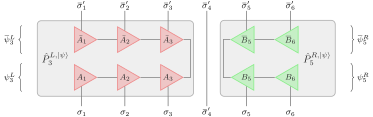
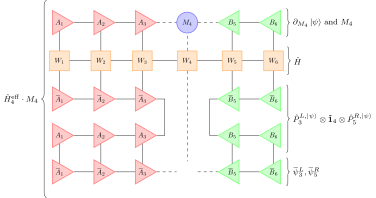
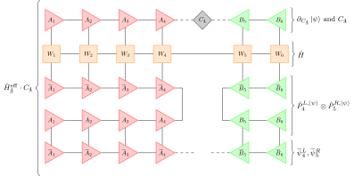

# The time-dependent variational principle (TDVP)

<!--TOC-->

The time-dependent variational
principle\cite{haegeman11:_time_depen_variat_princ_quant_lattic,
haegeman16:_unify} is an alternative to the Lie-Trotter decomposition
employed in
[[the local Krylov method|mps/algorithms/timeevo/local-krylov]]. The
motivation of this approach is quite different: its primary aim is to
constrain the time evolution to a specific manifold of matrix-product
states of a given initial bond dimension. To do so, it projects the
action of the Hamiltonian into the tangent space to this manifold and
then solves the TDSE solely within the manifold. While ideally used in
its single-site variant, the two-site variant allows for flexibility
in the bond dimension.

## Derivation

The main difference between the TDVP and the local Krylov method is in
the derivation of the series of these local time-dependent Schrödinger
equations and the recovery of the original-time step after each local
forward update: Instead of simply projecting the original site tensor
onto the new basis as done in the local Krylov approach, the TDVP
explicitly solves a backwards-evolution equation.
To embark on the derivation for the TDVP, we need to introduce a few
additional ingredients: First, we define the _single-site tangent space_ $ T_{|\psi\rangle}$ of a given MPS $|\psi\rangle$ as the space
spanned by variations of single MPS tensors.  One may e.g. change the
first site tensor of the MPS keeping all others fixed to obtain a new
state and combine the result with another MPS where only the second
site tensor was changed, but one may not change two (or more) site
tensors in the same basis state.  The projector
$\hat P_{T_{\ket{\psi}}}$ which projects onto this tangent space is
given by\cite{haegeman11:_time_depen_variat_princ_quant_lattic, haegeman16:_unify}
\begin{equation}
  \hat P_{T_{|\psi\rangle}} = \sum_{j=1}^L \hat P_{j-1}^{L, |\psi\rangle} \otimes \mathbf{\hat 1}^{\vphantom{L\ket{\psi}}}_j \otimes \hat P_{j+1}^{R,|\psi\rangle} - \sum_{j=1}^{L-1} \hat P_{j}^{L,|\psi\rangle} \otimes \hat P_{j+1}^{R,|\psi\rangle} \quad, \label{eq:tdvp:projector}
\end{equation}
where $\hat{P}^{L,\ket{\psi}}_j$ ($\hat{P}^{R,\ket{\psi}}_j$) projects on the sites left (right)
of and including site $n$  and is exactly the same as the projectors used in the local Krylov method:

These projectors use the gauge-fixed left- and right-normalised MPS
tensors, i.e. they depend on the MPS $|\psi\rangle$ and can be written
as
\begin{align}
  \hat P^{L, \ket{\psi}}_{j; \bar{\sigma}_1, \ldots, \bar{\sigma}_j, \sigma_1, \ldots, \sigma_j} & = \sum_{m_j} \bar{\psi}^{L; \bar{\sigma}_1, \ldots, \bar{\sigma}_j}_{j; m_j} \otimes \psi^{L; \sigma_1,\ldots, \sigma_j}_{j; m_j} \\
  \hat P^{R, \ket{\psi}}_{j; \bar{\sigma}_j, \ldots, \bar{\sigma}_L, \sigma_j, \ldots, \sigma_L} & = \sum_{m_{j-1}} \bar{\psi}^{R; \bar{\sigma}_j, \ldots, \bar{\sigma}_L}_{j; m_{j-1}} \otimes \psi^{R; \sigma_j,\ldots, \sigma_L}_{j; m_{j-1}} 
\end{align}
where $\psi^{L(R)}_{j}$ is the collection of left- (right-) normalised
MPS tensors on site $j$ and to its left (right) as in the local Krylov
approach.  The first contributing sum filters for all MPS which differ at most on one site from
$|\psi\rangle$, whereas the second contributing sum removes all those
states which coincide with $|\psi\rangle$.  Put differently,
individual tangent vectors are constructed by replacing any
orthogonality center tensor $M_j$ of the MPS by another tensor $N_j$
which is orthogonal to $M_j$, i.e., $M_j \cdot \bar{N}_{j} = 0$. In
contrast to the projectors $\hat \Pi_j^{\ket{\psi}}$ of the local
Krylov method, the total projector $\hat P_{T_{\ket{\psi}}}$ projects
onto some subspace of the Hilbert space and is only coincidentally
written as a sum of local terms.

Second, when inserting the projector $\hat P_{T_{|\psi\rangle}}$ into
the TDSE, we obtain
\begin{align}
  \frac{\partial}{\partial t}|\psi\rangle = & - \mathrm{i} \hat P_{T_{|\psi\rangle}} \hat H |\psi\rangle \\
                                          = & - \mathrm{i} \sum_{j=1}^L \hat P_{j-1}^{L,|\psi\rangle} \otimes \mathbf{\hat 1}^{\vphantom{L\ket{\psi}}}_j \otimes \hat P_{j+1}^{R,|\psi\rangle} \hat H |\psi\rangle + \mathrm{i} \sum_{j=1}^{L-1} \hat P_{j}^{L,|\psi\rangle} \otimes \hat P_{j+1}^{R,|\psi\rangle} \hat H |\psi\rangle \label{eq:tdvp:tdse-projected}\;.
\end{align}
While an exact solution is still not possible, we can approximate it
by solving each term individually and sequentially, i.e., solve $L$
forward-evolving equations of the form
\begin{alignat}{2}
  \frac{\partial}{\partial t}|\psi\rangle &= - \mathrm{i} \hat P_{j-1}^{L,\ket{\psi}} \otimes \mathbf{\hat 1}^{\vphantom{L\ket{\psi}}}_j \otimes \hat P_{j+1}^{R,\ket{\psi}} \hat H |\psi\rangle\label{eq:tdvp:fw}
  \intertext{and $L-1$ backward-evolving equations of the form}
  \frac{\partial}{\partial t}|\psi\rangle &= + \mathrm{i} \hat P_{j}^{L,\ket{\psi}} \otimes \hat P_{j+1}^{R,\ket{\psi}} \hat H |\psi\rangle \;.\label{eq:tdvp:bw}
\end{alignat}
We then multiply each individual equation above by the single-site map
$\bar{\psi}^L_{j-1} \otimes \bar{\psi}^R_{j+1}$ or the
center-bond map $\bar{\psi}^L_{j} \otimes \bar{\psi}^R_{j+1}$,
respectively.  As a result, instead of having to work with the full
MPS $|\psi\rangle$, we can work with the effective single-site and
effective center matrix tensors and associated local Schr\"odinger
equations directly:
\begin{align}
  \frac{\partial}{\partial t}M^{\vphantom{\mathrm{eff}}}_j &= - \mathrm{i} \hat H^{\mathrm{eff}}_{j} M^{\vphantom{\mathrm{eff}}}_j\label{eq:tdvp:fw:projected} \\
  \frac{\partial}{\partial t}C^{\vphantom{\mathrm{eff}}}_{\underline{j}} &= + \mathrm{i} \hat H^\mathrm{eff}_{\underline{j}} C^{\vphantom{\mathrm{eff}}}_{\underline{j}} \quad.\label{eq:tdvp:bw:projected}
\end{align}
The tensor contraction in the RHS of the forward evolution is 

while the RHS of the backwards evolution is

Each of these equations can be solved with a local application of the
Krylov method much as in DMRG or the local Krylov method of the
previous section.

Sweeping right-to-left (rather than left-to-right) through the system
results in solving the equations in reverse order.  This turns the
initial first-order integrator into a second-order integrator,
reducing the time step error (as described in below) from $O(\delta)$
to $O(\delta^2)$ if both sweeps are done with halved time steps
$\delta/2$.

An interesting property of the single-site TDVP variant (1TDVP) is
that the projection of the Hamiltonian onto the MPS manifold occurs
before the time evolution, the projection is the _only_ step necessary
to obtain the Lie-Trotter decomposition of the Hamiltonian, and no
truncation has to happen after the evolution.  As such, both the norm
and energy of the state are conserved under real-time evolution. This
is in contrast to the local Krylov method, where the basis
transformation generated by the $Q$ tensors is _not_ part of the
projector and hence introduces an additional error. Alternatively, it
is straightforward to extend the mechanism to a two-site variant. This
2TDVP forward-evolves a local tensor $M_{(j,j+1)}$ which needs to be
split into two separate site tensors again following the evolution.
The advantage is that the bond dimension of the state can be adapted
on the fly.  However, norm and energy are now no longer conserved
exactly if a truncation of the evolved bond is necessary.

## Errors

The TDVP has four sources of errors:
firstly, there is a _projection error_ due to the projection of
the full time-dependent Schrödinger equation (TDSE) onto the MPS
manifold of limited bond dimension.  This error is particularly severe
if the MPS in question has a small bond dimension, but it is exactly
zero if the MPS has maximal (exponentially growing) bond dimension.
However, the projection error occurs during the projection of the TDSE
onto the relevant subspace, i.e., _before_ the time evolution.  As
such, it cannot lead to a violation of energy conservation or change
the norm of the time-evolved state (during real-time evolution).
Using a two- or multi-site variance\cite{hubig18:_error} it is
possible to estimate this projection error.  If the $n$-site variance
of the state is large, the $(n-1)$TDVP will provide inadequate
results.  Vice versa, if the up-to-$n$-site variance of a state is
small, the $n$TDVP will consider this state an eigenstate of the
Hamiltonian and the time evolution will only add a global phase to the
state.  As a corollary, the 2TDVP can evolve Hamiltonians with only
nearest-neighbor interactions without incurring a projection error.

Second, the chain of forwards and backwards evolutions can be
considered a sequential solution of a series of coupled TDSE (which
are the result of the projection above), each describing the evolution
of any particular site tensor.  Except in the special case that all
these evolutions describe exactly the same dynamics (due to the state
having maximal bond dimension), there is a finite time-step error of
order $O(\delta^3)$ per time step and order $O(\delta^2)$ per unit
time.  In practice, the prefactor of this error is often much smaller
than, e.g., in a TEBD calculation, in particular if the bond dimension
of the input state is reasonably large. If the bond dimension is very
small, the time-step error will be relatively large.

Third, the 2TDVP contains a SVD to split the evolved two-site tensor
into two separate tensors again.  During this SVD, a truncation is
typically unavoidable, leading to a measurable truncation error.
Careful analysis of this truncation error is necessary as always, but
also proceeds in much the same way as always. In 1TDVP, this error is
exactly zero.

The fourth source of error lies in the inexact solution of the local
equations.  Using sufficiently many Krylov vectors locally, it is very
easy to make this error small. Therefore, one should always use
sufficiently many vectors such that the obtained error is at least
smaller than the truncation error in the previous step.

Note that changing the time-step size $\delta$ in the TDVP affects the
four errors differently: the projection and truncation error affect
each time step relatively independently of the size of that step.
Hence, increasing the number of time steps during a fixed total time
evolution increases the projection and truncation errors.  The finite
time-step error and the error from the inexact local solution, on the
other hand, decrease when increasing the number of time steps and the
total time is kept fixed.  As such, choosing a smaller $\delta$
decreases the time-step error but increases the projection and
truncation error.  It is hence typically useful to take some care when
choosing, e.g., the truncation threshold and the time-step size such as
to approximately balance the induced errors.

Additionally, the energy and norm of the state are conserved exactly
within the 1TDVP and only affected by the truncation error in the
2TDVP. This exact conservation may extend to those quantities which
are contained within the
Hamiltonian\cite{leviatan17:_quant_matrix_produc_states,
  goto18:_perfor}. While such energy conservation is certainly very
helpful to obtain long-time hydrodynamic observables such as diffusion
constants, care has to be taken when using only 1TDVP during the
calculation as shown in Ref.~\cite{kloss18:_time}. Specifically, one
has to take great care to ensure that the obtained data is completely
converged in the bond dimension of the state at all times.

## Algorithm

In practice, the 1/2TDVP method is quite similar to the 1/2DMRG method
without subspace expansion or density matrix perturbation and nearly
identical to the local Krylov method. Compared to the DMRG method, one
of course has to replace the local eigensolver by a local
exponentiation. Compared to both the local Krylov and the DMRG
methods, we also need an additional backwards evolution step either on
each bond (1TDVP) or the second site of a two-site evolution
(2TDVP). This replacement of the ad-hoc basis transformation done by
the local Krylov method with a properly motivated backwards evolution
will result in smaller errors in each step.

### Common Helper Functions

First, let us define some common helper functions. These are identical
to those used in standard DMRG ground-state search algorithms. In
addition, we need a local exponential Lanczos solver. For a more
detailed description of solver used to evaluate the local
exponentials, see [[the page on the global Krylov
method|mps/algorithms/timeevo/global-krylov]]. 1TDVP and 2TDVP then
only differ in which \texttt{SWEEP-LEFT} and \texttt{SWEEP-RIGHT}
functions are called from within the \texttt{TIMESTEP} function.

\begin{align}
  & \texttt{CONTRACT-LEFT}(L_{j-1}, W_j, A_j) \; \{ \\
  & \quad L_{j; m_j}^{\bar{m}_j, w_j} = 
					\sum_{
						\sigma_{j}, 
						\sigma^\prime_{j}, 
						w_{j-1}, 
						m_{j-1}, 
						\bar{m}_{j-1}
					} 
						L_{j-1; m_{j-1}}^{\bar{m}_{j-1}, w_{j-1}}
						\bar{A}^{\sigma_{j}}_{j;\bar{m}_{j-1}, \bar{m}_{j}} 
						W_{j; w_{j-1}, w_{j}}^{\sigma_{j}, \sigma^\prime_{j}} 
						A^{\sigma^\prime_{j}}_{j; m_{j-1}, m_{j}} \\
  & \} \\
  & \nonumber \\
  & \texttt{CONTRACT-RIGHT}(R_{j+1}, W_j, B_j) \; \{ \\
  & \quad R_{j; m_{j-1}}^{\bar{m}_{j-1}, w_{j-1}} = 
    \sum_{
    \sigma_{j}, 
    \sigma^\prime_{j}, 
    w_j, 
    m_j, 
    \bar{m}_j
    }
    \bar{B}^{\sigma_{j}}_{\bar{m}_{j-1}, \bar{m}_{j}} 
    W_{j; w_{j-1}, w_{j}}^{\sigma_{j}, \sigma^\prime_{j}}
    B^{\sigma^\prime_{j}}_{j; m_{j-1}, m_{j}} R_{j+1; m_j}^{\bar{m}_j, w_j} \\
  & \} \\
  & \nonumber \\
  & \texttt{INITIALISE}(\textrm{MPO } \{ W_j \}_{j=1}^L, \textrm{MPS } \{ M_j \}_{j=1}^L) \; \{ \\
  & \quad L_{0;m_0}^{\bar{m}_0, w_0} \gets 1 \textrm{ and } R_{L+1;m_L}^{\bar{m}_L,w_L} \gets 1 \\
  & \quad \textrm{Right-normalize } \{ M_j \}_{j=1}^L \to \{ B_j \}_{j=1}^L \textrm{ from right to left } \\
  & \quad \textbf{for } j \in [L, 2] \{ \\
  & \quad \quad R_j \gets \texttt{CONTRACT-RIGHT}(R_{j+1}, W_j, B_j) \\
  & \quad \} \\
  & \quad \textbf{return } L_0, \; \{ R_j \}_{j=2}^{L+1}, \; \{ B_j \}_{j=1}^L \\
  & \} \\
  & \nonumber \\
  & \texttt{TIMESTEP}(\delta, \; L_0, \; \{ R_j \}_{j=2}^{L+1}, \; \{ W_j \}, \; \{ M_1, \; B_j \}_{j=2}^L) \; \{ \\
  & \quad \{ L_j \}_{j=0}^{L-1}, \; \{ A_j, M_L \}_{j=1}^{L-1} \gets \texttt{SWEEP-RIGHT}(\frac{\delta}{2}, \; L_0, \; \{ R_j \}_{j=2}^L, \; \{ W_j \}_{j=1}^L, \; \{ M_1, B_j \}_{j=2}^L) \\
  & \quad \{ R_j \}_{j=2}^{L+1}, \; \{ M_1, B_j \}_{j=2}^L \gets  \texttt{SWEEP-LEFT}(\frac{\delta}{2}, \; R_{L+1}, \; \{ L_j \}_{j=0}^{L-1}, \; \{ W_j \}_{j=1}^L, \; \{ A_j, M_L \}_{j=1}^{L-1}) \\
  & \} \\
\end{align}

### 1TDVP

\begin{align}
  & \texttt{SWEEP-RIGHT}(\delta, \; L_0, \; \{ R_j \}_{j=2}^{L+1}, \; \{ W_j \}_{j=1}^L, \; \{ M_1, \; B_j \}_{j=2}^L) \; \{ \\
  & \quad \textbf{for } j \in [1, L] \\
  & \quad \quad M^{\vphantom{\mathrm{eff}}}_j \gets \mathrm{exp}(-\mathrm{i}\frac{\delta}{2} \hat H^{\mathrm{eff}}_j) M^{\vphantom{\mathrm{eff}}}_j \textrm{ using } \hat H_j^{\mathrm{eff}} \equiv L^{\vphantom{\mathrm{eff}}}_{j-1} \cdot W^{\vphantom{\mathrm{eff}}}_j \cdot R^{\vphantom{\mathrm{eff}}}_{j+1} \\
  & \quad \quad A_j, C_{\underline{j}} \gets M_j \textrm{ via QR decomposition} \\
  & \quad \quad L_j \gets \texttt{CONTRACT-LEFT}(L_{j-1}, \; W_j, \; A_j) \\
  & \quad \quad \textbf{if }j \neq L \\
  & \quad \quad \quad C^{\vphantom{\mathrm{eff}}}_{\underline{j}} \gets \mathrm{exp}(\mathrm{i}\frac{\delta}{2} \hat H_{\underline{j}}^{\mathrm{eff}}) C^{\vphantom{\mathrm{eff}}}_{\underline{j}} \textrm{ using } \hat H_{\underline{j}}^{\mathrm{eff}} \equiv L^{\vphantom{\mathrm{eff}}}_{j} \cdot R^{\vphantom{\mathrm{eff}}}_{j+1} \\
  & \quad \quad \quad M_{j+1} \gets C_{\underline{j}} \cdot B_{j+1} \\
  & \quad \quad \quad \textrm{Delete } R_{i+1} \\
  & \quad \quad \} \\
  & \quad \} \\
  & \quad \textbf{return } \{ L_j \}_{j=0}^{L-1}, \; \{ A_j, \; M_L \}_{j=1}^{L-1} \\
  & \} \\
  & \nonumber \\
  & \texttt{SWEEP-LEFT}(\delta, \; R_{L+1}, \; \{ L_j \}_{j=0}^{L-1}, \; \{ W_j \}_{j=1}^L, \; \{ A_j, \; M_L \}_{j=1}^{L-1}) \; \{ \\
  & \quad \textbf{for } j \in [L, 1] \\
  & \quad \quad M^{\vphantom{\mathrm{eff}}}_j \gets \mathrm{exp}(-\mathrm{i}\frac{\delta}{2} \hat H^{\mathrm{eff}}_j) M^{\vphantom{\mathrm{eff}}}_j using \hat H^{\mathrm{eff}}_j \equiv L^{\vphantom{\mathrm{eff}}}_{j-1} \cdot W^{\vphantom{\mathrm{eff}}}_j \cdot R^{\vphantom{\mathrm{eff}}}_{j+1} \\
  & \quad \quad B_j, C_{\underline{j-1}} \gets M_j \textrm{ via QR decomposition} \\
  & \quad \quad R_j \gets \texttt{CONTRACT-RIGHT}{R_{j+1}, W_j, B_j} \\
  & \quad \quad\textbf{if }{i \neq 1} \\
  & \quad \quad \quad C^{\vphantom{\mathrm{eff}}}_{\underline{j-1}} \gets \mathrm{exp}(\mathrm{i}\frac{\delta}{2} \hat H^{\mathrm{eff}}_{\underline{j-1}}) C^{\vphantom{\mathrm{eff}}}_{\underline{j-1}} \textrm{ using } \hat H^{\mathrm{eff}}_{\underline{j-1}} \equiv L^{\vphantom{\mathrm{eff}}}_{j-1} \cdot R^{\vphantom{\mathrm{eff}}}_{j} \\
  & \quad \quad \quad A_{j-1} \gets A_{j-1} \cdot C_{\underline{j-1}} \\
  & \quad \quad \quad \textrm{Delete }L_{j-1} \\
  & \quad \quad \} \\
  & \quad \} \\
  & \quad \textbf{return } \{ R_j \}_{j=2}^{L+1}, \; \{ M_1, B_j \}_{j=2}^L \\
  & \}
\end{align}

### 2TDVP

\begin{align}
  & \texttt{SWEEP-RIGHT}(\delta, \; L_0, \; \{ R_j \}_{j=3}^{L+1}, \; \{ W_j \}_{j=1}^L, \; \{ M_1, B_j \}_{j=2}^L) \\
  & \quad \textbf{for }{j \in [1, L-1]} \\
  & \quad \quad T_{j,j+1} \gets \sum_{m_j} M_{j;m_{j-1}, m_j}^{\sigma_i} B_{j+1;m_j, m_{j+1}}^{\sigma_{j+1}} \\
  & \quad \quad T^{\vphantom{\mathrm{eff}}}_{j,j+1} \gets \mathrm{exp}(-\mathrm{i}\frac{\delta}{2} \hat H^{\mathrm{eff}}_{(j,j+1)}) T^{\vphantom{\mathrm{eff}}}_{j,j+1} \textrm{ using } \hat H^{\mathrm{eff}}_{(j,j+1)} \equiv L^{\vphantom{\mathrm{eff}}}_{j-1} \cdot W^{\vphantom{\mathrm{eff}}}_j \cdot W^{\vphantom{\mathrm{eff}}}_{j+1} \cdot R^{\vphantom{\mathrm{eff}}}_{j+2} \\
  & \quad \quad A_j, C_{\underline{j}}, B_{j+1} \gets T_{j,j+1} \textrm{ via singular value decomposition and truncation } \\
  & \quad \quad M_{j+1} \gets C_{\underline{j}} \cdot B_{j+1} \\
  & \quad \quad \textbf{if }{j \neq L-1} \\
  & \quad \quad \quad L_j \gets \texttt{CONTRACT-LEFT}(L_{j-1}, W_j, A_j) \\
  & \quad \quad \quad M^{\vphantom{\mathrm{eff}}}_{j+1} \gets \mathrm{exp}(\mathrm{i}\frac{\delta}{2} \hat H^{\mathrm{eff}}_{j+1}) M^{\vphantom{\mathrm{eff}}}_{j+1} \textrm{ using } \hat H_{j+1}^{\mathrm{eff}} \equiv L^{\vphantom{\mathrm{eff}}}_{j} \cdot W^{\vphantom{\mathrm{eff}}}_{j+1} \cdot R^{\vphantom{\mathrm{eff}}}_{j+2} \\
  & \quad \quad \quad \textrm{Delete } R_{j+2} \\
  & \quad \quad \} \\
  & \quad \} \\
  & \quad \textbf{return } \{ L_j \}_{j=0}^{L-2}, \{ A_j, M_L \}_{j=1}^{L-1} \\
  & \} \\
  & \nonumber \\
  & \texttt{SWEEP-LEFT}(\delta, R_{L+1}, \{ L_j \}_{j=0}^{L-2}, \{ W_j \}_{j=1}^L, \{ A_j, M_L \}_{j=1}^{L-1}) \\
  & \quad \textbf{for }{j \in [L, 2]} \\
  & \quad \quad T_{j-1,j} \gets \sum_{m_{j-1}} A_{j-1;m_{j-2}, m_{j-1}}^{\sigma_{j-1}} M_{j;m_{j-1}, m_{i}}^{\sigma_{i}} \\
  & \quad \quad T^{\vphantom{\mathrm{eff}}}_{j-1,j} \gets \mathrm{exp}(-\mathrm{i}\frac{\delta}{2} \hat H^{\mathrm{eff}}_{(j-1,j)}) T^{\vphantom{\mathrm{eff}}}_{j-1,j} \textrm{ using } \hat H^{\mathrm{eff}}_{(j-1,j)} \equiv L^{\vphantom{\mathrm{eff}}}_{j-2} \cdot W^{\vphantom{\mathrm{eff}}}_{j-1} \cdot W^{\vphantom{\mathrm{eff}}}_{j} \cdot R^{\vphantom{\mathrm{eff}}}_{j+1} \\
  & \quad \quad A_{j-1}, C_{\underline{j-1}}, B_{j} \gets T_{j-1,j} \textrm{ via singular value decomposition and truncation} \\
  & \quad \quad M_{j-1} \gets A_{j-1} \cdot C_{\underline{j-1}} \\
  & \quad \quad \textbf{if }{j \neq 2} \\
  & \quad \quad \quad R_j \gets \texttt{CONTRACT-RIGHT}{R_{j+1}, W_j, B_j} \\
  & \quad \quad \quad M^{\vphantom{\mathrm{eff}}}_{j-1} \gets \mathrm{exp}(\mathrm{i}\frac{\delta}{2} \hat H^{\mathrm{eff}}_{j-1}) M^{\vphantom{\mathrm{eff}}}_{j-1} using \hat H_{j-1}^{\mathrm{eff}} \equiv L^{\vphantom{\mathrm{eff}}}_{j-2} \cdot W^{\vphantom{\mathrm{eff}}}_{j-1} \cdot R^{\vphantom{\mathrm{eff}}}_{j} \\
  & \quad \quad \quad \textrm{Delete } L_{j-2} \\
  & \quad \quad \} \\
  & \quad \} \\
  & \quad \textbf{return } \{ R_j \}_{j=2}^{L+1}, \{ M_1, B_j \}_{j=2}^{L} \\
  & \}
\end{align}
