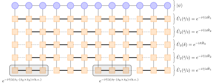

# The time-evolution block-decimation (TEBD)

At its heart, this method relies on a
Trotter-Suzuki\cite{suzuki76:_gener_trott} decomposition and
subsequent approximation of the time-evolution operator $\hat
U^\textrm{exact}(\delta)$. It was developed around 2004 both in the
(then new) context of MPS\cite{vidal04:_effic_simul_one_dimen_quant,
verstraete04:_matrix_produc_densit_operat} and the classical
system-environment DMRG\cite{white04:_real_time_evolut_using_densit,
daley04:_time_hilber} and remained the most popular time-evolution
method for both settings in the following
years. [NB: in these papers, TEBD is introduced without relying on MPO/MPS arithmetic but instead by applying quantum gates to individual state tensors. Here, we will employ MPOs to simplify notation and implementation.]

As an illustrative example let us first consider the nearest-neighbor
Heisenberg chain. Its Hamiltonian is given by
\begin{align}
  \hat H & = \sum_{j} \hat h_{j,j+1} \\
  \hat h^{\vphantom{y}}_{j,j+1} & = \hat s^{x\vphantom{y}}_j \hat s^{x\vphantom{y}}_{j+1} + \hat s^y_j \hat s^y_{j+1} + \hat s^{z\vphantom{y}}_j \hat s^{z\vphantom{y}}_{j+1} \;.
\end{align}
The exact evolution is then given by
\begin{align}
  \hat U^\mathrm{exact}(\delta) = e^{-\mathrm{i} \delta \hat H} \;.
\end{align}
If we split $\hat H$ into two summands $\hat H_{\mathrm{even}}$ and
$\hat H_{\mathrm{odd}}$ as
\begin{align}
  \hat H_{\textrm{even}} & = \sum_{j \textrm{ even}} \hat h_{j,j+1} \\
  \hat H_{\textrm{odd}} & = \sum_{j \textrm{ odd}} \hat h_{j,j+1} \\
  \hat H & = \hat H_{\mathrm{even}} + \hat H_{\mathrm{odd}}\;,
\end{align}
we can use the Baker-Campbell-Hausdorff formula to approximate
\begin{align}
  \hat U^\textrm{exact}(\delta) & = e^{-\mathrm{i} \delta \hat H} \\
                              & = e^{-\mathrm{i} \delta \hat H_{\textrm{even}}} e^{-\mathrm{i} \delta \hat H_{\mathrm{odd}}} e^{-\mathrm{i} \delta^2 \left[ \hat H_{\textrm{even}}, \hat H_{\textrm{odd}} \right]} \\ 
                              & \approx e^{-\mathrm{i} \delta \hat H_{\textrm{even}}} e^{-\mathrm{i} \delta \hat H_{\textrm{odd}}} \\
                              & \equiv \hat U^{\textrm{TEBD1}}(\delta) \;.
\end{align}
Now, both $e^{-\mathrm{i} \delta \hat H_{\mathrm{even}}}$  and
$e^{-\mathrm{i} \delta \hat H_{\mathrm{odd}}}$  are easy to evaluate: All the
summands $\hat h_{j,j+1}$ commute with each other so it suffices to
exponentiate them individually:
\begin{equation}
  e^{-\mathrm{i} \delta \hat H_{\textrm{even}}} = e^{-\mathrm{i} \delta \sum_{j \textrm{ even}} \hat h_{j,j+1}} = \prod_{j \textrm{ even}} e^{-\mathrm{i} \delta \hat h_{j,j+1}} \;.
\end{equation}
Writing $e^{-\mathrm{i} \delta \hat h_{j,j+1}}$  into an MPO, we have identity
tensors with bond dimension $w=1$ everywhere except on sites $j$ and
$j+1$. Splitting the two-site gate into two individual tensors (e.g. with an SVD) results in a bond between those sites which has at most dimension
$\sigma^2$. Hence writing $e^{-\mathrm{i} \delta \hat H_{\mathrm{even}}}$ as
an MPO is also efficient, it has alternating bond dimensions
$\sigma^2$ and $1$. Accordingly,
$e^{-\mathrm{i} \delta \hat H_{\mathrm{odd}}}$ written as an MPO has
alternating bond dimensions $1$ and $\sigma^2$ and their product
$e^{-\mathrm{i} \delta \hat H_{\mathrm{even}}} e^{-\mathrm{i} \delta \hat
  H_{\mathrm{odd}}}$
can be written with bond dimensions $\sigma^2$ throughout.

If we keep the decomposition of $\hat H$ into $\hat H_{\mathrm{even}}$
and $\hat H_{\mathrm{odd}}$ fixed and hence the commutator
$\left[ \hat H_\mathrm{even}, \hat H_\mathrm{odd} \right]$ constant,
the error per time step $\delta$ between
$\hat U^{\mathrm{TEBD1}}(\delta)$ and
$\hat U^{\mathrm{exact}}(\delta)$ is of second order:
\begin{equation}
  \hat U^\mathrm{exact}(\delta) = \hat U^{\mathrm{TEBD1}}(\delta) + O(\delta^2) \;
\end{equation}
because we can approximate
\begin{equation}
  e^{-\mathrm{i} \delta^2 \left[ \hat H_1, \hat H_2 \right]} \approx \hat{\mathbf{1}} -\mathrm{i} \delta^2 \left[ \hat H_1, \hat H_2 \right] \;.
\end{equation}
Considering a longer interval $T$, which we divide into
$\frac{T}{\delta}$ smaller intervals, at which we apply
$\hat U^{\mathrm{TEBD1}}(\delta)$, our errors accumulate to
$\frac{T}{\delta} \, O(\delta^2) = O(\delta)$ per time interval
$T$.  The error is hence of first order in $\delta$ which gives
$\hat U^{\mathrm{TEBD1}}(\delta)$ its name as first-order TEBD.  By
symmetrizing the decomposition, it is straightforward to construct
\begin{equation}
  \hat U^{\mathrm{TEBD2}}(\delta) \equiv e^{-\mathrm{i} \frac{\delta}{2} \hat H_{\mathrm{even}}} e^{-\mathrm{i} \delta \hat H_{\mathrm{odd}}}e^{-\mathrm{i} \frac{\delta}{2} \hat H_{\mathrm{even}}} \;,
\end{equation}
which has a third-order error per step
\begin{equation}
  \hat U^\mathrm{exact}(\delta) = \hat U^{\mathrm{TEBD2}}(\delta) + O(\delta^3)
\end{equation}
and hence a second-order error per time interval. Similarly, we can
construct a fourth-order TEBD evolution operator as
\begin{equation}
  \hat U^{\mathrm{TEBD4}}(\delta) \equiv \hat U^{\mathrm{TEBD2}}(\delta_1) \hat U^{\mathrm{TEBD2}}(\delta_1) \hat U^{\mathrm{TEBD2}}(\delta_2) \hat U^{\mathrm{TEBD2}}(\delta_1) \hat U^{\mathrm{TEBD2}}(\delta_1)
\end{equation}
with
\begin{align}
  \delta_1 & \equiv \frac{1}{4 - 4^{\frac{1}{3}}} \delta \\
  \delta_2 & \equiv \left(1 - 4 \delta_1\right) \delta \;.
\end{align}
We then have
\begin{equation}
\hat U^\mathrm{exact}(\delta) = \hat U^{\mathrm{TEBD4}}(\delta) + O(\delta^5)
\end{equation}
and hence a fourth-order error per time step.

This approach can be generalized to more complicated divisions of the
full Hamiltonian $\hat H$ into $N_H$ internally-commuting parts $\hat H_1$,
$\hat H_2$, $\ldots$:
\begin{equation}
  \hat H = \sum_{\alpha=1}^{N_H} \hat H_\alpha \;,
\end{equation}
where each $\hat H_\alpha$ is a sum
\begin{equation}
  \hat H_\alpha = \sum_{k=1}^{N_\alpha} \hat h_{\alpha}^k \label{eq:tebd:split_H}
\end{equation}
such that $\hat h_{\alpha}^k$ can be diagonalized efficiently
and $[ \hat h_{\alpha}^k, \hat h_{\alpha}^l ] = 0$. The
local terms $\hat h_{\alpha}^k$ do not need to be limited to two sites,
but it must still be possible to evaluate their exponential
efficiently. A first-order TEBD time evolution operator
$\hat U^\mathrm{TEBD1}(\delta)$ can then be written as
\begin{align}
  \hat U^\mathrm{TEBD1}(\delta) & = e^{-\mathrm{i} \delta \hat H_1} e^{-\mathrm{i} \delta \hat H_2} e^{-\mathrm{i} \delta \hat H_3} \cdots e^{-\mathrm{i} \delta \hat H_{N_H}}\\
                                & = \prod_{\alpha=1}^{N_H} e^{-\mathrm{i} \delta \hat H_\alpha} \;.
\end{align}
The error per time interval is still of first order as before. The
second-order decomposition is likewise obtained as a symmetrization of
the $\hat U^\mathrm{TEBD1}(\delta)$:
\begin{align}
  \hat U^\mathrm{TEBD2}(\delta) & = e^{-\mathrm{i} \frac{\delta}{2} \hat H_1} e^{-\mathrm{i} \frac{\delta}{2} \hat H_2} \cdots e^{-\mathrm{i} \frac{\delta}{2} \hat H_{N_H-1}} e^{-\mathrm{i} \delta \hat H_{N_H}} e^{-\mathrm{i} \frac{\delta}{2} \hat H_{N_H-1}} \cdots e^{-\mathrm{i} \frac{\delta}{2} \hat H_2} e^{-\mathrm{i} \frac{\delta}{2} \hat H_1} \\
                                & = \prod_{\alpha=1}^{N_H} e^{-\mathrm{i} \frac{\delta}{2} \hat H_\alpha} \prod_{\alpha=N_H}^1 e^{-\mathrm{i} \frac{\delta}{2} \hat H_\alpha} \;.
								\end{align}
								
It has the same second-order error per time step as above, an
exemplary tensor network for the case of a three-site interaction is
shown below. A fourth-order decomposition could be constructed, but
the number of terms required grows very quickly with the number of
summands $N_H$ in the Hamiltonian, making the fourth-order
decomposition less attractive. Recently,
Ref. \onlinecite{barthel19:_optim_lie_trott_suzuk} investigated optimized
decomposition schemes beyond the naive approaches presented
here. These schemes have the potential to further reduce errors and
the number of exponentials required, but still need to be tested in
practice.



(Above) Exemplary structure of a tensor network representing a time-evolved
state $\hat U^\mathrm{TEBD2}(\delta)\ket{\psi}$ of 12 sites. The state
is written as an MPS $\ket{\psi}$ at the top and evolved using TEBD2
under the Hamiltonian $\hat H = \sum_{j=1}^{10} \hat s_j \cdot \left(
\hat s_{j+1} \times \hat s_{j+2} \right) + \mathrm{h.c.}$.  The
three-site action of the Hamiltonian necessitates the decomposition
into three sums $\hat H_{1,2,3}$. To achieve a second-order error, the
evolution is symmetrized by applying the operators $\hat U_{1,2,3}$ in
reverse order after each half-step. The individual time-evolution
operators written as MPOs have two thick bonds alternating with a
1-dimensional dummy bond.}

## Errors

TEBD suffers from two errors, both of which are controllable and can
be estimated fairly straightforwardly. The first is the time step
error of order $O(\delta^2)$ per time step for first-order TEBD and
$O(\delta^3)$ per time step for second-order TEBD. With a fixed total
interval $T$ divided into $N = T / \delta$ steps, the error over the
entire interval is $O(\delta)$ and $O(\delta^2)$ respectively for
first and second order TEBD. This time step-inherent error does not
violate unitarity of a real-time evolution as each of the constructed
operators $e^{-\mathrm{i} \delta \hat H_\alpha}$ is unitary.  However,
the energy and other conserved quantities are not
necessarily constant if the time-step error is large. The primary
option to reduce this discretization error is to chose a smaller
time-step size $\delta$ or a higher-order decomposition like TEBD4. It
is not always optimal to use TEBD4, as higher-order decompositions
typically result in more MPOs to apply to the state sequentially to do
a single time step. For example, if a Trotter error of $10^{-2}$ per
unit time is desired, 1TEBD needs a step size $\delta = 0.01$ and
accordingly 100 steps to reach time $t=1$. For the same error, TEBD2
needs a step size $\delta = 0.1$ and hence $10$ steps to reach $t=1$
while TEBD4 could work with a step size of $\sqrt{0.1} \approx 0.3$
and hence approximately three steps. However, where TEBD1 (e.g.) needs
three exponentials
$e^{-\mathrm{i} \delta H_1} e^{-\mathrm{i} \delta H_2} e^{-\mathrm{i} \delta H_3}$ , TEBD2 has
to apply five exponentials
$e^{-\mathrm{i} \frac{\delta}{2} H_1} e^{-\mathrm{i} \frac{\delta}{2} H_2}
e^{-\mathrm{i} \delta H_3} e^{-\mathrm{i} \frac{\delta}{2} H_2} e^{-\mathrm{i}
  \frac{\delta}{2} H_1}$
(or four, if we combine $e^{-\mathrm{i} \frac{\delta}{2} H_1}$ of
neighboring steps) and TEBD4 has to work with 21 (20 when combining
neighboring steps) exponentials. That is, while TEBD4 only needs three
times fewer steps than TEBD2 for a final error of $10^{-2}$, each
individual step needs approximately five times as much work. In
comparison, if we target an error of $10^{-8}$, TEBD1 needs $10^8$
steps, TEBD2 needs $10^4$ steps and TEBD4 only needs $10^2$ steps --
for doing five times as much work per step, we reduce the number of
steps by a factor of 100 when going from TEBD2 to TEBD4.

As an alternative to such
higher-order decompositions, one may combine a large-scale Trotter
decomposition with a small-scale Krylov-based approach to make the
_commutator_ of the Hamiltonian summands $\hat H_\alpha$
smaller\cite{hashizume18:_dynam_phase_trans_two_dimen}.

The second source of errors is due to the mandatory truncation of the
time-evolved state to a realistic bond dimension. This truncation
error can also be controlled and measured by the discarded weight
during the truncation as usual. It affects both the unitarity of the
evolution and the conserved quantities. By gradually increasing the
MPS bond dimension, it is straightforward to estimate convergence of
the calculation with respect to this error.

## Long-range interactions

Long-range terms in the Hamiltonian can be treated by introducing swap
gates\cite{stoudenmire10:_minim} in order to exponentiate each
individual contribution. Each swap gate exchanges the physical indices of two nearest neighbors, hence moving the interacting sites next to each other. The evolution term
$e^{-\mathrm{i}\delta \hat h_{\alpha}^k}$ is then sandwiched between
two series of swap gates which first bring the sites onto which
$\hat h_{\alpha}^k$ acts next to each other and then, after the evolution,
move them back to their original places. A smart ordering of the
individual evolution terms often allows to cancel two series of swap
gates from different $\hat h_{\alpha}^k$ and $\hat h_{\alpha}^l$
against each other. Nearly the entire overhead of such swap gates can
be removed in this way.

## Algorithm

The two steps of the TEBD method (constructing the evolution operator
and repeatedly applying it to the state) are described at the end of
this section at the example of the second-order TEBD2 method.

To construct the time-evolution operator, one first needs to split the
Hamiltonian into internally-commuting parts $\hat H_\alpha$
(cf. Eq. (21)). Each summand $\hat h_{\alpha}^k$ of each
part is then individually exponentiated as
$\mathrm{exp}\left(-\mathrm{i}\delta \hat h_{\alpha}^k\right)$. If the
summand is non-local, swap gates are introduced before and after the
exponentiation such that the exponentiation works on nearest-neighbor
sites. One then obtains a number of MPO component tensors (one for
each site between the leftmost and rightmost sites on which
$\hat h_{\alpha}^k$ acts). These tensors are placed within an MPO spanning
the entire system to eventually yield $\hat U_\alpha$. Once all $\hat U_\alpha$
are constructed (in a specific, selected ordering), one has a
representation of the first-order decomposition of $\hat U$.  Going
from this first-order decomposition to a second-order decomposition is
very straightforward, one only has to first replace $\delta$ by
$\delta/2$ in the initial exponentiation and second append the reversed
list of MPOs to itself, i.e. store a list
$\{ \hat U_1, \hat U_2, \hat U_3, \hat U_3, \hat U_2, \hat U_1 \}$.
This new $\hat U$ is then symmetric, each half moves time forward by
$\delta/2$ for a total step of size $\delta$.

To then time-evolve the state, one only has to apply $\hat U$
repeatedly to it, each time advancing the state by a step $\delta$ in
time. In practice, we found it useful to write the time-evolved state
$|\psi(t)\rangle$ to disk after every step. In this way, the time
evolution can proceed as quickly as possible and evaluations (e.g. for
expectation values, overlaps with other states etc.) may proceed in
parallel by using the generated state files, possibly even on separate
computers.

An interesting avenue to
parallelization\cite{urbanek16:_paral_bose_hubbar} in TEBD can be used
if instead of working in the MPO framework all $n$-site gates are kept
separate. For very small time steps, gates should not affect singular
value spectra on far-away bonds. It should hence be possible to apply
many gates independently and also truncate many bonds independently
(using a slightly different gauge not discussed here). While not
extensively utilized in the literature yet, such real-space
parallelization promises much larger speed-ups than local (e.g. BLAS)
parallelization options if the associated errors are kept sufficiently
small.

**Splitting or combining $\hat U(\delta)$** It may provide an
additional computational advantage to combine multiple MPOs
representing $\hat U_\alpha(\delta)$ into one larger MPO representing
$\hat U(\delta)$. For example in the case of the nearest-neighbor
Heisenberg model, one arrives naively at two MPOs $\hat
U_{\mathrm{even}}$ and $\hat U_{\mathrm{odd}}$, each exponentials of
$\hat H_{\mathrm{even}}$ and $\hat H_{\mathrm{odd}}$
respectively. These MPOs have alternating bond dimensions $1 - 4 - 1 -
4 - \ldots$ and $4 - 1 - 4 - 1 - \ldots$.  Multiplying both MPOs
together, one obtains a single new MPO with bond dimension $4$
throughout the system. Applying the new MPO only requires a single
sweep over the system, whereas applying the two original MPOs requires
two sequential sweeps. While the computational effort to leading order
is identical, the former option is much more cache friendly, requiring
access of each individual site tensor from RAM (or even a hard disk
drive) only once instead of twice.

Similarly, if the Hamiltonian needs to be split into multiple terms
$\hat H_\alpha$, it is potentially helpful to first multiply the MPOs
for $\hat U_\alpha$ and then apply the resulting $\hat U$ to the MPS.
In general, applying many $\hat U_\alpha$ with very small bond
dimensions leads to a large overhead, whereas $\hat U_\alpha$ with
very large bond dimensions are more costly to multiply with states.
The optimal trade-off depends on the problem at hand.  As a rule of
thumb, one should multiply two time-evolution operators if this does
not increase the maximal bond dimension (as in the example above).  If
the bond dimension of the time-evolution operators is very small, it
might also make sense to combine them until a comparatively large bond
dimension (e.g.  $w \approx 10$) is obtained which reduces the
overhead associated to many small matrix multiplications.

### Algorithm Pseudocode for the second-order TEBD2 method.

The main input is an analytic expression for the Hamiltonian $\hat H$
necessary to split it into its constitutent internally-commuting
parts. Additionally, one needs to select an application method `APPLY`
to evaluate MPO-MPS products (including truncation as required). To
run, one first calls `PREPARE_U(δ)` and then repeatedly `TIMESTEP` to
generate the time-evolved states.
	

````
PREPARE_U_α(δ)[<Analytic expression for H_α>, <step size δ>] {
  FOR EACH summand h^k_α of H_α {
    u^k_α ← exp{-i δ h^k_α}          // If h^k_α is long-range, insert swap gates
    SPLIT u^k_α into MPO component tensors by SVD or QR
    PLACE those tensors on appropriate sites of the MPO U_α
  }
  RETURN U_a
}

PREPARE_U(δ)[<Analytic expression for H>, <step size δ>] {
  SPLIT H into internally-commuting parts { H_1, …, H_N }  // typically done by hand
  U ← [ PREPARE_U_α(H_1, δ/2), …, PREPARE_U_α(H_N, δ/2) ]
  U ← U + REVERSE(U)                                       // 2nd order Trotter decomposition, hence δ/2
  MULTIPLY pairs of constituents U_α, U_α+1 of U if possible within bond dimensions
  RETURN U
}

TIMESTEP[<List of MPOs U>, <initial state ψ>, <application method APPLY>] {
  FOR EACH term U_α in U {
    ψ ← APPLY(U_α, ψ)
  }
}
````

---

The content of this page is based on [Time-evolution methods for matrix-product states](https://www.sciencedirect.com/science/article/pii/S0003491619302532?via%3Dihub) by S. Paeckel, T. Köhler, A. Swoboda, S. R. Manmana, U. Schollwöck and C. Hubig and is licensed under the [CC-BY 4.0](https://creativecommons.org/licenses/by/4.0/) license.
