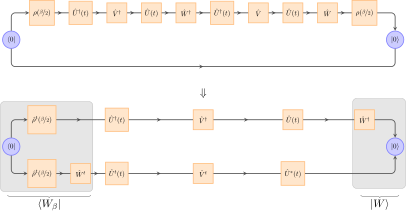
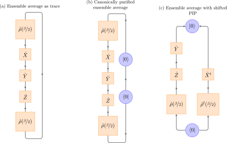
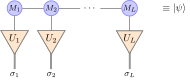

# Additional Tricks

<!--TOC-->

This page is a collection and summary of some generic improvements
without any claim to completeness. These are essentially tricks which
are relatively independent of the actual time-evolution method and can
mostly be implemented in all of the methods we just reviewed. They are
not strictly necessary to implement in conjunction with any method and
as such will not be benchmarked in detail later, but they are useful
to keep in mind in case of particularly hard or challenging problems.

## Combining Heisenberg and Schrödinger picture time evolution

In the context of MPS methods, combining Schrödinger and Heisenberg
picture\cite{hartmann09:_densit_matrix_renor_group_heisen_pictur,
prosen09:_matrix} time evolution was first proposed in
Ref. \onlinecite{kennes16:_exten}. Considering a time-dependent observable

\begin{equation}
  \langle \phi | \hat O(t) | \psi \rangle
\end{equation}

between two arbitrary states, in the Schrödinger picture we would
evaluate

\begin{equation}
  \langle \phi | \hat O(t) | \psi \rangle = \left( \langle \phi | e^{\mathrm{i} t \hat H} \right) \hat O \left( e^{-\mathrm{i} t \hat H} | \psi\rangle \right) \quad.
\end{equation}

That is, we apply time-evolution operators to the states
$|\phi\rangle$ and $|\psi\rangle$ to obtain time-evolved states
$|\phi(t)\rangle$ and $|\psi(t)\rangle$ and then evaluate the
time-independent observable between them. The maximum time $t$
obtainable is then typically limited by the entanglement growth in the
states, resulting in larger and larger bond dimensions or errors.

In comparison, the Heisenberg picture would see us time evolve the
operator $\hat O$ as

\begin{equation}
  \langle \phi | \hat O(t) | \psi \rangle = \langle \phi | \left( e^{\mathrm{i} t \hat H} \hat O e^{-\mathrm{i}t \hat H} \right) | \psi\rangle
  \end{equation}
  
while keeping the states $|\phi\rangle$, $|\psi\rangle$ static. Again,
the maximal obtainable time t is limited by the entanglement growth in
the operator $\hat O$ and the maximal bond dimension we can use to
represent it. (Note that it is difficult to compare errors
between MPS and MPO truncations, as the error of the MPO truncation is
given by the operator norm whereas during an MPO compression, we only
control the 2-norm of the operator\cite{barthel16:_matrix}.) If we now
combine the two evolutions as

\begin{equation}
  \langle \phi | \hat O(t_1+t_2) | \psi \rangle = \left( \langle \phi | e^{\mathrm{i} t_1 \hat H} \right) \left( e^{\mathrm{i} t_2 \hat H} \hat O e^{-\mathrm{i}t_2 \hat H} \right) \left( e^{-\mathrm{i} t_1 \hat H} | \psi\rangle \right)
\end{equation}

we can obtain times $t_1 + t_2$ while only requiring MPO and MPS bond
dimensions typical of times $t_1$ and $t_2$ respectively. Note that in
this case, the computationally limiting operation is no longer the
time evolution itself but the evaluation of observables given as the
tensor network of a large-$w$ MPO between two large-$m$
MPS\cite{kennes16:_exten}.

## Complex time steps

Let us assume that we have a time-evolution operator $\hat
U^\prime(\delta) = \mathbf{\hat 1} - \mathrm{i} \delta \hat H$ which
is exact to first order. Applying this operator to a state will result
in an error $O(\delta^2)$ compared to the exact evolution with the
operator $\hat U(\delta) = e^{-\mathrm{i} \delta \hat H}$. Repeating
the process $T / \delta$ times to obtain a state at final time $T$, we
incur an error $O(\delta^2) \frac{T}{\delta} = O(\delta)$.
However, if we allow complex intermediate steps $\delta_1$ and
$\delta_2$, we can solve

\begin{equation}
  \hat U^\prime(\delta_1) \hat U^\prime(\delta_2) = \mathbf{\hat 1} - \mathrm{i} \delta \hat H - \frac{\delta^2}{2} \hat H^2
\end{equation}

for $\delta_1$ and $\delta_2$ by expanding the left-hand side:

\begin{align}
  & \quad \hat U^\prime(\delta_1) \hat U^\prime(\delta_2) \\
= & \quad \left( \mathbf{\hat 1} - \mathrm{i} \delta_1 \hat H \right) \left( \mathbf{\hat 1} - \mathrm{i} \delta_2 \hat H \right) \\
= & \quad \mathbf{\hat 1} - \mathrm{i} ( \delta_1 + \delta_2 ) \hat H - \delta_1 \delta_2 \hat H^2 \\
\Rightarrow & \quad \delta_1 + \delta_2 = \delta \quad \land \quad \delta_1 \delta_2 = \frac{\delta^2}{2}\;.
\end{align}

Two solutions are possible, one of them is

\begin{align}
  \delta_1 = \frac{1 - \mathrm{i}}{2} \delta \quad \land \quad \delta_2 = \frac{1 + \mathrm{i}}{2} \delta \quad.
\end{align}

Choosing these values for $\delta_{1,2}$ then results in a third-order
error per time step and a second-order error overall. This choice of
time steps is suggested in particular in combination with the MPO
$\W^{II}$ method to obtain a better error per time step. The cost of the
method only grows linearly with the number of evolution operators and,
e.g., four operators $\hat U^\prime(\delta_{1,2,3,4})$ are required
for a third-order error \cite{zaletel15:_time}. Four steps for the third-order approximation have an algebraic form

\begin{align}
  \delta_1 = \frac{1}{4}\left( -\frac{1+i}{\sqrt{3}}+1-i \right)\delta \quad \land \quad \delta_2 = i\delta_1 \quad \land \quad \delta_3 = -i \bar \delta_1 \quad \land \quad \delta_4 = \bar \delta_1,
\end{align}

a fourth-order approximation requires 7 steps\cite{bidzh17}. 

The drawback is the loss of unitarity at each individual time step
which may be disadvantageous. Furthermore, if the time evolution is
purely imaginary (e.g., for finite-temperature calculations) and the
Hamiltonian does not contain complex coefficients, one may avoid
complex arithmetic entirely and only use real floating-point scalars
for 50% less memory usage and an approximately four-fold speed-up on
matrix multiplications. Unfortunately, it is then impossible to use
this trick to reduce the time-step error.

## Green's functions 1: Removal of low-lying states

This trick was first proposed in Ref. \onlinecite{schmitteckert04:_noneq}
and is relatively straightforward to implement. Assume a ground state
$|0\rangle$ as an MPS obtained via DMRG and let us shift the
Hamiltonian such that this state has energy $E_0 = 0$,
$\hat H |0\rangle = 0$. We are then interested in the time-dependent
observable

\begin{equation}
  x(t) = \langle 0 | \hat A(t) \hat B | 0 \rangle
\end{equation}

where $\hat A$ and $\hat B$ are typically local operators such as
creators or annihilators. The evolution of $\hat B | 0 \rangle$ is
generically non-trivial and if we want to capture all frequency
contributions in $x(t)$, we need to evolve until at least times
$t^\prime = \frac{1}{E_1}$ where $E_1$ is the energy of the lowest
eigenstate with non-zero energy $|1\rangle$ contained in $\hat B |0
\rangle$. In contrast, to capture contributions of higher-energy
states $|n\rangle$ with energies $E_n > E_1$, we only need to evolve
to shorter times $t^{\prime\prime} = \frac{1}{E_n} < t^\prime$.

However, a few low-lying eigenstates can often be calculated also with
DMRG by orthogonalizing against previously-found eigenstates. Hence if
we run DMRG multiple times, we can obtain not just the ground state
$|0\rangle$ but also further eigenstates $|1\rangle$, $|2\rangle$
etc. If we use quantum numbers and $\hat B$ changes the quantum number
of the state, these additional eigenstates should be calculated in the
quantum number sector of $\hat B |0\rangle$. If we then orthogonalize
$\hat B |0\rangle$ against $|1\rangle$, $|2\rangle$ etc., we remove
the contributions which rotate (in real-time) or decay (in
imaginary-time evolutions) the slowest and hence require the longest
time evolutions. The evolution of the removed states can then be done
exactly as we know both their energy and initial weight in $\hat B
|0\rangle$. Even missing one of the eigenstates due to convergence
problems with DMRG does not introduce an error but merely decreases
the effectivity of the method.

## Green's functions 2: Linear prediction

Calculating dynamical structure factors or more generally spectral
functions from time-dependent data requires two Fourier
transformations: first, one needs to transform from real-space to
momentum-space and second from real-time to frequency. The former
transformation is typically unproblematic, but the latter
transformation suffers either from overdamping or strong spectral
leakage if the available maximal time $t$ is insufficient. Linear
prediction\cite{vaidyanathan08:_theor_linear_predic,
white08:_spect_heisen, barthel09:_spect} assumes that the real-time
momentum-space Green's function $G(k,t)$ is composed of multiple
distinct exponentially decaying and oscillating contributions arising
from a distinct pole structure of $G(k,\omega)$. If this is true for a
time series $x_1, x_2, x_3, \ldots$, an additional data point
$\tilde{x}_n$ can be approximated well by the form

\begin{equation}
  \tilde{x}_n = - \sum_{i=1}^p a_i x_{n-i-1}
\end{equation}
  
with suitably chosen coefficients $a_i$ independent of $n$. We hence
first compute a finite time series which is still as long as we can
manage with time-dependent MPS methods. Subsequently, we need to find
coefficients $a_i$ such that the above holds for the data we computed
exactly. Using those $a_i$, we can then extend the time series to
arbitrarily long times to generate a sufficiently long time series
that a subsequent Fourier transform only requires minimal damping and
hence provides for clear features.

It is useful to divide the available calculated data into three
segments: first, one should discard an interval
$[x_0, \ldots, x_{D-1}]$ at the beginning which captures short-time
physics irrelevant and untypical of the longer-time behavior. Second,
a fitting interval $[x_{D}, \ldots, x_{D+N-1}]$ of N points is
selected over which the coefficients $a_i$ are minimized. Third, trust
in the prediction is increased if it coincides with additional
calculated data $[x_{D+N}, \ldots, x_{\mathrm{max}}]$ outside the
fitting interval.

To select the $a_i$, we want to minimize the error

\begin{equation}
  \epsilon = \sum_{k=D}^{D+N-1} | \tilde{x}_k - x_k |^2 \quad.
\end{equation}

Note that to evaluate $\tilde{x}_k$, $D$ must be larger than the
number of coefficients $p$. The coefficient vector $\underline{a}$ is obtained as

\begin{equation}
  \underline{a} = - \underline{R}^{-1} \underline{r}
\end{equation}

where the matrix $\underline{R}$ and vector $\underline{r}$ have
entries

\begin{align}
  R_{i,j} = & \sum_{k=D}^{D+N-1} x_{k-i}^\star x_{k-j} \\
  r_i    = & \sum_{k=D}^{D+N-1} x_{k-i}^\star x_k
\end{align}

respectively. Once the $a_i$ are obtained, data ideally can be
generated initially for the interval
$[x_{D+N}, \ldots, x_{\mathrm{max}}]$ and, once verified to coincide
with the calculated data, extended to arbitrary times.

Several numerical pitfalls need to be considered here: First, the
matrix $\underline{R}$ may be singular. Two possible remedies include
addition of a small shift $\varepsilon$ or reduction of the number of
parameters $p$. Ideally the latter should be considered, but may lead
to problems finding the optimal non-singular $p$. Second, if we
construct the vector

\begin{equation}
  \underline{x}_n = [x_{n-1}, \ldots, x_{n-p}]^T
\end{equation}
we can move it forward one step as
\begin{equation}
  \underline{\tilde{x}}_{n+1} = \underline{A} {\hspace{0.1cm}} \underline{x}_n
\end{equation}
where the matrix $\underline{A}$ is of the form
\begin{equation}
  \underline{A} = \begin{pmatrix} -a_1 & -a_2 & -a_3 & \cdots & -a_p \\
 1 & 0 & 0 & \cdots & 0 \\
 0 & 1 & 0 & \cdots & 0 \\
 \vdots & \ddots & \ddots & \ddots & \vdots \\
 0 & \cdots & 0 & 1 & 0
\end{pmatrix}
\end{equation}

and its eigenvalues $\alpha_i$ contain the frequencies and dampings of
the aforementioned oscillations and exponential decays. As such,
$\alpha_i > 1$ are unphysical and need to be dealt with, it appears
\cite{barthel09:_spect} that setting those contributions to zero works
best.

## Purification insertion point (PIP)

---

(Above) Graphical representation of the expectation value of an out-of-time-ordered correlator within the purification framework of finite-temperature MPS calculations.

---

Calculating out-of-time-ordered correlators (OTOC) allows us to
measure the scrambling of quantum information and finds many
interesting and current applications. In general an OTOC of operators
$\hat{W},\hat{V}$ is given as an ensemble average

\begin{align}
        C^{\hat V, \hat W}_{\beta}(t) &= \frac{1}{2} \mathrm{Tr} \left\{\hat{\rho}(\beta) \left[\hat{V}(t),\hat{W}\right]^{\dagger} \left[\hat{V}(t),\hat{W}\right] \right\} \notag \\
        &= \underbrace{\mathcal{Re} \left[ \mathrm{Tr} \left\{\hat{\rho}(\beta) \hat{V}^{\dagger}(t)\hat{W}^{\dagger} \hat{V}(t)\hat{W} \right\} \right]}_{\equiv F^{\hat V, \hat W}_{\beta}(t)} + \text{time ordered}
\end{align}

wherein we have suppressed the time-ordered terms and define the OTOC
as the out-of-time ordered part $F^{\hat V, \hat W}_{\beta}(t)$. At
finite temperature, we have to use a purification to evaluate this
quantity.  If we would calculate the time evolutions in $F^{\hat V,
\hat W}_{\beta}(t)$ naively by direct evolution only in the physical
degrees of freedom we would require $\mathcal{O}(N^{2})$ time steps to
obtain the OTOC at time $t=N\delta$.

Clearly, the growing numerical expenses forbid to reach both large
system sizes and long time scales $t$. Graphically representing this
process (see above) immediately suggests to transform the operators in the OTOC in
some way as to evenly distribute the required time evolutions leading
to only linear scaling of effort in time $t$. In the following, we
will explain how to transform these operators in the purification
picture and alter the purification insertion point (PIP). For related
work in the framework of matrix-product operators,
cf. Ref. \onlinecite{bohrdt17:_scram}.

Consider the ensemble average $F_{\hat X, \hat Y, \hat Z,\beta} \equiv
\mathrm{Tr} \left\{\hat{\rho}(\beta)\hat{Z}\hat{Y}\hat{X}\right\}$ for some
global operators $\hat{X},\hat{Y},\hat{Z}$ at inverse temperature
$\beta$. Using the cyclic property of the trace the ensemble average
can now be written as expectation value in the enlarged Hilbert space

\begin{equation}
        F_{\hat X, \hat Y, \hat Z,\beta} = \mathrm{Tr} \left\{\hat{\rho}(\beta)\hat{Z}\hat{Y}\hat{X}\right\} = \bra{0}\hat{\rho}(\frac{\beta}{2})\hat{Z}\hat{Y}\hat{X}\hat{\rho}(\frac{\beta}{2})\ket{0} \equiv \bra{\frac{\beta}{2}}\hat{Z}\hat{Y}\hat{X}\ket{\frac{\beta}{2}} \;,
\end{equation}

where we have introduced the purified finite temperature state
$\ket{\frac{\beta}{2}} \equiv
\hat{\rho}(\frac{\beta}{2})\ket{0}$ based on the infinite
temperature state $\ket{0}$.  A graphical representation of recasting
the trace into an expectation value is given by the two networks (a)
and (b) in the figure below with out-going indices representing row
vectors and in-going indices column vectors.

---

(Above) Different choices of operator purifications for ensemble average $F_{\hat X, \hat Y, \hat Z,\beta} = \mathrm{Tr} \left\{\hat{\rho}(\beta)\hat{Z}\hat{Y}\hat{X}\right\}$.

---

From the pictographical representation we motivate the infinite temperature state $\ket{0}$ to be represented by a rank $(2,0)$ tensor $\ket{0} \equiv \sum_{a,\bar{b}} D^{a,\bar{b}}\ket{a}\ket{\bar{b}}$ and correspondingly $\bra{0}$ by a rank $(0,2)$ tensor $\bra{0} \equiv \sum_{a,\bar{b}}D_{a,\bar{b}}\bra{a}\bra{\bar{b}}$, where we have placed a bar over those indices labeling ancilla degrees of freedom.

These tensors have to fulfill the orthogonality conditions
\begin{equation}
        \sum_{\bar{b}} D^{a,\bar{b}}D_{c,\bar{b}} = \delta^{a}_{c}, \quad \sum_{a} D^{a,\bar{b}}D_{a,\bar{c}} = \delta^{\bar{b}}_{\bar{c}}
\end{equation}
so that the tensor elements can be choosen to be $D^{a,\bar{b}} \equiv D^{a,\bar{b}}\delta^{\bar{a}}_{\bar{b}}$ and $D_{a,\bar{b}} \equiv D_{a,\bar{b}}\delta^{\bar{b}}_{\bar{a}}$.
When contracted over physical degrees of freedom, the action of these tensors is to convert row vectors into column vectors and vice versa
\begin{equation}
        D\hat O D^{\dagger} = \sum_{a,c}\sum_{\bar{b},\bar{d}}D^{a,\bar{b}}\hat O^{c}_{a}D_{c,\bar{d}}\ket{\bar{b}}\bra{\bar{d}} = \sum_{\bar{b},\bar{d}}\hat O^{\bar{a}}_{\bar{c}}\ket{\bar{a}}\bra{\bar{c}} = \hat O^{t} \;.
\end{equation}
If we now interpret indices carrying a bar as maps between ancilla degrees of freedom we can reformulate the purification in terms of the $D$ tensors
\begin{equation}
        F_{\hat X, \hat Y, \hat Z,\beta} = \sum_{a,c,\ldots,g,\bar{b}} D_{a,\bar{b}}\hat \rho^{a}_{c}(\frac{\beta}{2})\hat Z^{c}_{d} \hat Y^{d}_{e} \hat X^{e}_{f}\hat \rho^{f}_{g}(\frac{\beta}{2})D^{g,\bar{b}}\;.
\end{equation}
Inserting identities on the physical Hilbert space between $\hat{\rho}$ and $\hat{X}$ as well as $\hat{X}$ and $\hat{Y}$ and making explicit use of the representation of $\hat{D}$ we obtain
\begin{align}
        F_{\hat X, \hat Y, \hat Z,\beta} &= \sum_{\substack{a,c,d,g,\bar{b}, \\ \bar{e},\bar{f},e_l,e_r,f_l,f_r}} D_{a,\bar{b}}\rho^{a}_{c}(\frac{\beta}{2}) \hat Z^{c}_{d} \hat Y^{d}_{e_{l}} \underbrace{D^{e_{l},\bar{e}}D_{e_{r},\bar{e}}}_{\delta^{e_{l}}_{e_{r}}} \hat X^{e_{r}}_{f_{l}} \underbrace{D^{f_{l},\bar{f}}D_{f_{r},\bar{f}}}_{\delta^{f_{l}}_{f_{r}}} \rho^{f_{r}}_{g}(\frac{\beta}{2})D^{g,\bar{b}} \notag \\
                      &= \sum_{\substack{a,c,d,\bar{b}, \\ \bar{e},\bar{f},e_l}} D_{a,\bar{b}} \rho^{a}_{c}(\frac{\beta}{2}) \hat Z^{c}_{d} \hat Y^{d}_{e_{l}} D^{e_{l},\bar{e}} \underbrace{\hat X^{\bar{f}}_{\bar{e}} \rho^{\bar{b}}_{\bar{f}}(\frac{\beta}{2})}_{\text{act on $\mathcal{H}_{A}$}}\\
                      & = \bra{0}\left(\hat{\rho}^{t}(\frac{\beta}{2}) \hat{X}^{t} \right)_{A}\otimes \left(\hat{\rho}(\frac{\beta}{2}) \hat{Z} \hat{Y} \right)_{P} \ket{0}
\end{align}
so that now $\sum_{\bar{f}} \hat X^{\bar{f}}_{\bar{e}} \hat \rho^{\bar{b}}_{\bar{f}}(\frac{\beta}{2}) \equiv \hat{\rho}^{t}(\frac{\beta}{2})\hat{X}^{t}$ are acting on the ancilla space $\mathcal{H}_{A}$, i.e., we have shifted the purification insertion point.
Again these manipulations can be represented efficiently in a graphical notation and are given as (c) in the figure above.

Using this procedure, we can rewrite the OTOC $F^{\hat V, \hat W}_{\beta}(t)$ as
\begin{align}
        F^{\hat V, \hat W}_{\beta}(t) &= \mathcal{Re}\left[ \mathrm{Tr} \left\{\hat{\rho}(\frac{\beta}{2}) \hat{U}^{\dagger}(t) \hat{V}^{\dagger} \hat{U}(t) \hat{W}^{\dagger} \hat{U}^{\dagger}(t) \hat{V} \hat{U}(t) \hat{W} \hat{\rho}(\frac{\beta}{2})\right\} \right] \notag \\
        &= \mathcal{Re} \left[ \bra{0} \left( \hat{U}^{\dagger}(t) \hat{V} \hat{U}(t) \hat{W} \hat{\rho}(\frac{\beta}{2}) \right)^{t}_{A} \otimes \left(\hat{\rho}(\frac{\beta}{2}) \hat{U}^{\dagger}(t) \hat{V}^{\dagger} \hat{U}(t) \hat{W}^{\dagger} \right)_{P} \ket{0} \right] \;.
\end{align}
Defining the initial states
\begin{align}
  \ket{W} &\equiv \hat{W}^{\dagger}_{P}\otimes \mathbf{\hat{1}}_{A}\ket{0}\;, \\
  \ket{W_{\beta}} &\equiv \hat{\rho}_{P}(\frac{\beta}{2}) \otimes \left(\hat{W}^{*}\hat{\rho}_{A}(\frac{\beta}{2})\right) \ket{0} \;, \\
\end{align}
and their purified time evolutions
\begin{align}
  \ket{W(t)} &\equiv \hat{U}^{\vphantom{*}}_{P}(t) \otimes \hat{U}^{*}_{A}(t)\ket{W} \;,\\
  \ket{W_{\beta}(t)} &\equiv \hat{U}^{\vphantom{*}}_{P}(t) \otimes \hat{U}^{*}_{A}(t)\ket{W_{\beta}}
\end{align}
the OTOC can be obtained by calculating the expectation value
\begin{align}
  F^{\hat V, \hat W}_{\beta}(t) &= \mathcal{Re} \left[ \bra{W_{\beta}(t)}\hat{V}^{\dagger}_{P} \otimes \hat{V}^{t}_{A}\ket{W(t)} \right]\;.
\end{align}
We hence only need $N$ steps to evaluate all expectation values for times $t = N \delta$.

From a more general point of view shifting the purification insertion
point in the OTOCs reformulates the multiple Schrödinger time
evolutions of the physical system in the canonical choice of the PIP
into a Heisenberg time evolution on both the physical and ancilla
system of a generalized observable
$\hat{V}^{\dagger}_{P}\otimes \hat{V}^{\vphantom{\dagger}t}_{A}$.

## Local basis optimization

---

(Above) Local basis optimization matrices $U_j$ are inserted on the
physical legs of the MPS to transform a large physical basis
(indicated by doubled lines) into a smaller effective basis of the MPS
tensors $M_j$.

---

While the dimension of local Hilbert spaces is typically very limited
in spin and electronic systems, bosonic systems potentially require a
large local dimension $\sigma = \mathcal{O}(100)$. As this local
dimension typically enters at least quadratically in some operations
on matrix-product states, some way to dynamically select the most
relevant subspace of the local Hilbert space is potentially extremely
helpful. The local basis
transformation\cite{zhang98:_densit_matrix_approac_local_hilber_space_reduc,
guo12:_critic_stron_coupl_phases_one, brockt15:_matrix} method
provides for just this: by inserting an additional matrix $U_j$ on
each physical leg of the MPS, the large physical dimension is
transformed into a smaller effective basis. The rank-3 MPS tensor then
only has to work with the smaller effective basis. The method was
adapted for TEBD time evolution in Ref. \onlinecite{brockt15:_matrix} but it
is also straightforward to use in the other time-evolution methods
presented here. For the MPO \wiii and global Krylov methods, only the
MPO-MPS product has to be adapted to generate additionally a new
optimal local basis after each step. The DMRG, TDVP and local Krylov
method translate\cite{schroeder16:_simul, dorfner17:_numer,
hubig17:_symmet_protec_tensor_networ} directly in much the same way as
DMRG.

---

The content of this page is based on [Time-evolution methods for matrix-product states](https://www.sciencedirect.com/science/article/pii/S0003491619302532?via%3Dihub) by S. Paeckel, T. Köhler, A. Swoboda, S. R. Manmana, U. Schollwöck and C. Hubig and is licensed under the [CC-BY 4.0](https://creativecommons.org/licenses/by/4.0/) license.
