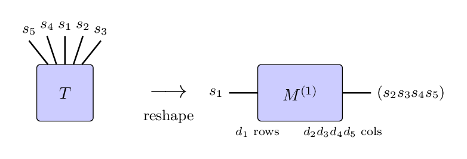
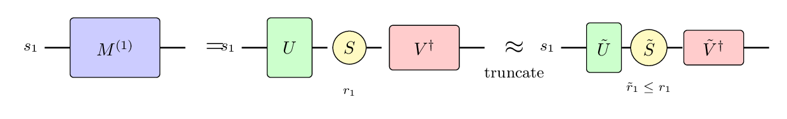
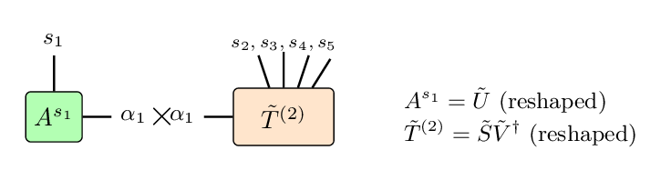
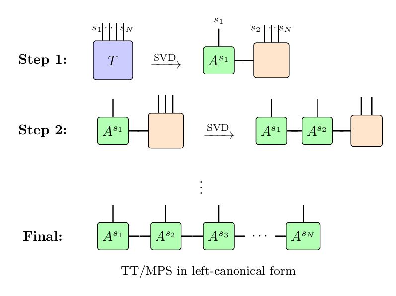
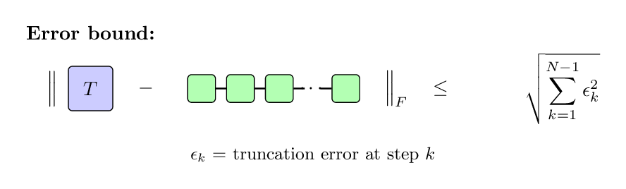
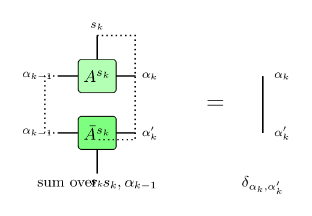

# TT-SVD Algorithm

The TT-SVD algorithm\cite{Oseledets:2011} is a fundamental method for decomposing a tensor into [[tensor train (TT) or matrix product state (MPS)|mps]] format. Starting from a full tensor, the algorithm applies the [[singular value decomposition (SVD)|svd]] repeatedly to factor the tensor into a chain of smaller tensors. By truncating small singular values at each step, the algorithm produces a compressed approximation with controllable accuracy.

The TT-SVD algorithm is conceptually simple and provides rigorous error bounds, making it a natural starting point for understanding tensor train decompositions. However, because it requires access to the full input tensor, it is only practical when the tensor can be stored in memory. For large tensors that cannot be stored explicitly, alternative methods such as [[tensor cross interpolation (TCI)|mps/algorithms/tci]] or variational approaches are preferred.

<!--TOC-->

## Statement of the Problem

Given a tensor $T$ with $N$ indices, each of dimension $d_j$, we want to find a TT/MPS approximation:

\begin{equation}
T^{s_1 s_2 \cdots s_N} \approx \sum_{\{\alpha\}} A^{s_1}_{\alpha_1} A^{s_2}_{\alpha_1 \alpha_2} \cdots A^{s_{N-1}}_{\alpha_{N-2} \alpha_{N-1}} A^{s_N}_{\alpha_{N-1}}
\end{equation}

where the bond dimensions $\alpha_j$ are kept small to achieve compression. The goal is to find the factor tensors $A^{s_j}$ such that the approximation error is minimized for a given maximum bond dimension, or equivalently, to find the smallest bond dimensions that achieve a target accuracy.

## The Algorithm

The TT-SVD algorithm proceeds by successively "peeling off" one index at a time from the tensor using the SVD. At each step, the current tensor is reshaped into a matrix and decomposed, with the left factor becoming part of the TT/MPS and the right factor becoming the input for the next step.

### Step 1: Initial Reshape

Begin with the full tensor $T^{s_1 s_2 \cdots s_N}$. Reshape it into a matrix by grouping the first index as rows and all remaining indices as columns:

\begin{equation}
T^{s_1 s_2 \cdots s_N} \to M^{(1)}_{(s_1), (s_2 \cdots s_N)}
\end{equation}

The matrix $M^{(1)}$ has $d_1$ rows and $d_2 \cdot d_3 \cdots d_N$ columns, where $d_j$ refers to the dimension of index $j$.

### Step 2: SVD and Truncation

Apply the SVD to the matrix $M^{(1)}$:

\begin{equation}
M^{(1)} = U^{(1)} S^{(1)} V^{(1)\dagger}
\end{equation}

where $U^{(1)}$ contains the left singular vectors, $S^{(1)}$ is diagonal with singular values, and $V^{(1)\dagger}$ contains the right singular vectors.

To compress the representation, truncate to keep only the $r_1$ largest singular values, where $r_1$ is chosen based on either:
- A maximum allowed bond dimension $r_{\max}$
- A tolerance $\epsilon$ such that discarded singular values satisfy $\sum_{j > r_1} \sigma_j^2 < \epsilon^2$

The first TT/MPS tensor is formed from the truncated $U^{(1)}$:

\begin{equation}
A^{s_1}_{\alpha_1} = U^{(1)}_{s_1, \alpha_1}
\end{equation}

### Step 3: Prepare for Next Iteration

Form the remainder tensor by contracting $S^{(1)}$ with $V^{(1)\dagger}$ and reshaping:

\begin{equation}
\tilde{T}^{(2)}_{\alpha_1, s_2, s_3, \cdots, s_N} = S^{(1)}_{\alpha_1} V^{(1)\dagger}_{\alpha_1, (s_2 s_3 \cdots s_N)}
\end{equation}

Reshape this into a matrix for the next SVD by grouping $(\alpha_1, s_2)$ as rows:

\begin{equation}
M^{(2)}_{(\alpha_1 s_2), (s_3 \cdots s_N)}
\end{equation}

### Step 4: Iterate

Repeat the SVD and truncation process. At iteration $k$:

1. The matrix $M^{(k)}$ has dimensions $(r_{k-1} \cdot d_k) \times (d_{k+1} \cdots d_N)$
2. Apply SVD: $M^{(k)} = U^{(k)} S^{(k)} V^{(k)\dagger}$
3. Truncate to $r_k$ singular values
4. Reshape $U^{(k)}$ to form the TT/MPS tensor: $A^{s_k}_{\alpha_{k-1}, \alpha_k}$
5. Form the remainder $S^{(k)} V^{(k)\dagger}$ and reshape for the next step

### Step 5: Final Tensor

After $N-1$ SVD operations, the final TT/MPS tensor $A^{s_N}_{\alpha_{N-1}}$ is simply the remaining matrix (no further SVD needed).

## Diagrammatic Summary

The algorithm can be visualized as repeatedly applying SVD to separate indices:

Starting from the full tensor, each SVD "peels off" one index, creating an isometric tensor that becomes part of the TT/MPS. The process continues until all indices have been separated, resulting in a TT/MPS in left-canonical form.

## Computational Cost

The computational cost of TT-SVD is dominated by the SVD operations. For a tensor with $N$ indices each of dimension $d$, and target bond dimension $r$, the cost scales as:

\begin{equation}
O(N d^{N+1} r)
\end{equation}

in the worst case when the full tensor must be accessed. In practice, if the tensor already has low-rank structure, early truncations reduce the effective dimensions in later steps.

The key costs at each step are:
- Reshaping: negligible (just reinterpreting memory layout)
- SVD of an $(m \times n)$ matrix: $O(\min(m^2 n, m n^2))$
- Truncation and forming the remainder: $O(r \cdot n)$

## Error Analysis

A key advantage of TT-SVD is its rigorous error bound. If at each step the truncation error (sum of squared discarded singular values) is $\epsilon_k^2$, then the total approximation error satisfies:\cite{Oseledets:2011}

\begin{equation}
\|T - \tilde{T}\|_F \leq \sqrt{\sum_{k=1}^{N-1} \epsilon_k^2}
\end{equation}

where $\|\cdot\|_F$ denotes the Frobenius norm. This bound shows that errors from each truncation step combine in a controlled way.

For a uniform truncation tolerance $\epsilon$ at each step, the total error is bounded by $\sqrt{N-1} \cdot \epsilon$.

## Properties of the Resulting TT/MPS

The TT-SVD algorithm produces a TT/MPS in _left-canonical form_, meaning each tensor $A^{s_k}$ (except the last) satisfies the left-orthogonality condition:

\begin{equation}
\sum_{s_k, \alpha_{k-1}} A^{s_k}_{\alpha_{k-1}, \alpha_k} \overline{A^{s_k}_{\alpha_{k-1}, \alpha'_k}} = \delta_{\alpha_k, \alpha'_k}
\end{equation}

This property is useful for subsequent computations, such as computing expectation values or performing further compressions.

## Variants and Extensions

**Right-to-left decomposition**: The algorithm can equivalently proceed from the last index to the first, producing a _right-canonical_ TT/MPS.

**Adaptive rank selection**: Rather than fixing the maximum rank, one can adaptively choose the rank at each bond to achieve a target accuracy, discarding singular values below a threshold.

**Two-site variant**: Instead of peeling off one index at a time, one can group pairs of indices and use a truncated SVD, which can be useful in iterative refinement schemes.

<!-- Table to add

## Comparison with Other Methods

| Method | Requires Full Tensor | Optimal | Complexity |
|--------|---------------------|---------|------------|
| TT-SVD | Yes | Quasi-optimal | $O(N d^{N+1} r)$ |
| [[TCI|mps/algorithms/tci]] | No | Heuristic | $O(N d r^3)$ per sweep |
| Variational | No | Local optimum | $O(N d r^3)$ per sweep |
| [[Density Matrix|mps/index#compression]] | For MPS input | Quasi-optimal | $O(N d r^3)$ |

TT-SVD is the method of choice when the full tensor is available and a guaranteed approximation is needed. For tensors too large to store, or when only function evaluations are available, methods like TCI are preferred.

-->

## Implementations

The TT-SVD algorithm is implemented in many tensor network libraries:

- [tt-toolbox](https://github.com/oseledets/TT-Toolbox) (MATLAB) - by the original author
- [ttpy](https://github.com/oseledets/ttpy) (Python) - by the original author
- [ITensor](https://itensor.org) (Julia)

---

