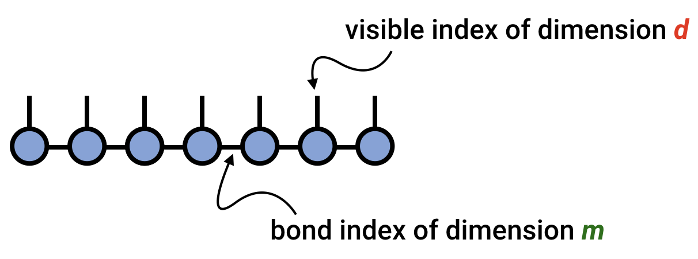

# Matrix Product State / Tensor Train

The matrix product state (MPS)\cite{Fannes:1992}\cite{Lange:1994}\cite{Ostlund:1995} or tensor train (TT)\cite{Oseledets:2011} tensor network
is a factorization of a [[tensor|tensor]] with N indices
into a chain-like product of three-index tensors.
The MPS/TT is one of the best understood tensor networks for which
many efficient algorithms have been developed, in part because
because it is a special case of a [[tree tensor network|ttn]]. 

A matrix product state / tensor train factorization of a tensor $T$ 
can be expressed in [[tensor diagram notation|diagrams]] as

where for concreteness $T$ is taken to have six indices, but the 
pattern above can be generalized for a tensor with any number of indices.

Alternatively, the MPS/TT factorization of a tensor
can be expressed in traditional notation as

@@
T^{s_1 s_2 s_3 s_4 s_5 s_6} = \sum_{\{\mathbf{\alpha}\}} A^{s_1}_{\alpha_1} 
A^{s_2}_{\alpha_1 \alpha_2}
A^{s_3}_{\alpha_2 \alpha_3} 
A^{s_4}_{\alpha_3 \alpha_4} 
A^{s_5}_{\alpha_4 \alpha_5} 
A^{s_6}_{\alpha_5}
@@

where the bond indices $\alpha$ are contracted, or summed over.
Note that each of the $A$ tensors can in general be different
from each other; instead of denoting them with different letters,
it is a useful convention to just distinguish them by their indices.

Any tensor can be exactly represented in MPS / TT form for a large
enough dimension of the bond indices $\alpha$.

## Bond Dimension / Rank

A key concept in understanding the matrix product state or tensor train 
factorization is the _bond dimension_ or _tensor-train rank_, sometimes
also called the virtual dimension. This is the dimension of the bond 
index connecting one tensor in the chain to the next, and can vary
from bond to bond. The bond dimension can be thought of as a 
parameter controlling the expressivity of a MPS/TT network. 
In the example above, it is the dimension of the $\alpha$ indices.

Given a large enough bond dimension or rank, an MPS/TT can
represent an arbitrary tensor. Consider a tensor
$T^{s_1 s_2 \cdots s_N}$ having N indices all of dimension $d$.
Then this tensor can always be represented exactly as an MPS/TT with
bond dimension $m=d^{N/2}$.

However, in most applications the MPS/TT form is used as an approximation.
In such cases, the bond dimension or rank is either fixed at a moderate size,
or determined adaptively.

## Elementary Operations Involving MPS/TT

The MPS/TT tensor network format makes it possible to efficiently
carry out operations on a large, high-order tensor $T$ by manipulating
the much smaller factors making up the MPS/TT representation of $T$.

There are many known algorithms for computations involving MPS/TT networks.
Below, we highlight some of the simplest and most foundational examples.

### Inner Product of Two MPS/TT

Consider two high-order tensors $T^{s_1 s_2 s_3 s_4 s_5 s_6}$ 
and $W^{s_1 s_2 s_3 s_4 s_5 s_6}$. Say that we want to compute the inner product of 
$T$ and $W$, viewed as vectors. That is, we want to compute:

@@
T \cdot W =
\sum_{\{\mathbf{s}\}} 
T^{s_1 s_2 s_3 s_4 s_5 s_6} 
W^{s_1 s_2 s_3 s_4 s_5 s_6} 
@@

In the case of $T = W$, then this operation computes the Frobenius norm of $T$.

Now assume that $T$ and $W$ each can be efficiently represented or approximated by 
MPS/TT tensor networks as follows:

@@
T^{s_1 s_2 s_3 s_4 s_5 s_6} = \sum_{\{\mathbf{\alpha}\}} 
A^{s_1}_{\alpha_1} 
A^{s_2}_{\alpha_1 \alpha_2}
A^{s_3}_{\alpha_2 \alpha_3} 
A^{s_4}_{\alpha_3 \alpha_4} 
A^{s_5}_{\alpha_4 \alpha_5} 
A^{s_6}_{\alpha_5}
@@

@@
W^{s_1 s_2 s_3 s_4 s_5 s_6} = \sum_{\{\mathbf{\beta}\}} 
B^{s_1}_{\beta_1} 
B^{s_2}_{\beta_1 \beta_2}
B^{s_3}_{\beta_2 \beta_3} 
B^{s_4}_{\beta_3 \beta_4} 
B^{s_5}_{\beta_4 \beta_5} 
B^{s_6}_{\beta_5}
@@

The strategy to efficiently compute $T\cdot W$ is to contract $A^{s_1}$ with 
$B^{s_1}$, forming a tensor 
$E^{\alpha_1}_{\beta_1}$. Then this tensor $E$ is 
contracted with $A^{s_2}$ and $B^{s_2}$ to form another intermediate tensor
$E^{\alpha_2}_{\beta_2}$, etc. Let us express this process more simply
in diagrammatic notation:

