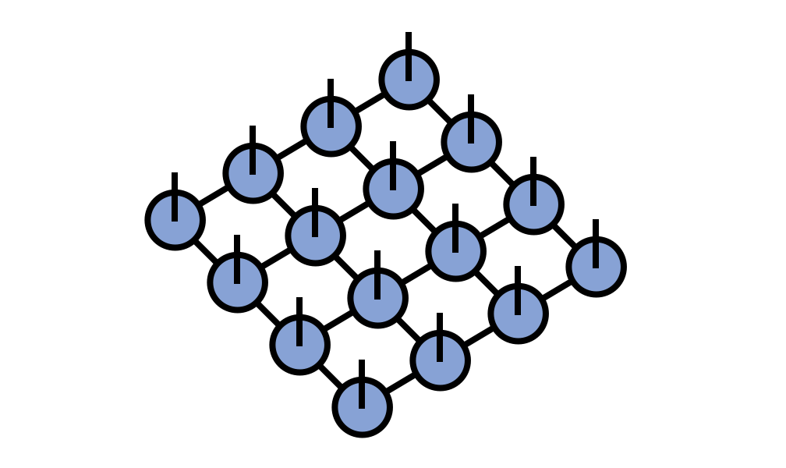

# PEPS Tensor Network 

The PEPS tensor network (_projected entangled pair states_)\cite{Verstraete:2004p,Verstraete:2004r}
generalizes the [[matrix product state / tensor train|mps]] tensor 
network from a one-dimensional network to a network on an arbitrary graph.

The tensor diagram for a PEPS on a finite square lattice is:

## Explanation of the Name PEPS

The name PEPS comes from a quantum information viewpoint that generic tensor networks
can be viewed as maximally correlated (or entangled) tensors in multiple copies of
the tensor index space which are then projected into a single copy of the index space.

In an more general mathematics context, a better name for these networks might be
tensor grid or tensor lattice networks.

## Applications of PEPS in Quantum Physics

PEPS tensor networks have primarily been used as an ansatz for 
quantum wavefunctions, more specifically ground states of 
two-dimensional Hamiltonians.

