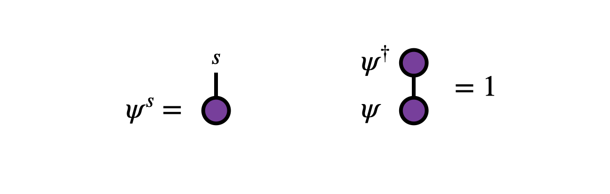
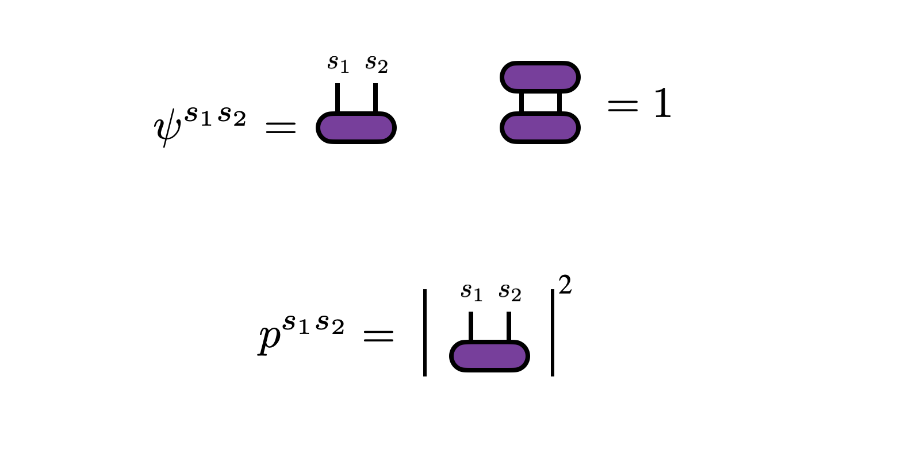
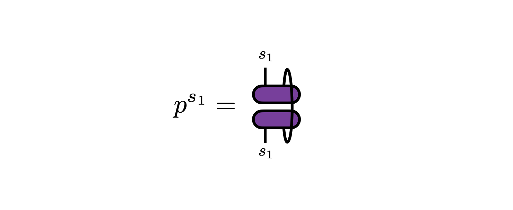
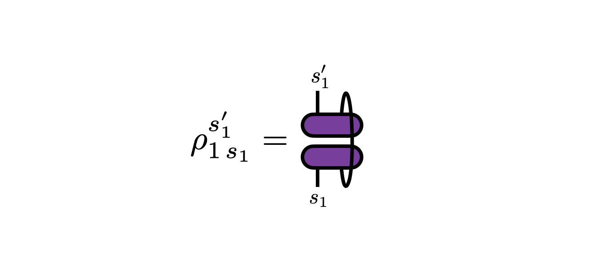
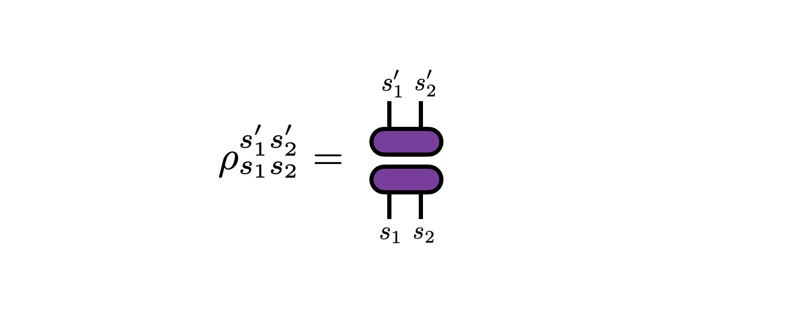

## Two-Norm or Born Rule Probability Formalism

In addition to the [[standard probability formalism|probability]], where 
probabilities are positive numbers which add up to one, there is 
a lesser-known but practical and elegant "2-norm" formalism based on complex numbers 
whose *squares* add up to one. This formalism is used extensively
in quantum mechanics (where it is known as the *Born rule*), to the point 
where the two formalisms are often identified.
However, 2-norm probability can be viewed as a purely mathematical formalism
with certain appealing aspects compared to standard or "1-norm" probability.\cite{aaronson_democritus}

For simplicity, we will only consider discrete probability distributions---the generalization to 
continuous distributions is done in a similar fashion as in standard probability theory.

(Technical note: physicists often use the word "state" as a synonym for "distribution". Here
we will just use the term "distribution".)

### Basic Formalism

Consider a random variable $s$ taking one of $d$ values, that is
$s=1,2,...,d$. To parameterize the probabilities of each of these outcomes, one associates
numbers $\psi^s$ called *amplitudes* which can be positive, negative, or even complex.

The only requirement of these amplitudes is that their squared magnitudes sum to one:
@@
\sum_{s=1}^d |\psi^s|^2 = 1
@@
Viewed as a vector $\vec{\psi}$, the amplitudes have unit norm under the Euclidean or 2-norm:

From the amplitudes, one defines the probability of observing an outcome $j$ as
@@
p^s = |\psi^s|^2
@@

The standard 1-norm formalism applies to the probabilities $p^s$, thus one can think 
of standard probability as fitting "on top" or as a corollary of 2-norm probability theory.
We will see below that standard probability also relates to 2-norm probability
in other interesting ways.

The most general linear maps taking a valid 2-norm distribution into another valid 
distribution are *unitary transformations*---matrices $U$ for which $U U^\dagger = 1$.
This follows from the fact that unitary transformations preserve the 2-norms of complex vectors.
In contrast, the linear maps which preserve valid 1-norm (or standard) probabilities are 
*stochastic matrices*, which are a more limited and less convenient class of matrices
compared to unitary matrices. (For example, the very useful singular value decomposition 
results in factor matrices which are unitary.)

### Marginals and Densities

When considering probability distributions whose outcomes are labeled by two or more
variables (so called "joint distributions") one can introduce the concept of 
marginal distributions where only a subset of outcomes are considered or observed.
In 2-norm probability theory, marginal probabilities naturally give rise to the 
concept of "density matrices" which we will here just call *densities* for short.

For simplicity, consider a 2-norm probability distribution $\psi^{s_1 s_2}$ 
over a two-dimensional space of outcomes $(s_1, s_2) = (1,1), (2,1), (1,2), (2,2), ..., (d,d)$.
By definition, the probabilities of observing each outcome is given by
$p^{s_1 s_2} = |\psi^{s_1 s_2}|^2$. 

Thus, following standard probability theory, the 
marginal probabilities $p^{s_1}$---that is, the probabilities of observing outcomes $s_1$
without observing $s_2$---are given by summing over $s_2$:
@@
p^{s_1} = \sum_{s_2} p^{s_1 s_2} = \sum_{s_2} |\psi^{s_1 s_2}|^2 = \sum_{s_2} \psi^{s_1 s_2} \psi^\dagger_{s_2 s_1}
@@

In the last expression above, $p^{s_1}$ is suggestively written as the diagonal of 
a matrix formed by multiplying the $d\times d$ matrices $\psi$ and $\psi^\dagger$ together.
It turns out to be interesting to extend $p^{s_1}$ into an entire matrix by including 
the off-diagonal elements too, where this matrix
@@
\rho_{1\, s_1}^{s'_1} = \sum_{s_2} \psi^{s^\prime_1 s_2} \psi^{\dagger}_{s_2 s_1}
@@
is known as the "reduced density matrix" for $s_1$ or just the "reduced density" over $s_1$. 

By construction, the diagonal entries of this matrix are the marginal probabilities $p^{s_1} = \rho_{1\, s_1}^{s_1}$. 
The off-diagonal entries of $\rho_1$ take more care to interpret: among other things, they capture
information about how much $s_1$ is correlated with the other dimensions that were marginalized over (in this case just $s_2$).

Note that from it follows from its definition that $\rho_1$ is a Hermitian, positive-semi-definite matrix
whose trace is equal to 1. We can actually take these properties as the *definition* of a density.

There is a density $\rho$ we can form out of $\psi^{s_1 s_2}$ whose diagonal elements are the joint distribution 
over both $s_1$ and $s_2$. This density is  given by the outer product of $\psi$ with itself:

Densities which have rank 1, such as this one, are known as "pure". 
Otherwise a density is called "mixed".

### Mixing Densities

Two-norm probability admits an interesting extension, used often in quantum mechanics applications,
where standard (1-norm) probability can be "layered on top".\cite{aaronson_democritus}
We have already seen the main ingredients of this formalism: density matrices whose
diagonal elements have the interpretation of probabilities. 

Densities are formed by taking tensor products of amplitudes and their conjugates and 
possibly tracing (marginalizing) over a subset of the variables.
Densities can also be *added together*. As long as the coefficients are positive and
sum to one, the result will be another valid density (this follows from properties of trace-one,
positive-semi-definite matrices). Therefore, these coefficients are nothing but 
probabilities.

Consider two densities $\rho_A$ and $\rho_B$. Another valid density can be formed by taking
positive numbers $\alpha_1, \alpha_2$ such that $\alpha_1 + \alpha_2 = 1$. Then 
@@
\rho_C = \alpha_1 \rho_A + \alpha_2 \rho_B
@@
is another valid density. It has the interpretation of a mixture of distributions, where
the outcome is described by the distribution $\rho_A$ with probability $\alpha_1$, or
by the distribution $\rho_B$ with probability $\alpha_2$.

Forming a mixture of different densities by summing them will result in a density
that has a rank larger than one. This is why such densities are called "mixed".

### Advantages and Disadvantages of 2-Norm Probability

Though both the standard (1-norm) and 2-norm probability formalisms may seem like just
two different choices, or the 2-norm formalism slightly more cumbersome perhaps,
there are intriguing tradeoffs that result from choosing one versus the other.

_Advantages of the 2-norm probability formalism_:
* Conserved under unitary transformations (versus only stochastic transformations for 1-norm). Unitary transformations can be convenient for both analytical and numerical computations. For example, unitaries naturally arise from matrix factorizations like SVD and QR.
* Geometrically, the set of vectors which are admissible 2-norm amplitudes form a smooth sphere, versus in standard probability theory where normalized vectors form a multi-dimensional diamond which has flat sides and sharp corners.
* Amplitude parameters can be negative or even complex valued. This can offer flexibility for numerical computations. In contrast, the requirement of positivity for standard, 1-norm probabilities can be a serious numerical difficulty.
* Because marginal probabilities are computing by squaring and contracting, or tracing, part of a tensor or tensor network, and because of the relationship to the unitary group, certain tensor networks such as [[matrix product states|mps]] can be brought into "canonical forms" where many of the tensors cancel out of certain computations.
* Densities (2-norm analogues of marginals) contain off-diagonal elements which encode information about correlations with marginalized variables.

_Drawbacks of the 2-norm probability formalism_:
* Because tensors occur twice in computations of probabilities or marginals, there can be a higher computational cost for computing certain quantities compared to standard, 1-norm probability.
* Certain quantities like individual elements of densities can be hard to interpret. Extra quantities and concepts can occur which may not be welcome or necessary for many purposes.

