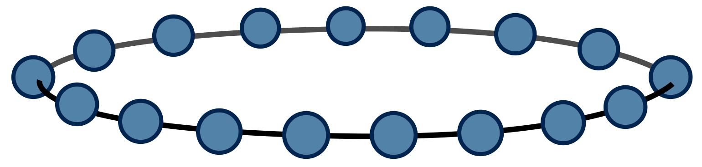
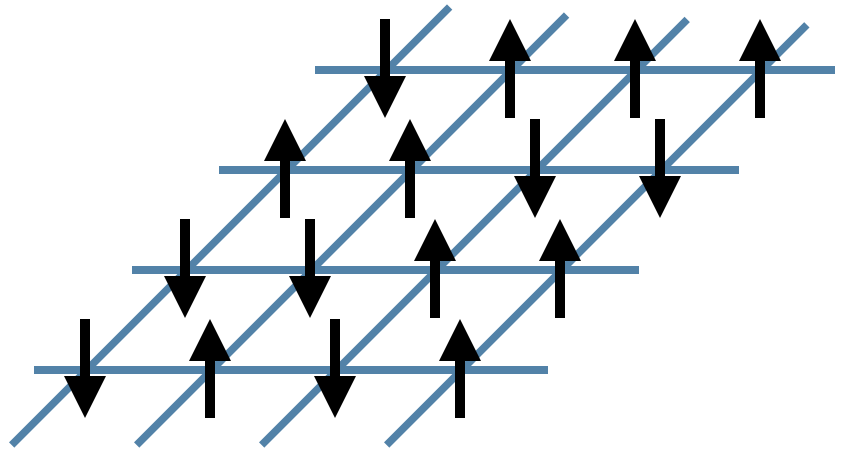
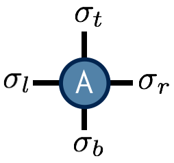
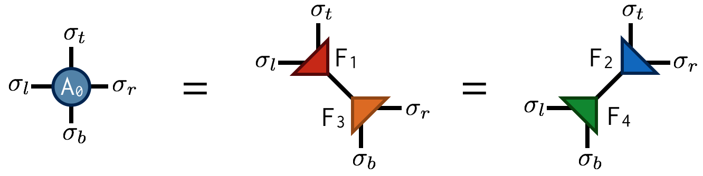
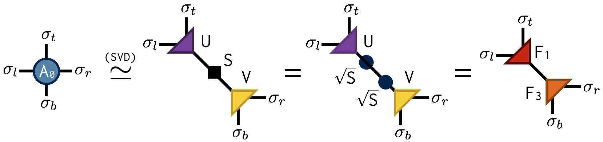
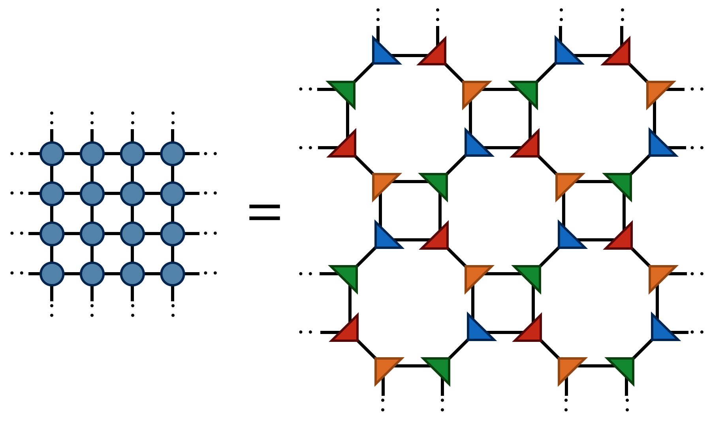
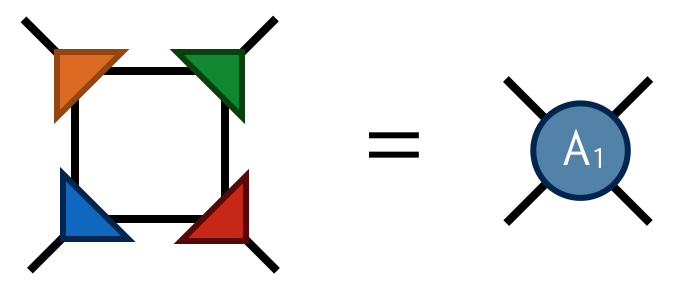
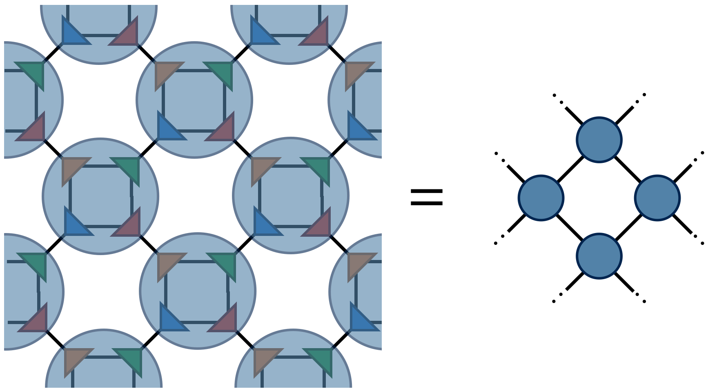
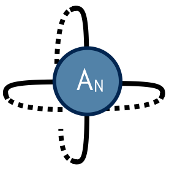

# Tensor Renormalization Group Algorithm

<!--TOC-->

The _tensor renormalization group_ or TRG algorithm
is a strategy for evaluating a fully contracted network of tensors
by decimating the network in a heirarchical fashion.\cite{Levin} 
The strategy is to factorize each tensor in the network using a truncated
[[singular value decomposition|background/svd]] (SVD) into two smaller
factor tensors. Then each factor tensor is contracted with another factor
from a neighboring tensor, resulting in a new contracted lattice of half 
as many tensors.

The term ["renormalization group"](https://websites.pmc.ucsc.edu/~wrs/Project/2014-summer%20seminar/Renorm/Wilson-many%20scales-Sci%20Am-79.pdf) is a term used in the physics
literature to refer to processes where less important 
information at small distance scales is repeatedly discarded until only the 
most important information remains.

## Motivation --- Ising Model

TRG can be used to compute certain large, non-trivial sums by exploiting
the fact that they can be recast as the contraction of a lattice of small tensors.

A classic example of such a sum is the "partition function" $Z$ of the classical Ising
model at temperature T, defined to be

\begin{align}
Z = \sum_{\sigma_1 \sigma_2 \sigma_3 \ldots} e^{-E(\sigma_1,\sigma_2,\sigma_3,\ldots)/T}
\end{align}

where each Ising "spin" $\sigma$ is just a variable taking the values $\sigma = +1, -1$ and the energy
$E(\sigma_1,\sigma_2,\sigma_3,\ldots)$ is the sum of products $\sigma_i \sigma_j$ of 
neighboring $\sigma$ variables.
In the two-dimensional case described below, there is a "critical" temperature $T_c=2.269\ldots$
at which this Ising system develops an interesting hidden scale invariance.

### Background: Ising Model in One dimension

In one dimension, spins only have two neighbors since they are arranged along a chain.
For a finite-size system of N Ising spins, the usual convention is to use periodic boundary conditions 
meaning that the Nth spin connects back to the first around a circle:
\\[
E(\sigma_1,\sigma_2,\sigma_3,\ldots,\sigma_N) 
 = \sigma_1 \sigma_2 + \sigma_2 \sigma_3 + \sigma_3 \sigma_4 + \ldots + \sigma_N \sigma_1 \:.
\\]

The classic "transfer matrix" trick for computing $Z$ goes as follows:
\\[
Z = \sum_{\{\sigma\}} \exp \left(\frac{-1}{T} \sum_n \sigma_n \sigma_{n+1}\right)
 = \sum_{\{\sigma\}} \prod_{n} e^{-(\sigma_n \sigma_{n+1})/ T}
 = \text{Tr} \left(M^N \right)
\\]

where $\text{Tr}$ means "trace" and the transfer matrix $M$ is a 2x2 matrix with elements

\\[
M_{\sigma^{\\!} \sigma^\prime} = e^{-(\sigma^{\\!} \sigma^\prime)/T} \ .
\\]

Pictorially, we can view $\text{Tr}\left(M^N\right)$ as a chain of tensor contractions around a
circle:

With each 2-index tensor in the above diagram defined to equal the matrix M, it is an exact
rewriting of the partition function $Z$ as a tensor network.

For this one-dimensional case, the trick to compute $Z$ is just to diagonalize $M$. 
If $M$ has eigenvalues $\lambda_1$ and $\lambda_2$, it follows that 
$Z = \lambda_1^N + \lambda_2^N$ by the basis invariance of the trace operation.

###  Two dimensional Ising Model

Now let us consider the main problem of interest. For two dimensions, the energy function
can be written as
\begin{equation}
E(\sigma_1, \sigma_2, \ldots) = \sum_{\langle i j \rangle} \sigma_i \sigma_j
\end{equation}
where the notation $\langle i j \rangle$ means the sum only includes $i,j$ which are
neighboring sites. It helps to visualize the system:

In the figure above, the black arrows are the Ising spins $\sigma$ and the 
blue lines represent the local energies $\sigma_i \sigma_j$.
The total energy $E$ of each configuration is the sum of all of these local energies.

Interestingly, it is again possible to rewrite the partition function sum
$Z$ as a network of contracted tensors. Define the tensor $A^{\sigma_t \sigma_r \sigma_b \sigma_l}$
to be 
\begin{equation}
A^{\sigma_t \sigma_r \sigma_b \sigma_l} = e^{-(\sigma_t \sigma_r + \sigma_r \sigma_b + \sigma_b \sigma_l + \sigma_l \sigma_t)/T}
\end{equation}

The interpretation of this tensor is that it computes the local energies between the four spins that
live on its indices, and its value is the Boltzmann probability weight $e^{-E/T}$ associated with
these energies. Note its similarity to the one-dimensional transfer matrix $M$.

With $A$ thus defined, the partition function $Z$ for the two-dimensional Ising model can
be found by contracting the following network of $A$ tensors:

The above drawing is of a lattice of 32 Ising spins (recall that the spins live on
the tensor indices). The indices at the edges of this square wrap around in a periodic
fashion because the energy function was defined using periodic boundary conditions.

## The TRG Algorithm

TRG is a strategy for computing the above 2d network, which is just equal to a single number $Z$
(since there are no uncontracted external indices). The TRG approach is to locally replace 
individual $A$ tensors with pairs of lower-rank tensors which guarantee the result of the contraction
remains the same to a good approximation. These smaller tensors can then be recombined in a different 
way that results in a more sparse, yet equivalent network.

Referring to the original $A$ tensor as $A_0$, the first "move" of 
TRG is to factorize the $A_0$ tensor in two different ways:

Both factorizations can be computed using the [[singular value decomposition (SVD)|book/itensor_factorizing]].
For example, to compute the first factorization, view $A_0$ as a matrix with a collective "row"
index $\sigma_l$ and $\sigma_t$ and collective "column" index $\sigma_b$ and $\sigma_r$. 
After performing an SVD of $A_0$ in this way, further factorize the singular value matrix $S$ as $S = \sqrt{S} \sqrt{S}$ and 
absorb each $\sqrt{S}$ factor into 
U and V to create the factors $F_1$ and $F_2$. Pictorially:

Importantly, the SVD is only done approximately by retaining just the $\chi$ largest singular
values and discarding the columns of U and V corresponding to the smaller singular values.
This truncation is crucial for keeping the cost of the TRG algorithm under control.

Making the above substitutions, either
$A_0=F_1 F_3$ or $A_0=F_2 F_4$ on alternating lattice sites, transforms the
original tensor network into the following network:

Finally by contracting the four F tensors in the following way

one obtains the tensor $A_1$ which has four indices just like $A_0$.
Contracting the $A_1$ tensors in a square-lattice pattern gives the 
same result (up to SVD truncation errors) as contracting the original $A_0$ tensors,
only there are half as many $A_1$ tensors (each $A_0$ consists
of two F's while each $A_1$ consists of four F's).

To compute $Z$ defined by contracting a square lattice of $2^{1+N}$ tensors, one
repeats the above two steps (factor and recombine) N times until only a single
tensor remains. Calling this final tensor $A_N$, the result $Z$ of contracting
the original network is equal to the following "double trace" of $A_N$:

## Extensions

Extensions of the basic TRG algorithm include:

- _tensor entanglement renormalization group_ (TERG) Ref. \onlinecite{Gu:2008}
- _tensor network renormalization_ (TNR) Refs. \onlinecite{Evenbly:2015,Evenbly:2015algs,Evenbly:2015tnrm} 
- loop-TNR Ref. \onlinecite{Yang}
- GILT Ref. \onlinecite{Hauru:2017}

## Suggested Reading

- *The original paper on TRG*:

  Levin and Nave, "Tensor Renormalization Group Approach to Two-Dimensional Classical Lattice Models",
  [PRL 99, 120601](http://dx.doi.org/10.1103/PhysRevLett.99.120601) (2007)  cond-mat/0611687

- *Paper on TRG with very useful figures (particularly Fig. 5)*:

  Gu, Levin, and Wen, 
  "Tensor-entanglement renormalization group approach as a unified method for symmetry
  breaking and topological phase transitions"
  [PRB 78, 205116](http://dx.doi.org/10.1103/PhysRevB.78.205116) (2008)  arxiv:0806.3509

- *TNR is an extension of TRG which qualitatively improves TRG's fixed-point behavior
   and can be used to generate MERA tensor networks*:

  Evenbly and Vidal, "Tensor Network Renormalization"
  [PRL 115, 180405](http://dx.doi.org/10.1103/PhysRevLett.115.180405) (2015) arxiv:1412.0732

